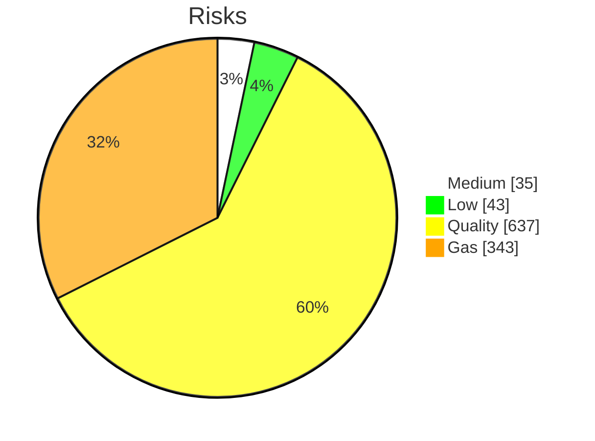

## Executive summary



## Contents

### Medium risks
Total **35 instances** over **2 risks**<br>
  

|ID|Risk|Instances|Gas Savings|
| :---: | :---: | :---: | :---: |
|[[CWE-654](#CWE-654)]|The *owner* is a single point of failure and a centralization risk|3|0|
|[[DOW-BNU](#DOW-BNU)]|*block.number* means different things on different L2s|32|0|

### Low risks
Total **43 instances** over **5 risks**<br>
  

|ID|Risk|Instances|Gas Savings|
| :---: | :---: | :---: | :---: |
|[[SWC-120](#SWC-120)]|Weak sources of randomness from chain attributes|4|0|
|[[DOW-FRI](#DOW-FRI)]|Initializers could be front-run|24|0|
|[[DOW-OWN](#DOW-OWN)]|Use *Ownable2Step* instead of *Ownable*|2|0|
|[[DOW-EBO](#DOW-EBO)]|Empty Function Body - Consider commenting why|5|0|
|[[SWC-115](#SWC-115)]|Use of *tx.origin* is unsafe in almost every context|8|0|

### Non-Critical/Quality risks
Total **637 instances** over **7 risks**<br>
  

|ID|Risk|Instances|Gas Savings|
| :---: | :---: | :---: | :---: |
|[[DOW-TOD](#DOW-TOD)]|TODO Left in the code|1|0|
|[[DOW-UCO](#DOW-UCO)]|Constants should be defined rather than using magic numbers|82|0|
|[[SWC-103](#SWC-103)]|*Lock pragmas* to specific compiler version|37|0|
|[[DOW-ICI](#DOW-ICI)]|Incorrect comparison implementation|3|0|
|[[SWC-110](#SWC-110)]|*require()* should be used instead of *assert()*|381|0|
|[[DOW-INF](#DOW-INF)]|Large or complicated code bases should implement invariant tests|17|0|
|[[DOW-LTL](#DOW-LTL)]|Lines are too long|116|0|

### Gas risks
Total **343 instances** over **9 risks**<br>
  

|ID|Risk|Instances|Gas Savings|
| :---: | :---: | :---: | :---: |
|[[GAS-MEM](#GAS-MEM)]|Use *calldata* instead of *memory* for immutable arguments|139|139|
|[[GAS-UIC](#GAS-UIC)]|Use != 0 instead of > 0 for unsigned integer comparison|20|120|
|[[GAS-EIP](#GAS-EIP)]|Use *external* instead of *public* where possible|37|814|
|[[GAS-PIN](#GAS-PIN)]|Pre-increments and pre-decrements are cheaper than post-increments and post-decrements|34|170|
|[[GAS-CUE](#GAS-CUE)]|Use custom errors|72|72|
|[[GAS-12](#GAS-12)]|Use *selfbalance()* instead of *address(this).balance*|7|105|
|[[GAS-PAF](#GAS-PAF)]|Functions guaranteed to revert when called by normal users can be marked `payable`|16|16|
|[[GAS-IUL](#GAS-IUL)]|Increments can be unchecked in for-loops|14|490|
|[[GAS-ADZ](#GAS-ADZ)]|Use assembly to check for *address(0)*|4|560|

## Details contents

## Medium risks

### [CWE-654]<a name="CWE-654"></a> The *owner* is a single point of failure and a centralization risk
**Description:**<br>
Having a single EOA as the only owner of contracts is a large centralization risk and a single point of failure. A single private key may be taken in a hack, or the sole holder of the key may become unable to retrieve the key when necessary.<br>
https://cwe.mitre.org/data/definitions/654.html<br>
<br>**Recommendation:**<br>
Consider changing to a multi-signature setup, or having a role-based authorization model.<br>
*There are 3 instances of this risk:*
<details><summary>see instances</summary>File: RollupCreator.sol


```solidity
63: function setTemplates(
        BridgeCreator _bridgeCreator,
        IOneStepProofEntry _osp,
        IEdgeChallengeManager _challengeManagerLogic,
        IRollupAdmin _rollupAdminLogic,
        IRollupUser _rollupUserLogic,
        IUpgradeExecutor _upgradeExecutorLogic,
        address _validatorWalletCreator,
        DeployHelper _l2FactoriesDeployer
    ) external onlyOwner {

```
*GitHub* : [L63-L72](https://github.com/code-423n4/2024-05-arbitrum-foundation/tree/main/src/rollup/RollupCreator.sol#L63-L72) 

<br>File: BridgeCreator.sol


```solidity
53: function updateTemplates(BridgeTemplates calldata _newTemplates) external onlyOwner {
58: function updateERC20Templates(BridgeTemplates calldata _newTemplates) external onlyOwner {

```
*GitHub* : [L53](https://github.com/code-423n4/2024-05-arbitrum-foundation/tree/main/src/rollup/BridgeCreator.sol#L53) [L58](https://github.com/code-423n4/2024-05-arbitrum-foundation/tree/main/src/rollup/BridgeCreator.sol#L58) 

<br>
</details>

### [DOW-BNU]<a name="DOW-BNU"></a> *block.number* means different things on different L2s
**Description:**<br>
On Optimism, `block.number` is the L2 block number, but on Arbitrum, it's the L1 block number, and `ArbSys(address(100)).arbBlockNumber()` must be used. Furthermore, L2 block numbers often occur much more frequently than L1 block numbers (any may even occur on a per-transaction basis), so using block numbers for timing results in inconsistencies, especially when voting is involved across multiple chains. <br>
<br><br>**Recommendation:**<br>
As of version 4.9, OpenZeppelin has [modified](https://blog.openzeppelin.com/introducing-openzeppelin-contracts-v4.9#governor) their governor code to use a clock rather than block numbers, to avoid these sorts of issues, but this still requires that the project [implement](https://docs.openzeppelin.com/contracts/4.x/governance#token_2) a [clock](https://eips.ethereum.org/EIPS/eip-6372) for each L2.<br>
<br>
*There are 32 instances of this risk:*
<details><summary>see instances</summary>File: SequencerInbox.sol


```solidity
228: block.number
229: block.number
231: block.number
314: block.number
863: block.number
909: block.number

```
*GitHub* : [L228](https://github.com/code-423n4/2024-05-arbitrum-foundation/tree/main/src/bridge/SequencerInbox.sol#L228) [L229](https://github.com/code-423n4/2024-05-arbitrum-foundation/tree/main/src/bridge/SequencerInbox.sol#L229) [L231](https://github.com/code-423n4/2024-05-arbitrum-foundation/tree/main/src/bridge/SequencerInbox.sol#L231) [L314](https://github.com/code-423n4/2024-05-arbitrum-foundation/tree/main/src/bridge/SequencerInbox.sol#L314) [L863](https://github.com/code-423n4/2024-05-arbitrum-foundation/tree/main/src/bridge/SequencerInbox.sol#L863) [L909](https://github.com/code-423n4/2024-05-arbitrum-foundation/tree/main/src/bridge/SequencerInbox.sol#L909) 

<br>File: ISequencerInbox.sol


```solidity
161: block number
162: block number

```
*GitHub* : [L161](https://github.com/code-423n4/2024-05-arbitrum-foundation/tree/main/src/bridge/ISequencerInbox.sol#L161) [L162](https://github.com/code-423n4/2024-05-arbitrum-foundation/tree/main/src/bridge/ISequencerInbox.sol#L162) 

<br>File: DelayBuffer.sol


```solidity
67: block number
74: block.number
79: block number
81: block number
105: block.number

```
*GitHub* : [L67](https://github.com/code-423n4/2024-05-arbitrum-foundation/tree/main/src/bridge/DelayBuffer.sol#L67) [L74](https://github.com/code-423n4/2024-05-arbitrum-foundation/tree/main/src/bridge/DelayBuffer.sol#L74) [L79](https://github.com/code-423n4/2024-05-arbitrum-foundation/tree/main/src/bridge/DelayBuffer.sol#L79) [L81](https://github.com/code-423n4/2024-05-arbitrum-foundation/tree/main/src/bridge/DelayBuffer.sol#L81) [L105](https://github.com/code-423n4/2024-05-arbitrum-foundation/tree/main/src/bridge/DelayBuffer.sol#L105) 

<br>File: ChallengeEdgeLib.sol


```solidity
47: block number
49: block number
120: block.number
151: block.number
254: block.number

```
*GitHub* : [L47](https://github.com/code-423n4/2024-05-arbitrum-foundation/tree/main/src/challengeV2/libraries/ChallengeEdgeLib.sol#L47) [L49](https://github.com/code-423n4/2024-05-arbitrum-foundation/tree/main/src/challengeV2/libraries/ChallengeEdgeLib.sol#L49) [L120](https://github.com/code-423n4/2024-05-arbitrum-foundation/tree/main/src/challengeV2/libraries/ChallengeEdgeLib.sol#L120) [L151](https://github.com/code-423n4/2024-05-arbitrum-foundation/tree/main/src/challengeV2/libraries/ChallengeEdgeLib.sol#L151) [L254](https://github.com/code-423n4/2024-05-arbitrum-foundation/tree/main/src/challengeV2/libraries/ChallengeEdgeLib.sol#L254) 

<br>File: EdgeChallengeManagerLib.sol


```solidity
552: block.number

```
*GitHub* : [L552](https://github.com/code-423n4/2024-05-arbitrum-foundation/tree/main/src/challengeV2/libraries/EdgeChallengeManagerLib.sol#L552) 

<br>File: RollupCore.sol


```solidity
141: block number

```
*GitHub* : [L141](https://github.com/code-423n4/2024-05-arbitrum-foundation/tree/main/src/rollup/RollupCore.sol#L141) 

<br>File: RollupUserLogic.sol


```solidity
57: block.number
59: block.number
110: block.number
125: block.number
205: block.number

```
*GitHub* : [L57](https://github.com/code-423n4/2024-05-arbitrum-foundation/tree/main/src/rollup/RollupUserLogic.sol#L57) [L59](https://github.com/code-423n4/2024-05-arbitrum-foundation/tree/main/src/rollup/RollupUserLogic.sol#L59) [L110](https://github.com/code-423n4/2024-05-arbitrum-foundation/tree/main/src/rollup/RollupUserLogic.sol#L110) [L125](https://github.com/code-423n4/2024-05-arbitrum-foundation/tree/main/src/rollup/RollupUserLogic.sol#L125) [L205](https://github.com/code-423n4/2024-05-arbitrum-foundation/tree/main/src/rollup/RollupUserLogic.sol#L205) 

<br>File: Assertion.sol


```solidity
23: block number
75: block.number
87: block.number
89: block.number

```
*GitHub* : [L23](https://github.com/code-423n4/2024-05-arbitrum-foundation/tree/main/src/rollup/Assertion.sol#L23) [L75](https://github.com/code-423n4/2024-05-arbitrum-foundation/tree/main/src/rollup/Assertion.sol#L75) [L87](https://github.com/code-423n4/2024-05-arbitrum-foundation/tree/main/src/rollup/Assertion.sol#L87) [L89](https://github.com/code-423n4/2024-05-arbitrum-foundation/tree/main/src/rollup/Assertion.sol#L89) 

<br>File: IRollupCore.sol


```solidity
82: block number

```
*GitHub* : [L82](https://github.com/code-423n4/2024-05-arbitrum-foundation/tree/main/src/rollup/IRollupCore.sol#L82) 

<br>File: RollupAdminLogic.sol


```solidity
24: block.number

```
*GitHub* : [L24](https://github.com/code-423n4/2024-05-arbitrum-foundation/tree/main/src/rollup/RollupAdminLogic.sol#L24) 

<br>File: BOLDUpgradeAction.sol


```solidity
34: block number

```
*GitHub* : [L34](https://github.com/code-423n4/2024-05-arbitrum-foundation/tree/main/src/rollup/BOLDUpgradeAction.sol#L34) 

<br>
</details>

## Low risks

### [SWC-120]<a name="SWC-120"></a> Weak sources of randomness from chain attributes
**Description:**<br>Creating a strong enough source of randomness in Ethereum is very challenging. For example, use of *block.timestamp* is insecure, as a miner can choose to provide any timestamp within a few seconds and still get his block accepted by others. Use of blockhash, *block.difficulty* and other fields is also insecure, as they're controlled by the miner. If the stakes are high, the miner can mine lots of blocks in a short time by renting hardware, pick the block that has required block hash for him to win, and drop all others.<br>https://swcregistry.io/docs/SWC-120 <br>**Recommendation:**<br>Using commitment scheme, e.g. RANDAO.<br>Using external sources of randomness via oracles, e.g. Oraclize. Note that this approach requires trusting in oracle, thus it may be reasonable to use multiple oracles. <br>Using Bitcoin block hashes, as they are more expensive to mine.<br>
*There are 4 instances of this risk:*
<details><summary>see instances</summary>File: SequencerInbox.sol


```solidity
224: block.timestamp
225: block.timestamp
227: block.timestamp
775: block.timestamp

```
*GitHub* : [L224](https://github.com/code-423n4/2024-05-arbitrum-foundation/tree/main/src/bridge/SequencerInbox.sol#L224) [L225](https://github.com/code-423n4/2024-05-arbitrum-foundation/tree/main/src/bridge/SequencerInbox.sol#L225) [L227](https://github.com/code-423n4/2024-05-arbitrum-foundation/tree/main/src/bridge/SequencerInbox.sol#L227) [L775](https://github.com/code-423n4/2024-05-arbitrum-foundation/tree/main/src/bridge/SequencerInbox.sol#L775) 

<br>
</details>

### [DOW-FRI]<a name="DOW-FRI"></a> Initializers could be front-run
**Description:**<br>
Initializers could be front-run, allowing an attacker to either set their own values, take ownership of the contract, and in the best case forcing a re-deployment<br>
 <br>**Recommendation:**<br>Use the constructor to initialize non-proxied contracts.For initializing proxy contracts deploy contracts using a factory contract that immediately calls initialize after deployment or make sure to call it immediately after deployment and verify the transaction succeeded.<br>
<br>
*There are 24 instances of this risk:*
<details><summary>see instances</summary>File: SequencerInbox.sol


```solidity
177: initialize(

```
*GitHub* : [L177](https://github.com/code-423n4/2024-05-arbitrum-foundation/tree/main/src/bridge/SequencerInbox.sol#L177) 

<br>File: ISequencerInbox.sol


```solidity
285: initializer
287: initialize(

```
*GitHub* : [L285](https://github.com/code-423n4/2024-05-arbitrum-foundation/tree/main/src/bridge/ISequencerInbox.sol#L285) [L287](https://github.com/code-423n4/2024-05-arbitrum-foundation/tree/main/src/bridge/ISequencerInbox.sol#L287) 

<br>File: EdgeChallengeManager.sol


```solidity
20: initializer
34: initialize(
305: initialize(
316: initializer
427: initializer

```
*GitHub* : [L20](https://github.com/code-423n4/2024-05-arbitrum-foundation/tree/main/src/challengeV2/EdgeChallengeManager.sol#L20) [L34](https://github.com/code-423n4/2024-05-arbitrum-foundation/tree/main/src/challengeV2/EdgeChallengeManager.sol#L34) [L305](https://github.com/code-423n4/2024-05-arbitrum-foundation/tree/main/src/challengeV2/EdgeChallengeManager.sol#L305) [L316](https://github.com/code-423n4/2024-05-arbitrum-foundation/tree/main/src/challengeV2/EdgeChallengeManager.sol#L316) [L427](https://github.com/code-423n4/2024-05-arbitrum-foundation/tree/main/src/challengeV2/EdgeChallengeManager.sol#L427) 

<br>File: RollupCore.sol


```solidity
226: init(

```
*GitHub* : [L226](https://github.com/code-423n4/2024-05-arbitrum-foundation/tree/main/src/rollup/RollupCore.sol#L226) 

<br>File: RollupUserLogic.sol


```solidity
27: initialize(

```
*GitHub* : [L27](https://github.com/code-423n4/2024-05-arbitrum-foundation/tree/main/src/rollup/RollupUserLogic.sol#L27) 

<br>File: RollupCreator.sol


```solidity
99: initialize(
282: initialize(

```
*GitHub* : [L99](https://github.com/code-423n4/2024-05-arbitrum-foundation/tree/main/src/rollup/RollupCreator.sol#L99) [L282](https://github.com/code-423n4/2024-05-arbitrum-foundation/tree/main/src/rollup/RollupCreator.sol#L282) 

<br>File: RollupAdminLogic.sol


```solidity
18: initialize(
22: initializer

```
*GitHub* : [L18](https://github.com/code-423n4/2024-05-arbitrum-foundation/tree/main/src/rollup/RollupAdminLogic.sol#L18) [L22](https://github.com/code-423n4/2024-05-arbitrum-foundation/tree/main/src/rollup/RollupAdminLogic.sol#L22) 

<br>File: BOLDUpgradeAction.sol


```solidity
503: initialize(

```
*GitHub* : [L503](https://github.com/code-423n4/2024-05-arbitrum-foundation/tree/main/src/rollup/BOLDUpgradeAction.sol#L503) 

<br>File: BridgeCreator.sol


```solidity
118: initialize(
120: initialize(
122: initialize(
123: initialize(
124: initialize(
125: initialize(

```
*GitHub* : [L118](https://github.com/code-423n4/2024-05-arbitrum-foundation/tree/main/src/rollup/BridgeCreator.sol#L118) [L120](https://github.com/code-423n4/2024-05-arbitrum-foundation/tree/main/src/rollup/BridgeCreator.sol#L120) [L122](https://github.com/code-423n4/2024-05-arbitrum-foundation/tree/main/src/rollup/BridgeCreator.sol#L122) [L123](https://github.com/code-423n4/2024-05-arbitrum-foundation/tree/main/src/rollup/BridgeCreator.sol#L123) [L124](https://github.com/code-423n4/2024-05-arbitrum-foundation/tree/main/src/rollup/BridgeCreator.sol#L124) [L125](https://github.com/code-423n4/2024-05-arbitrum-foundation/tree/main/src/rollup/BridgeCreator.sol#L125) 

<br>File: RollupProxy.sol


```solidity
20: initialize(

```
*GitHub* : [L20](https://github.com/code-423n4/2024-05-arbitrum-foundation/tree/main/src/rollup/RollupProxy.sol#L20) 

<br>File: IRollupAdmin.sol


```solidity
16: initialize(

```
*GitHub* : [L16](https://github.com/code-423n4/2024-05-arbitrum-foundation/tree/main/src/rollup/IRollupAdmin.sol#L16) 

<br>File: IRollupLogic.sol


```solidity
15: initialize(

```
*GitHub* : [L15](https://github.com/code-423n4/2024-05-arbitrum-foundation/tree/main/src/rollup/IRollupLogic.sol#L15) 

<br>
</details>

### [DOW-OWN]<a name="DOW-OWN"></a> Use *Ownable2Step* instead of *Ownable*
**Description:**<br>
Ownable2Step and Ownable2StepUpgradeable prevent the contract ownership from mistakenly being transferred to an address that cannot handle it (e.g. due to a typo in the address), by requiring that the recipient of the owner permissions actively accept via a contract call of its own.<br>
https://swcregistry.io/docs/SWC-120 <br>**Recommendation:**<br>Use *Ownable2Step* and *Ownable2StepUpgradeable* instead of *Ownable* when possible<br>
<br>
*There are 2 instances of this risk:*
<details><summary>see instances</summary>File: RollupCreator.sol


```solidity
17: contract RollupCreator is Ownable {

```
*GitHub* : [L17](https://github.com/code-423n4/2024-05-arbitrum-foundation/tree/main/src/rollup/RollupCreator.sol#L17) 

<br>File: BridgeCreator.sol


```solidity
21: contract BridgeCreator is Ownable {

```
*GitHub* : [L21](https://github.com/code-423n4/2024-05-arbitrum-foundation/tree/main/src/rollup/BridgeCreator.sol#L21) 

<br>
</details>

### [DOW-EBO]<a name="DOW-EBO"></a> Empty Function Body - Consider commenting why
**Description:**<br>
Empty function body has been detected.<br>
https://cwe.mitre.org/data/definitions/1071.html <br>**Recommendation:**<br>Consider commenting on the purpose of the empty body.<br>
<br>
*There are 5 instances of this risk:*
<details><summary>see instances</summary>File: SequencerInbox.sol


```solidity
192: {}

```
*GitHub* : [L192](https://github.com/code-423n4/2024-05-arbitrum-foundation/tree/main/src/bridge/SequencerInbox.sol#L192) 

<br>File: RollupCreator.sol


```solidity
58: {}
61: {}

```
*GitHub* : [L58](https://github.com/code-423n4/2024-05-arbitrum-foundation/tree/main/src/rollup/RollupCreator.sol#L58) [L61](https://github.com/code-423n4/2024-05-arbitrum-foundation/tree/main/src/rollup/RollupCreator.sol#L61) 

<br>File: RollupAdminLogic.sol


```solidity
166: {}
171: {}

```
*GitHub* : [L166](https://github.com/code-423n4/2024-05-arbitrum-foundation/tree/main/src/rollup/RollupAdminLogic.sol#L166) [L171](https://github.com/code-423n4/2024-05-arbitrum-foundation/tree/main/src/rollup/RollupAdminLogic.sol#L171) 

<br>
</details>

### [SWC-115]<a name="SWC-115"></a> Use of *tx.origin* is unsafe in almost every context
**Description:**<br>
*tx.origin* is a global variable in Solidity which returns the address of the account that sent the transaction. Using the variable for authorization could make a contract vulnerable if an authorized account calls into a malicious contract. A call could be made to the vulnerable contract that passes the authorization check since *tx.origin* returns the original sender of the transaction which in this case is the authorized account. 
https://swcregistry.io/docs/SWC-115 
<br>**Recommendation:**<br>
*tx.origin* should not be used for authorization. Use *msg.sender* instead. 
It is recommended to make a conscious decision on which visibility type is appropriate for a function. This can dramatically reduce the attack surface of a contract system.
<br>
*There are 8 instances of this risk:*
<details><summary>see instances</summary>File: Error.sol


```solidity
26: tx.origin

```
*GitHub* : [L26](https://github.com/code-423n4/2024-05-arbitrum-foundation/tree/main/src/libraries/Error.sol#L26) 

<br>File: SequencerInbox.sol


```solidity
375: tx.origin
440: tx.origin
507: tx.origin
751: tx.origin
751: tx.origin
761: tx.origin
764: tx.origin

```
*GitHub* : [L375](https://github.com/code-423n4/2024-05-arbitrum-foundation/tree/main/src/bridge/SequencerInbox.sol#L375) [L440](https://github.com/code-423n4/2024-05-arbitrum-foundation/tree/main/src/bridge/SequencerInbox.sol#L440) [L507](https://github.com/code-423n4/2024-05-arbitrum-foundation/tree/main/src/bridge/SequencerInbox.sol#L507) [L751](https://github.com/code-423n4/2024-05-arbitrum-foundation/tree/main/src/bridge/SequencerInbox.sol#L751) [L751](https://github.com/code-423n4/2024-05-arbitrum-foundation/tree/main/src/bridge/SequencerInbox.sol#L751) [L761](https://github.com/code-423n4/2024-05-arbitrum-foundation/tree/main/src/bridge/SequencerInbox.sol#L761) [L764](https://github.com/code-423n4/2024-05-arbitrum-foundation/tree/main/src/bridge/SequencerInbox.sol#L764) 

<br>
</details>

## Non-Critical/Quality risks

### [DOW-TOD]<a name="DOW-TOD"></a> TODO Left in the code
**Description:**<br>
TODOs may signal that a feature is missing or not ready for audit<br>
<br>**Recommendation:**<br>
consider resolving the issue and removing the TODO comment or giving the purpose of the remainder to make<br>
<br>
*There is 1 instance of this risk:*
<details><summary>see instance</summary>File: ChallengeEdgeLib.sol


```solidity
63: TODO

```
*GitHub* : [L63](https://github.com/code-423n4/2024-05-arbitrum-foundation/tree/main/src/challengeV2/libraries/ChallengeEdgeLib.sol#L63) 

<br>
</details>

### [DOW-UCO]<a name="DOW-UCO"></a> Constants should be defined rather than using magic numbers
**Description:**<br>
Constants should be defined rather than using magic numbers<br>
<br>**Recommendation:**<br>
cf. Description<br>
<br>
*There are 82 instances of this risk:*
<details><summary>see instances</summary>File: Error.sol


```solidity
1: // Copyright 2021

```
*GitHub* : [L1](https://github.com/code-423n4/2024-05-arbitrum-foundation/tree/main/src/libraries/Error.sol#L1) 

<br>File: AssertionStakingPool.sol


```solidity
1: // Copyright 2021

```
*GitHub* : [L1](https://github.com/code-423n4/2024-05-arbitrum-foundation/tree/main/src/assertionStakingPool/AssertionStakingPool.sol#L1) 

<br>File: StakingPoolCreatorUtils.sol


```solidity
1: // Copyright 2021

```
*GitHub* : [L1](https://github.com/code-423n4/2024-05-arbitrum-foundation/tree/main/src/assertionStakingPool/StakingPoolCreatorUtils.sol#L1) 

<br>File: EdgeStakingPool.sol


```solidity
1: // Copyright 2021

```
*GitHub* : [L1](https://github.com/code-423n4/2024-05-arbitrum-foundation/tree/main/src/assertionStakingPool/EdgeStakingPool.sol#L1) 

<br>File: AssertionStakingPoolCreator.sol


```solidity
1: // Copyright 2021

```
*GitHub* : [L1](https://github.com/code-423n4/2024-05-arbitrum-foundation/tree/main/src/assertionStakingPool/AssertionStakingPoolCreator.sol#L1) 

<br>File: AbsBoldStakingPool.sol


```solidity
1: // Copyright 2021

```
*GitHub* : [L1](https://github.com/code-423n4/2024-05-arbitrum-foundation/tree/main/src/assertionStakingPool/AbsBoldStakingPool.sol#L1) 

<br>File: EdgeStakingPoolCreator.sol


```solidity
1: // Copyright 2021

```
*GitHub* : [L1](https://github.com/code-423n4/2024-05-arbitrum-foundation/tree/main/src/assertionStakingPool/EdgeStakingPoolCreator.sol#L1) 

<br>File: IEdgeStakingPool.sol


```solidity
1: // Copyright 2021

```
*GitHub* : [L1](https://github.com/code-423n4/2024-05-arbitrum-foundation/tree/main/src/assertionStakingPool/interfaces/IEdgeStakingPool.sol#L1) 

<br>File: IEdgeStakingPoolCreator.sol


```solidity
1: // Copyright 2021

```
*GitHub* : [L1](https://github.com/code-423n4/2024-05-arbitrum-foundation/tree/main/src/assertionStakingPool/interfaces/IEdgeStakingPoolCreator.sol#L1) 

<br>File: IAbsBoldStakingPool.sol


```solidity
1: // Copyright 2021

```
*GitHub* : [L1](https://github.com/code-423n4/2024-05-arbitrum-foundation/tree/main/src/assertionStakingPool/interfaces/IAbsBoldStakingPool.sol#L1) 

<br>File: IAssertionStakingPool.sol


```solidity
1: // Copyright 2021

```
*GitHub* : [L1](https://github.com/code-423n4/2024-05-arbitrum-foundation/tree/main/src/assertionStakingPool/interfaces/IAssertionStakingPool.sol#L1) 

<br>File: IAssertionStakingPoolCreator.sol


```solidity
1: // Copyright 2021

```
*GitHub* : [L1](https://github.com/code-423n4/2024-05-arbitrum-foundation/tree/main/src/assertionStakingPool/interfaces/IAssertionStakingPoolCreator.sol#L1) 

<br>File: SequencerInbox.sol


```solidity
1: // Copyright 2021
70: ublic constant HEADER_LENGTH = 40
91: nternal constant GAS_PER_BLOB = 1 << 17
127:     // On L1 this should be set to 117964: 90
703:             // The first data byte cannot be the same as any that have been set via other methods (eg 4844
704:             // would allow the supplier of the data to spoof an incorrect 4844
708:             // das batches expect to have the type byte set, followed by the keyset (so they should have at least 33
711:             if (data[0] & DAS_MESSAGE_HEADER_FLAG != 0 && data.length >= 33
720:     /// @dev    Form a hash of the data being provided in 4844
905:         bytes32 ksHash = bytes32(ksWord ^ (1 << 255
906:         if (keysetBytes.length >= 64

```
*GitHub* : [L1](https://github.com/code-423n4/2024-05-arbitrum-foundation/tree/main/src/bridge/SequencerInbox.sol#L1) [L70](https://github.com/code-423n4/2024-05-arbitrum-foundation/tree/main/src/bridge/SequencerInbox.sol#L70) [L91](https://github.com/code-423n4/2024-05-arbitrum-foundation/tree/main/src/bridge/SequencerInbox.sol#L91) [L127](https://github.com/code-423n4/2024-05-arbitrum-foundation/tree/main/src/bridge/SequencerInbox.sol#L127) [L703](https://github.com/code-423n4/2024-05-arbitrum-foundation/tree/main/src/bridge/SequencerInbox.sol#L703) [L704](https://github.com/code-423n4/2024-05-arbitrum-foundation/tree/main/src/bridge/SequencerInbox.sol#L704) [L708](https://github.com/code-423n4/2024-05-arbitrum-foundation/tree/main/src/bridge/SequencerInbox.sol#L708) [L711](https://github.com/code-423n4/2024-05-arbitrum-foundation/tree/main/src/bridge/SequencerInbox.sol#L711) [L720](https://github.com/code-423n4/2024-05-arbitrum-foundation/tree/main/src/bridge/SequencerInbox.sol#L720) [L905](https://github.com/code-423n4/2024-05-arbitrum-foundation/tree/main/src/bridge/SequencerInbox.sol#L905) [L906](https://github.com/code-423n4/2024-05-arbitrum-foundation/tree/main/src/bridge/SequencerInbox.sol#L906) 

<br>File: ISequencerInbox.sol


```solidity
1: // Copyright 2021
58:     ///      the sequencer inbox has authenticated the data. Currently only used for 4844
64:     ///      then the batch data is to be found in 4844

```
*GitHub* : [L1](https://github.com/code-423n4/2024-05-arbitrum-foundation/tree/main/src/bridge/ISequencerInbox.sol#L1) [L58](https://github.com/code-423n4/2024-05-arbitrum-foundation/tree/main/src/bridge/ISequencerInbox.sol#L58) [L64](https://github.com/code-423n4/2024-05-arbitrum-foundation/tree/main/src/bridge/ISequencerInbox.sol#L64) 

<br>File: DelayBuffer.sol


```solidity
1: // Copyright 2021
21:     ///         should count once as a single 100 block delay, not twice as a 200
22:     ///         Eg. If the buffer is 300

```
*GitHub* : [L1](https://github.com/code-423n4/2024-05-arbitrum-foundation/tree/main/src/bridge/DelayBuffer.sol#L1) [L21](https://github.com/code-423n4/2024-05-arbitrum-foundation/tree/main/src/bridge/DelayBuffer.sol#L21) [L22](https://github.com/code-423n4/2024-05-arbitrum-foundation/tree/main/src/bridge/DelayBuffer.sol#L22) 

<br>File: DelayBufferTypes.sol


```solidity
1: // Copyright 2021

```
*GitHub* : [L1](https://github.com/code-423n4/2024-05-arbitrum-foundation/tree/main/src/bridge/DelayBufferTypes.sol#L1) 

<br>File: IAssertionChain.sol


```solidity
1: // Copyright 2023

```
*GitHub* : [L1](https://github.com/code-423n4/2024-05-arbitrum-foundation/tree/main/src/challengeV2/IAssertionChain.sol#L1) 

<br>File: EdgeChallengeManager.sol


```solidity
1: // Copyright 2023
355:         if (_numBigStepLevel > 253

```
*GitHub* : [L1](https://github.com/code-423n4/2024-05-arbitrum-foundation/tree/main/src/challengeV2/EdgeChallengeManager.sol#L1) [L355](https://github.com/code-423n4/2024-05-arbitrum-foundation/tree/main/src/challengeV2/EdgeChallengeManager.sol#L355) 

<br>File: ChallengeEdgeLib.sol


```solidity
1: // Copyright 2023

```
*GitHub* : [L1](https://github.com/code-423n4/2024-05-arbitrum-foundation/tree/main/src/challengeV2/libraries/ChallengeEdgeLib.sol#L1) 

<br>File: Enums.sol


```solidity
1: // Copyright 2023

```
*GitHub* : [L1](https://github.com/code-423n4/2024-05-arbitrum-foundation/tree/main/src/challengeV2/libraries/Enums.sol#L1) 

<br>File: EdgeChallengeManagerLib.sol


```solidity
1: // Copyright 2023
333:         // if x is a power of 2, then this will be 0111111

```
*GitHub* : [L1](https://github.com/code-423n4/2024-05-arbitrum-foundation/tree/main/src/challengeV2/libraries/EdgeChallengeManagerLib.sol#L1) [L333](https://github.com/code-423n4/2024-05-arbitrum-foundation/tree/main/src/challengeV2/libraries/EdgeChallengeManagerLib.sol#L333) 

<br>File: ChallengeErrors.sol


```solidity
1: // Copyright 2023

```
*GitHub* : [L1](https://github.com/code-423n4/2024-05-arbitrum-foundation/tree/main/src/challengeV2/libraries/ChallengeErrors.sol#L1) 

<br>File: MerkleTreeLib.sol


```solidity
1: // Copyright 2023
104: ublic constant MAX_LEVEL = 64
240:         // or root node, since these are always the hash of 64

```
*GitHub* : [L1](https://github.com/code-423n4/2024-05-arbitrum-foundation/tree/main/src/challengeV2/libraries/MerkleTreeLib.sol#L1) [L104](https://github.com/code-423n4/2024-05-arbitrum-foundation/tree/main/src/challengeV2/libraries/MerkleTreeLib.sol#L104) [L240](https://github.com/code-423n4/2024-05-arbitrum-foundation/tree/main/src/challengeV2/libraries/MerkleTreeLib.sol#L240) 

<br>File: UintUtilsLib.sol


```solidity
1: // Copyright 2023
11:     /// @dev    Zero indexed from the least sig bit. Eg 1010 => 1, 1100
25:     /// @dev    Zero indexed from the least sig bit. Eg 1010 => 3, 110
37:         // x >= 2 ** 64
39:             x >>= 64
40:             msb += 64
47:         // x >= 2 ** 16
49:             x >>= 16
50:             msb += 16

```
*GitHub* : [L1](https://github.com/code-423n4/2024-05-arbitrum-foundation/tree/main/src/challengeV2/libraries/UintUtilsLib.sol#L1) [L11](https://github.com/code-423n4/2024-05-arbitrum-foundation/tree/main/src/challengeV2/libraries/UintUtilsLib.sol#L11) [L25](https://github.com/code-423n4/2024-05-arbitrum-foundation/tree/main/src/challengeV2/libraries/UintUtilsLib.sol#L25) [L37](https://github.com/code-423n4/2024-05-arbitrum-foundation/tree/main/src/challengeV2/libraries/UintUtilsLib.sol#L37) [L39](https://github.com/code-423n4/2024-05-arbitrum-foundation/tree/main/src/challengeV2/libraries/UintUtilsLib.sol#L39) [L40](https://github.com/code-423n4/2024-05-arbitrum-foundation/tree/main/src/challengeV2/libraries/UintUtilsLib.sol#L40) [L47](https://github.com/code-423n4/2024-05-arbitrum-foundation/tree/main/src/challengeV2/libraries/UintUtilsLib.sol#L47) [L49](https://github.com/code-423n4/2024-05-arbitrum-foundation/tree/main/src/challengeV2/libraries/UintUtilsLib.sol#L49) [L50](https://github.com/code-423n4/2024-05-arbitrum-foundation/tree/main/src/challengeV2/libraries/UintUtilsLib.sol#L50) 

<br>File: ArrayUtilsLib.sol


```solidity
1: // Copyright 2023

```
*GitHub* : [L1](https://github.com/code-423n4/2024-05-arbitrum-foundation/tree/main/src/challengeV2/libraries/ArrayUtilsLib.sol#L1) 

<br>File: RollupCore.sol


```solidity
1: // Copyright 2021

```
*GitHub* : [L1](https://github.com/code-423n4/2024-05-arbitrum-foundation/tree/main/src/rollup/RollupCore.sol#L1) 

<br>File: RollupUserLogic.sol


```solidity
1: // Copyright 2021
39:      *         This is 28 days assuming a 12 seconds block time. Since it can take 14
41:      *         a further 14
49: ublic constant VALIDATOR_AFK_BLOCKS = 201600

```
*GitHub* : [L1](https://github.com/code-423n4/2024-05-arbitrum-foundation/tree/main/src/rollup/RollupUserLogic.sol#L1) [L39](https://github.com/code-423n4/2024-05-arbitrum-foundation/tree/main/src/rollup/RollupUserLogic.sol#L39) [L41](https://github.com/code-423n4/2024-05-arbitrum-foundation/tree/main/src/rollup/RollupUserLogic.sol#L41) [L49](https://github.com/code-423n4/2024-05-arbitrum-foundation/tree/main/src/rollup/RollupUserLogic.sol#L49) 

<br>File: Assertion.sol


```solidity
1: // Copyright 2021

```
*GitHub* : [L1](https://github.com/code-423n4/2024-05-arbitrum-foundation/tree/main/src/rollup/Assertion.sol#L1) 

<br>File: IRollupCore.sol


```solidity
1: // Copyright 2021

```
*GitHub* : [L1](https://github.com/code-423n4/2024-05-arbitrum-foundation/tree/main/src/rollup/IRollupCore.sol#L1) 

<br>File: RollupCreator.sol


```solidity
1: // Copyright 2021

```
*GitHub* : [L1](https://github.com/code-423n4/2024-05-arbitrum-foundation/tree/main/src/rollup/RollupCreator.sol#L1) 

<br>File: RollupAdminLogic.sol


```solidity
1: // Copyright 2021
51:         // A little over 15
52:         minimumAssertionPeriod = 75
225:         emit OwnerFunctionCalled(12
234:         emit OwnerFunctionCalled(22
255:         emit OwnerFunctionCalled(23
266:         emit OwnerFunctionCalled(24
274:         emit OwnerFunctionCalled(25
283:         emit OwnerFunctionCalled(26
292:         emit OwnerFunctionCalled(27
301:         emit OwnerFunctionCalled(28
310:         emit OwnerFunctionCalled(30
319:         emit OwnerFunctionCalled(31

```
*GitHub* : [L1](https://github.com/code-423n4/2024-05-arbitrum-foundation/tree/main/src/rollup/RollupAdminLogic.sol#L1) [L51](https://github.com/code-423n4/2024-05-arbitrum-foundation/tree/main/src/rollup/RollupAdminLogic.sol#L51) [L52](https://github.com/code-423n4/2024-05-arbitrum-foundation/tree/main/src/rollup/RollupAdminLogic.sol#L52) [L225](https://github.com/code-423n4/2024-05-arbitrum-foundation/tree/main/src/rollup/RollupAdminLogic.sol#L225) [L234](https://github.com/code-423n4/2024-05-arbitrum-foundation/tree/main/src/rollup/RollupAdminLogic.sol#L234) [L255](https://github.com/code-423n4/2024-05-arbitrum-foundation/tree/main/src/rollup/RollupAdminLogic.sol#L255) [L266](https://github.com/code-423n4/2024-05-arbitrum-foundation/tree/main/src/rollup/RollupAdminLogic.sol#L266) [L274](https://github.com/code-423n4/2024-05-arbitrum-foundation/tree/main/src/rollup/RollupAdminLogic.sol#L274) [L283](https://github.com/code-423n4/2024-05-arbitrum-foundation/tree/main/src/rollup/RollupAdminLogic.sol#L283) [L292](https://github.com/code-423n4/2024-05-arbitrum-foundation/tree/main/src/rollup/RollupAdminLogic.sol#L292) [L301](https://github.com/code-423n4/2024-05-arbitrum-foundation/tree/main/src/rollup/RollupAdminLogic.sol#L301) [L310](https://github.com/code-423n4/2024-05-arbitrum-foundation/tree/main/src/rollup/RollupAdminLogic.sol#L310) [L319](https://github.com/code-423n4/2024-05-arbitrum-foundation/tree/main/src/rollup/RollupAdminLogic.sol#L319) 

<br>File: BOLDUpgradeAction.sol


```solidity
1: // Copyright 2021
347:         if (stakerCount > 50
348:             stakerCount = 50

```
*GitHub* : [L1](https://github.com/code-423n4/2024-05-arbitrum-foundation/tree/main/src/rollup/BOLDUpgradeAction.sol#L1) [L347](https://github.com/code-423n4/2024-05-arbitrum-foundation/tree/main/src/rollup/BOLDUpgradeAction.sol#L347) [L348](https://github.com/code-423n4/2024-05-arbitrum-foundation/tree/main/src/rollup/BOLDUpgradeAction.sol#L348) 

<br>File: BridgeCreator.sol


```solidity
1: // Copyright 2021

```
*GitHub* : [L1](https://github.com/code-423n4/2024-05-arbitrum-foundation/tree/main/src/rollup/BridgeCreator.sol#L1) 

<br>File: RollupProxy.sol


```solidity
1: // Copyright 2021

```
*GitHub* : [L1](https://github.com/code-423n4/2024-05-arbitrum-foundation/tree/main/src/rollup/RollupProxy.sol#L1) 

<br>File: IRollupAdmin.sol


```solidity
1: // Copyright 2021

```
*GitHub* : [L1](https://github.com/code-423n4/2024-05-arbitrum-foundation/tree/main/src/rollup/IRollupAdmin.sol#L1) 

<br>File: Config.sol


```solidity
1: // Copyright 2021

```
*GitHub* : [L1](https://github.com/code-423n4/2024-05-arbitrum-foundation/tree/main/src/rollup/Config.sol#L1) 

<br>File: RollupLib.sol


```solidity
1: // Copyright 2021

```
*GitHub* : [L1](https://github.com/code-423n4/2024-05-arbitrum-foundation/tree/main/src/rollup/RollupLib.sol#L1) 

<br>File: AssertionState.sol


```solidity
1: // Copyright 2021

```
*GitHub* : [L1](https://github.com/code-423n4/2024-05-arbitrum-foundation/tree/main/src/rollup/AssertionState.sol#L1) 

<br>File: IRollupLogic.sol


```solidity
1: // Copyright 2021

```
*GitHub* : [L1](https://github.com/code-423n4/2024-05-arbitrum-foundation/tree/main/src/rollup/IRollupLogic.sol#L1) 

<br>
</details>

### [SWC-103]<a name="SWC-103"></a> *Lock pragmas* to specific compiler version
**Description:**<br>Pragma statements can be allowed to float when a contract is intended for consumption by other developers, as in the case with contracts in a library or EthPM package. Otherwise, the developer would need to manually update the pragma in order to compile locally.<br>https://swcregistry.io/docs/SWC-103 <br>**Recommendation:**<br>Ethereum Smart Contract Best Practices - Lock pragmas to specific compiler version.<br>https://consensys.github.io/smart-contract-best-practices/development-recommendations/solidity-specific/locking-pragmas/<br>
*There are 37 instances of this risk:*
<details><summary>see instances</summary>File: Error.sol


```solidity
5: pragma solidity ^0.8.4

```
*GitHub* : [L5](https://github.com/code-423n4/2024-05-arbitrum-foundation/tree/main/src/libraries/Error.sol#L5) 

<br>File: AssertionStakingPool.sol


```solidity
6: pragma solidity ^0.8.0

```
*GitHub* : [L6](https://github.com/code-423n4/2024-05-arbitrum-foundation/tree/main/src/assertionStakingPool/AssertionStakingPool.sol#L6) 

<br>File: StakingPoolCreatorUtils.sol


```solidity
6: pragma solidity ^0.8.0

```
*GitHub* : [L6](https://github.com/code-423n4/2024-05-arbitrum-foundation/tree/main/src/assertionStakingPool/StakingPoolCreatorUtils.sol#L6) 

<br>File: EdgeStakingPool.sol


```solidity
5: pragma solidity ^0.8.0

```
*GitHub* : [L5](https://github.com/code-423n4/2024-05-arbitrum-foundation/tree/main/src/assertionStakingPool/EdgeStakingPool.sol#L5) 

<br>File: AssertionStakingPoolCreator.sol


```solidity
6: pragma solidity ^0.8.0

```
*GitHub* : [L6](https://github.com/code-423n4/2024-05-arbitrum-foundation/tree/main/src/assertionStakingPool/AssertionStakingPoolCreator.sol#L6) 

<br>File: AbsBoldStakingPool.sol


```solidity
5: pragma solidity ^0.8.0

```
*GitHub* : [L5](https://github.com/code-423n4/2024-05-arbitrum-foundation/tree/main/src/assertionStakingPool/AbsBoldStakingPool.sol#L5) 

<br>File: EdgeStakingPoolCreator.sol


```solidity
6: pragma solidity ^0.8.0

```
*GitHub* : [L6](https://github.com/code-423n4/2024-05-arbitrum-foundation/tree/main/src/assertionStakingPool/EdgeStakingPoolCreator.sol#L6) 

<br>File: IEdgeStakingPool.sol


```solidity
5: pragma solidity ^0.8.0

```
*GitHub* : [L5](https://github.com/code-423n4/2024-05-arbitrum-foundation/tree/main/src/assertionStakingPool/interfaces/IEdgeStakingPool.sol#L5) 

<br>File: IEdgeStakingPoolCreator.sol


```solidity
5: pragma solidity ^0.8.0

```
*GitHub* : [L5](https://github.com/code-423n4/2024-05-arbitrum-foundation/tree/main/src/assertionStakingPool/interfaces/IEdgeStakingPoolCreator.sol#L5) 

<br>File: IAbsBoldStakingPool.sol


```solidity
5: pragma solidity ^0.8.0

```
*GitHub* : [L5](https://github.com/code-423n4/2024-05-arbitrum-foundation/tree/main/src/assertionStakingPool/interfaces/IAbsBoldStakingPool.sol#L5) 

<br>File: IAssertionStakingPool.sol


```solidity
5: pragma solidity ^0.8.0

```
*GitHub* : [L5](https://github.com/code-423n4/2024-05-arbitrum-foundation/tree/main/src/assertionStakingPool/interfaces/IAssertionStakingPool.sol#L5) 

<br>File: IAssertionStakingPoolCreator.sol


```solidity
5: pragma solidity ^0.8.0

```
*GitHub* : [L5](https://github.com/code-423n4/2024-05-arbitrum-foundation/tree/main/src/assertionStakingPool/interfaces/IAssertionStakingPoolCreator.sol#L5) 

<br>File: SequencerInbox.sol


```solidity
5: pragma solidity ^0.8.0

```
*GitHub* : [L5](https://github.com/code-423n4/2024-05-arbitrum-foundation/tree/main/src/bridge/SequencerInbox.sol#L5) 

<br>File: DelayBuffer.sol


```solidity
5: pragma solidity ^0.8.0

```
*GitHub* : [L5](https://github.com/code-423n4/2024-05-arbitrum-foundation/tree/main/src/bridge/DelayBuffer.sol#L5) 

<br>File: IAssertionChain.sol


```solidity
5: pragma solidity ^0.8.17

```
*GitHub* : [L5](https://github.com/code-423n4/2024-05-arbitrum-foundation/tree/main/src/challengeV2/IAssertionChain.sol#L5) 

<br>File: EdgeChallengeManager.sol


```solidity
5: pragma solidity ^0.8.17

```
*GitHub* : [L5](https://github.com/code-423n4/2024-05-arbitrum-foundation/tree/main/src/challengeV2/EdgeChallengeManager.sol#L5) 

<br>File: ChallengeEdgeLib.sol


```solidity
5: pragma solidity ^0.8.17

```
*GitHub* : [L5](https://github.com/code-423n4/2024-05-arbitrum-foundation/tree/main/src/challengeV2/libraries/ChallengeEdgeLib.sol#L5) 

<br>File: Enums.sol


```solidity
5: pragma solidity ^0.8.17

```
*GitHub* : [L5](https://github.com/code-423n4/2024-05-arbitrum-foundation/tree/main/src/challengeV2/libraries/Enums.sol#L5) 

<br>File: EdgeChallengeManagerLib.sol


```solidity
5: pragma solidity ^0.8.17

```
*GitHub* : [L5](https://github.com/code-423n4/2024-05-arbitrum-foundation/tree/main/src/challengeV2/libraries/EdgeChallengeManagerLib.sol#L5) 

<br>File: ChallengeErrors.sol


```solidity
5: pragma solidity ^0.8.17

```
*GitHub* : [L5](https://github.com/code-423n4/2024-05-arbitrum-foundation/tree/main/src/challengeV2/libraries/ChallengeErrors.sol#L5) 

<br>File: MerkleTreeLib.sol


```solidity
5: pragma solidity ^0.8.17

```
*GitHub* : [L5](https://github.com/code-423n4/2024-05-arbitrum-foundation/tree/main/src/challengeV2/libraries/MerkleTreeLib.sol#L5) 

<br>File: UintUtilsLib.sol


```solidity
5: pragma solidity ^0.8.17

```
*GitHub* : [L5](https://github.com/code-423n4/2024-05-arbitrum-foundation/tree/main/src/challengeV2/libraries/UintUtilsLib.sol#L5) 

<br>File: ArrayUtilsLib.sol


```solidity
5: pragma solidity ^0.8.17

```
*GitHub* : [L5](https://github.com/code-423n4/2024-05-arbitrum-foundation/tree/main/src/challengeV2/libraries/ArrayUtilsLib.sol#L5) 

<br>File: RollupCore.sol


```solidity
5: pragma solidity ^0.8.0

```
*GitHub* : [L5](https://github.com/code-423n4/2024-05-arbitrum-foundation/tree/main/src/rollup/RollupCore.sol#L5) 

<br>File: RollupUserLogic.sol


```solidity
5: pragma solidity ^0.8.0

```
*GitHub* : [L5](https://github.com/code-423n4/2024-05-arbitrum-foundation/tree/main/src/rollup/RollupUserLogic.sol#L5) 

<br>File: Assertion.sol


```solidity
5: pragma solidity ^0.8.0

```
*GitHub* : [L5](https://github.com/code-423n4/2024-05-arbitrum-foundation/tree/main/src/rollup/Assertion.sol#L5) 

<br>File: IRollupCore.sol


```solidity
5: pragma solidity ^0.8.0

```
*GitHub* : [L5](https://github.com/code-423n4/2024-05-arbitrum-foundation/tree/main/src/rollup/IRollupCore.sol#L5) 

<br>File: RollupCreator.sol


```solidity
5: pragma solidity ^0.8.0

```
*GitHub* : [L5](https://github.com/code-423n4/2024-05-arbitrum-foundation/tree/main/src/rollup/RollupCreator.sol#L5) 

<br>File: RollupAdminLogic.sol


```solidity
5: pragma solidity ^0.8.0

```
*GitHub* : [L5](https://github.com/code-423n4/2024-05-arbitrum-foundation/tree/main/src/rollup/RollupAdminLogic.sol#L5) 

<br>File: BOLDUpgradeAction.sol


```solidity
5: pragma solidity ^0.8.0

```
*GitHub* : [L5](https://github.com/code-423n4/2024-05-arbitrum-foundation/tree/main/src/rollup/BOLDUpgradeAction.sol#L5) 

<br>File: BridgeCreator.sol


```solidity
5: pragma solidity ^0.8.0

```
*GitHub* : [L5](https://github.com/code-423n4/2024-05-arbitrum-foundation/tree/main/src/rollup/BridgeCreator.sol#L5) 

<br>File: RollupProxy.sol


```solidity
5: pragma solidity ^0.8.0

```
*GitHub* : [L5](https://github.com/code-423n4/2024-05-arbitrum-foundation/tree/main/src/rollup/RollupProxy.sol#L5) 

<br>File: IRollupAdmin.sol


```solidity
5: pragma solidity ^0.8.0

```
*GitHub* : [L5](https://github.com/code-423n4/2024-05-arbitrum-foundation/tree/main/src/rollup/IRollupAdmin.sol#L5) 

<br>File: Config.sol


```solidity
5: pragma solidity ^0.8.0

```
*GitHub* : [L5](https://github.com/code-423n4/2024-05-arbitrum-foundation/tree/main/src/rollup/Config.sol#L5) 

<br>File: RollupLib.sol


```solidity
5: pragma solidity ^0.8.0

```
*GitHub* : [L5](https://github.com/code-423n4/2024-05-arbitrum-foundation/tree/main/src/rollup/RollupLib.sol#L5) 

<br>File: AssertionState.sol


```solidity
5: pragma solidity ^0.8.0

```
*GitHub* : [L5](https://github.com/code-423n4/2024-05-arbitrum-foundation/tree/main/src/rollup/AssertionState.sol#L5) 

<br>File: IRollupLogic.sol


```solidity
5: pragma solidity ^0.8.0

```
*GitHub* : [L5](https://github.com/code-423n4/2024-05-arbitrum-foundation/tree/main/src/rollup/IRollupLogic.sol#L5) 

<br>
</details>

### [DOW-ICI]<a name="DOW-ICI"></a> Incorrect comparison implementation
**Description:**<br>
Comparison will be ignored. and does not have any edge cases with unexpected behavior. <br>**Recommendation:**<br>
Using *require* or *if* statements for comparisons can help prevent logical errors<br>
<br>
*There are 3 instances of this risk:*
<details><summary>see instances</summary>File: SequencerInbox.sol


```solidity
679:  (headerByte == (DAS_MESSAGE_HEADER_FLAG | TREE_DAS_MESSAGE_HEADER_FLAG))

```
*GitHub* : [L679](https://github.com/code-423n4/2024-05-arbitrum-foundation/tree/main/src/bridge/SequencerInbox.sol#L679) 

<br>File: EdgeChallengeManagerLib.sol


```solidity
337:  ((x & y) == 0)
485:  (hasRival(store, edgeId) && store.edges[edgeId].length() == 1)

```
*GitHub* : [L337](https://github.com/code-423n4/2024-05-arbitrum-foundation/tree/main/src/challengeV2/libraries/EdgeChallengeManagerLib.sol#L337) [L485](https://github.com/code-423n4/2024-05-arbitrum-foundation/tree/main/src/challengeV2/libraries/EdgeChallengeManagerLib.sol#L485) 

<br>
</details>

### [SWC-110]<a name="SWC-110"></a> *require()* should be used instead of *assert()*
**Description:**<br>
Prior to solidity version 0.8.0, hitting an assert consumes the remainder of the transaction\’s available gas rather than returning it, as require()/revert() do. assert() should be avoided even past solidity version 0.8.0 as its documentation states that “The assert function creates an error of type Panic(uint256). … Properly functioning code should never create a Panic, not even on invalid external input. If this happens, then there is a bug in your contract which you should fix”.
https://swcregistry.io/docs/SWC-110/ <br>
<br>**Recommendation:**<br>
Consider whether the condition checked in the *assert()* is actually an invariant.If not, replace the *assert()* statement with a *require()* statement. 
If the exception is indeed caused by unexpected behaviour of the code, fix the underlying bug(s) that allow the assertion to be violated. <br>
<br>
*There are 381 instances of this risk:*
<details><summary>see instances</summary>File: AssertionStakingPool.sol


```solidity
13: /// @notice Staking pool contract for target assertion.
15: ///         Allows users to deposit stake, create assertion once required stake amount is reached,
16: ///         and reclaim their stake when and if the assertion is confirmed.
27:     bytes32 public immutable assertionHash;
30:     /// @param _assertionHash Assertion hash to be passed into Rollup.stakeOnNewAssertion
33:         bytes32 _assertionHash
36:         assertionHash = _assertionHash;
40:     function createAssertion(AssertionInputs calldata assertionInputs) external {
41:         uint256 requiredStake = assertionInputs.beforeStateData.configData.requiredStake;
44:         // reverts if pool doesn't have enough stake and if assertion has already been asserted
45:         IRollupUser(rollup).newStakeOnNewAssertion(requiredStake, assertionInputs, assertionHash, address(this));

```
*GitHub* : [L13](https://github.com/code-423n4/2024-05-arbitrum-foundation/tree/main/src/assertionStakingPool/AssertionStakingPool.sol#L13) [L15](https://github.com/code-423n4/2024-05-arbitrum-foundation/tree/main/src/assertionStakingPool/AssertionStakingPool.sol#L15) [L16](https://github.com/code-423n4/2024-05-arbitrum-foundation/tree/main/src/assertionStakingPool/AssertionStakingPool.sol#L16) [L27](https://github.com/code-423n4/2024-05-arbitrum-foundation/tree/main/src/assertionStakingPool/AssertionStakingPool.sol#L27) [L30](https://github.com/code-423n4/2024-05-arbitrum-foundation/tree/main/src/assertionStakingPool/AssertionStakingPool.sol#L30) [L33](https://github.com/code-423n4/2024-05-arbitrum-foundation/tree/main/src/assertionStakingPool/AssertionStakingPool.sol#L33) [L36](https://github.com/code-423n4/2024-05-arbitrum-foundation/tree/main/src/assertionStakingPool/AssertionStakingPool.sol#L36) [L40](https://github.com/code-423n4/2024-05-arbitrum-foundation/tree/main/src/assertionStakingPool/AssertionStakingPool.sol#L40) [L41](https://github.com/code-423n4/2024-05-arbitrum-foundation/tree/main/src/assertionStakingPool/AssertionStakingPool.sol#L41) [L44](https://github.com/code-423n4/2024-05-arbitrum-foundation/tree/main/src/assertionStakingPool/AssertionStakingPool.sol#L44) [L45](https://github.com/code-423n4/2024-05-arbitrum-foundation/tree/main/src/assertionStakingPool/AssertionStakingPool.sol#L45) 

<br>File: EdgeStakingPool.sol


```solidity
23: /// @dev    Unlike the assertion staking pool, there is no need for a function to claim the stake back into the pool.

```
*GitHub* : [L23](https://github.com/code-423n4/2024-05-arbitrum-foundation/tree/main/src/assertionStakingPool/EdgeStakingPool.sol#L23) 

<br>File: AssertionStakingPoolCreator.sol


```solidity
12: /// @notice Creates staking pool contract for a target assertion. Can be used for any child Arbitrum chain running on top of the deployed AssertionStakingPoolCreator's chain.
17:         bytes32 _assertionHash
19:         AssertionStakingPool assertionPool = new AssertionStakingPool{salt: 0}(_rollup, _assertionHash);
20:         emit NewAssertionPoolCreated(_rollup, _assertionHash, address(assertionPool));
21:         return assertionPool;
27:         bytes32 _assertionHash
32:                 abi.encode(_rollup, _assertionHash)

```
*GitHub* : [L12](https://github.com/code-423n4/2024-05-arbitrum-foundation/tree/main/src/assertionStakingPool/AssertionStakingPoolCreator.sol#L12) [L17](https://github.com/code-423n4/2024-05-arbitrum-foundation/tree/main/src/assertionStakingPool/AssertionStakingPoolCreator.sol#L17) [L19](https://github.com/code-423n4/2024-05-arbitrum-foundation/tree/main/src/assertionStakingPool/AssertionStakingPoolCreator.sol#L19) [L20](https://github.com/code-423n4/2024-05-arbitrum-foundation/tree/main/src/assertionStakingPool/AssertionStakingPoolCreator.sol#L20) [L21](https://github.com/code-423n4/2024-05-arbitrum-foundation/tree/main/src/assertionStakingPool/AssertionStakingPoolCreator.sol#L21) [L27](https://github.com/code-423n4/2024-05-arbitrum-foundation/tree/main/src/assertionStakingPool/AssertionStakingPoolCreator.sol#L27) [L32](https://github.com/code-423n4/2024-05-arbitrum-foundation/tree/main/src/assertionStakingPool/AssertionStakingPoolCreator.sol#L32) 

<br>File: AbsBoldStakingPool.sol


```solidity
11: /// @notice Abstract contract for handling deposits and withdrawals of trustless edge/assertion staking pools.

```
*GitHub* : [L11](https://github.com/code-423n4/2024-05-arbitrum-foundation/tree/main/src/assertionStakingPool/AbsBoldStakingPool.sol#L11) 

<br>File: IAssertionStakingPool.sol


```solidity
11:     /// @notice Create assertion. Callable only if required stake has been reached and assertion has not been asserted yet.
12:     function createAssertion(AssertionInputs calldata assertionInputs) external;
19:     /// Callable only if this contract has already created an assertion and it's now inactive.
29:     /// @notice The assertion hash that this pool creates
30:     function assertionHash() external view returns (bytes32);

```
*GitHub* : [L11](https://github.com/code-423n4/2024-05-arbitrum-foundation/tree/main/src/assertionStakingPool/interfaces/IAssertionStakingPool.sol#L11) [L12](https://github.com/code-423n4/2024-05-arbitrum-foundation/tree/main/src/assertionStakingPool/interfaces/IAssertionStakingPool.sol#L12) [L19](https://github.com/code-423n4/2024-05-arbitrum-foundation/tree/main/src/assertionStakingPool/interfaces/IAssertionStakingPool.sol#L19) [L29](https://github.com/code-423n4/2024-05-arbitrum-foundation/tree/main/src/assertionStakingPool/interfaces/IAssertionStakingPool.sol#L29) [L30](https://github.com/code-423n4/2024-05-arbitrum-foundation/tree/main/src/assertionStakingPool/interfaces/IAssertionStakingPool.sol#L30) 

<br>File: IAssertionStakingPoolCreator.sol


```solidity
14:         bytes32 indexed _assertionHash,
15:         address assertionPool
20:     /// @param _assertionHash Assertion hash to be passed into Rollup.stakeOnNewAssertion
23:         bytes32 _assertionHash
28:     /// @param _assertionHash Assertion hash to be passed into Rollup.stakeOnNewAssertion
31:         bytes32 _assertionHash

```
*GitHub* : [L14](https://github.com/code-423n4/2024-05-arbitrum-foundation/tree/main/src/assertionStakingPool/interfaces/IAssertionStakingPoolCreator.sol#L14) [L15](https://github.com/code-423n4/2024-05-arbitrum-foundation/tree/main/src/assertionStakingPool/interfaces/IAssertionStakingPoolCreator.sol#L15) [L20](https://github.com/code-423n4/2024-05-arbitrum-foundation/tree/main/src/assertionStakingPool/interfaces/IAssertionStakingPoolCreator.sol#L20) [L23](https://github.com/code-423n4/2024-05-arbitrum-foundation/tree/main/src/assertionStakingPool/interfaces/IAssertionStakingPoolCreator.sol#L23) [L28](https://github.com/code-423n4/2024-05-arbitrum-foundation/tree/main/src/assertionStakingPool/interfaces/IAssertionStakingPoolCreator.sol#L28) [L31](https://github.com/code-423n4/2024-05-arbitrum-foundation/tree/main/src/assertionStakingPool/interfaces/IAssertionStakingPoolCreator.sol#L31) 

<br>File: SequencerInbox.sol


```solidity
651:         assert(header.length == HEADER_LENGTH);

```
*GitHub* : [L651](https://github.com/code-423n4/2024-05-arbitrum-foundation/tree/main/src/bridge/SequencerInbox.sol#L651) 

<br>File: IAssertionChain.sol


```solidity
12: /// @notice The interface required by the EdgeChallengeManager for requesting assertion data from the AssertionChain
16:         bytes32 assertionHash,
21:     function validateConfig(bytes32 assertionHash, ConfigData calldata configData) external view;
22:     function getFirstChildCreationBlock(bytes32 assertionHash) external view returns (uint64);
23:     function getSecondChildCreationBlock(bytes32 assertionHash) external view returns (uint64);
24:     function isFirstChild(bytes32 assertionHash) external view returns (bool);
25:     function isPending(bytes32 assertionHash) external view returns (bool);

```
*GitHub* : [L12](https://github.com/code-423n4/2024-05-arbitrum-foundation/tree/main/src/challengeV2/IAssertionChain.sol#L12) [L16](https://github.com/code-423n4/2024-05-arbitrum-foundation/tree/main/src/challengeV2/IAssertionChain.sol#L16) [L21](https://github.com/code-423n4/2024-05-arbitrum-foundation/tree/main/src/challengeV2/IAssertionChain.sol#L21) [L22](https://github.com/code-423n4/2024-05-arbitrum-foundation/tree/main/src/challengeV2/IAssertionChain.sol#L22) [L23](https://github.com/code-423n4/2024-05-arbitrum-foundation/tree/main/src/challengeV2/IAssertionChain.sol#L23) [L24](https://github.com/code-423n4/2024-05-arbitrum-foundation/tree/main/src/challengeV2/IAssertionChain.sol#L24) [L25](https://github.com/code-423n4/2024-05-arbitrum-foundation/tree/main/src/challengeV2/IAssertionChain.sol#L25) 

<br>File: EdgeChallengeManager.sol


```solidity
21:     /// @param _assertionChain              The assertion chain contract
35:         IAssertionChain _assertionChain,
78:     ///         This method also includes the amount of time the assertion being claimed spent without a sibling
87:     /// @dev    When zero layer edges are created they reference an edge, or assertion, in the level below. If a zero layer
182:     /// @notice Get the id of the prev assertion that this edge is originates from
184:     ///         until it gets to the origin assertion
199: /// @notice When two assertions are created that have the same predecessor the protocol needs to decide which of the two is correct
200: ///         This challenge manager allows the staker who has created the valid assertion to enforce that it will be confirmed, and all
201: ///         other rival assertions will be rejected. The challenge is all-vs-all in that all assertions with the same
202: ///         predecessor will vie for succession against each other. Stakers compete by creating edges that reference the assertion they
204: ///         exact point of disagreement. Eventually, at step size 1, the step can be proved on-chain directly proving that the related assertion
284:     /// @notice The assertion chain about which challenges are created
285:     IAssertionChain public assertionChain;
306:         IAssertionChain _assertionChain,
317:         if (address(_assertionChain) == address(0)) {
320:         assertionChain = _assertionChain;
374:         bool whitelistEnabled = !assertionChain.validatorWhitelistDisabled();
376:         if (whitelistEnabled && !assertionChain.isValidator(msg.sender)) {
386:             // for block type edges we need to provide some extra assertion data context
393:             assertionChain.validateAssertionHash(
394:                 args.claimId, claimStateData.assertionState, claimStateData.prevAssertionHash, claimStateData.inboxAcc
397:             assertionChain.validateAssertionHash(
399:                 predecessorStateData.assertionState,
404:             if (args.endHistoryRoot != claimStateData.assertionState.endHistoryRoot) {
405:                 revert EndHistoryRootMismatch(args.endHistoryRoot, claimStateData.assertionState.endHistoryRoot);
411:                 assertionChain.isPending(args.claimId),
412:                 assertionChain.getSecondChildCreationBlock(claimStateData.prevAssertionHash) > 0,
413:                 predecessorStateData.assertionState,
414:                 claimStateData.assertionState
428:         // this a new challenge manager needs to be deployed and its address updated in the assertion chain
517:         uint64 assertionBlocks = 0;
518:         // if the edge is block level and the assertion being claimed against was the first child of its predecessor
522:         if (isBlockLevel && assertionChain.isFirstChild(topEdge.claimId)) {
523:             assertionChain.validateAssertionHash(
525:                 claimStateData.assertionState,
529:             assertionBlocks = assertionChain.getSecondChildCreationBlock(claimStateData.prevAssertionHash)
530:                 - assertionChain.getFirstChildCreationBlock(claimStateData.prevAssertionHash);
533:         uint256 totalTimeUnrivaled = store.confirmEdgeByTime(edgeId, assertionBlocks, challengePeriodBlocks);
548:         assertionChain.validateConfig(prevAssertionHash, prevConfig);
552:             bridge: assertionChain.bridge(),

```
*GitHub* : [L21](https://github.com/code-423n4/2024-05-arbitrum-foundation/tree/main/src/challengeV2/EdgeChallengeManager.sol#L21) [L35](https://github.com/code-423n4/2024-05-arbitrum-foundation/tree/main/src/challengeV2/EdgeChallengeManager.sol#L35) [L78](https://github.com/code-423n4/2024-05-arbitrum-foundation/tree/main/src/challengeV2/EdgeChallengeManager.sol#L78) [L87](https://github.com/code-423n4/2024-05-arbitrum-foundation/tree/main/src/challengeV2/EdgeChallengeManager.sol#L87) [L182](https://github.com/code-423n4/2024-05-arbitrum-foundation/tree/main/src/challengeV2/EdgeChallengeManager.sol#L182) [L184](https://github.com/code-423n4/2024-05-arbitrum-foundation/tree/main/src/challengeV2/EdgeChallengeManager.sol#L184) [L199](https://github.com/code-423n4/2024-05-arbitrum-foundation/tree/main/src/challengeV2/EdgeChallengeManager.sol#L199) [L200](https://github.com/code-423n4/2024-05-arbitrum-foundation/tree/main/src/challengeV2/EdgeChallengeManager.sol#L200) [L201](https://github.com/code-423n4/2024-05-arbitrum-foundation/tree/main/src/challengeV2/EdgeChallengeManager.sol#L201) [L202](https://github.com/code-423n4/2024-05-arbitrum-foundation/tree/main/src/challengeV2/EdgeChallengeManager.sol#L202) [L204](https://github.com/code-423n4/2024-05-arbitrum-foundation/tree/main/src/challengeV2/EdgeChallengeManager.sol#L204) [L284](https://github.com/code-423n4/2024-05-arbitrum-foundation/tree/main/src/challengeV2/EdgeChallengeManager.sol#L284) [L285](https://github.com/code-423n4/2024-05-arbitrum-foundation/tree/main/src/challengeV2/EdgeChallengeManager.sol#L285) [L306](https://github.com/code-423n4/2024-05-arbitrum-foundation/tree/main/src/challengeV2/EdgeChallengeManager.sol#L306) [L317](https://github.com/code-423n4/2024-05-arbitrum-foundation/tree/main/src/challengeV2/EdgeChallengeManager.sol#L317) [L320](https://github.com/code-423n4/2024-05-arbitrum-foundation/tree/main/src/challengeV2/EdgeChallengeManager.sol#L320) [L374](https://github.com/code-423n4/2024-05-arbitrum-foundation/tree/main/src/challengeV2/EdgeChallengeManager.sol#L374) [L376](https://github.com/code-423n4/2024-05-arbitrum-foundation/tree/main/src/challengeV2/EdgeChallengeManager.sol#L376) [L386](https://github.com/code-423n4/2024-05-arbitrum-foundation/tree/main/src/challengeV2/EdgeChallengeManager.sol#L386) [L393](https://github.com/code-423n4/2024-05-arbitrum-foundation/tree/main/src/challengeV2/EdgeChallengeManager.sol#L393) [L394](https://github.com/code-423n4/2024-05-arbitrum-foundation/tree/main/src/challengeV2/EdgeChallengeManager.sol#L394) [L397](https://github.com/code-423n4/2024-05-arbitrum-foundation/tree/main/src/challengeV2/EdgeChallengeManager.sol#L397) [L399](https://github.com/code-423n4/2024-05-arbitrum-foundation/tree/main/src/challengeV2/EdgeChallengeManager.sol#L399) [L404](https://github.com/code-423n4/2024-05-arbitrum-foundation/tree/main/src/challengeV2/EdgeChallengeManager.sol#L404) [L405](https://github.com/code-423n4/2024-05-arbitrum-foundation/tree/main/src/challengeV2/EdgeChallengeManager.sol#L405) [L411](https://github.com/code-423n4/2024-05-arbitrum-foundation/tree/main/src/challengeV2/EdgeChallengeManager.sol#L411) [L412](https://github.com/code-423n4/2024-05-arbitrum-foundation/tree/main/src/challengeV2/EdgeChallengeManager.sol#L412) [L413](https://github.com/code-423n4/2024-05-arbitrum-foundation/tree/main/src/challengeV2/EdgeChallengeManager.sol#L413) [L414](https://github.com/code-423n4/2024-05-arbitrum-foundation/tree/main/src/challengeV2/EdgeChallengeManager.sol#L414) [L428](https://github.com/code-423n4/2024-05-arbitrum-foundation/tree/main/src/challengeV2/EdgeChallengeManager.sol#L428) [L517](https://github.com/code-423n4/2024-05-arbitrum-foundation/tree/main/src/challengeV2/EdgeChallengeManager.sol#L517) [L518](https://github.com/code-423n4/2024-05-arbitrum-foundation/tree/main/src/challengeV2/EdgeChallengeManager.sol#L518) [L522](https://github.com/code-423n4/2024-05-arbitrum-foundation/tree/main/src/challengeV2/EdgeChallengeManager.sol#L522) [L523](https://github.com/code-423n4/2024-05-arbitrum-foundation/tree/main/src/challengeV2/EdgeChallengeManager.sol#L523) [L525](https://github.com/code-423n4/2024-05-arbitrum-foundation/tree/main/src/challengeV2/EdgeChallengeManager.sol#L525) [L529](https://github.com/code-423n4/2024-05-arbitrum-foundation/tree/main/src/challengeV2/EdgeChallengeManager.sol#L529) [L530](https://github.com/code-423n4/2024-05-arbitrum-foundation/tree/main/src/challengeV2/EdgeChallengeManager.sol#L530) [L533](https://github.com/code-423n4/2024-05-arbitrum-foundation/tree/main/src/challengeV2/EdgeChallengeManager.sol#L533) [L548](https://github.com/code-423n4/2024-05-arbitrum-foundation/tree/main/src/challengeV2/EdgeChallengeManager.sol#L548) [L552](https://github.com/code-423n4/2024-05-arbitrum-foundation/tree/main/src/challengeV2/EdgeChallengeManager.sol#L552) 

<br>File: ChallengeEdgeLib.sol


```solidity
15:     /// @notice The origin id is a link from the edge to an edge or assertion at a lower level.
19:     ///         For a Block edge the origin id is the assertion hash of the assertion that is the root of the challenge - all edges in this challenge agree
20:     ///         that that assertion hash is valid.
41:     /// @notice The edge or assertion in the upper level that this edge claims to be true.

```
*GitHub* : [L15](https://github.com/code-423n4/2024-05-arbitrum-foundation/tree/main/src/challengeV2/libraries/ChallengeEdgeLib.sol#L15) [L19](https://github.com/code-423n4/2024-05-arbitrum-foundation/tree/main/src/challengeV2/libraries/ChallengeEdgeLib.sol#L19) [L20](https://github.com/code-423n4/2024-05-arbitrum-foundation/tree/main/src/challengeV2/libraries/ChallengeEdgeLib.sol#L20) [L41](https://github.com/code-423n4/2024-05-arbitrum-foundation/tree/main/src/challengeV2/libraries/ChallengeEdgeLib.sol#L41) 

<br>File: EdgeChallengeManagerLib.sol


```solidity
18:     AssertionState assertionState;
19:     /// @notice assertion Hash of the prev assertion
21:     /// @notice Inbox accumulator of the assertion
31:     ///         makes a claim about an assertion or assertion in the lower level.
42:     /// @notice The edge, or assertion, that is being claimed correct by the newly created edge.
52:     ///         bytes32 predecessorId: id of the prev assertion
53:     ///         bytes32 inboxAcc:  the inbox accumulator of the assertion
109: /// @notice Data about an assertion that is being claimed by an edge
112:     /// @notice The id of the assertion - will be used in a sanity check
113:     bytes32 assertionHash;
114:     /// @notice The predecessor of the assertion
116:     /// @notice Is the assertion pending
118:     /// @notice Does the assertion have a sibling
120:     /// @notice The execution state of the predecessor assertion
122:     /// @notice The execution state of the assertion being claimed
208:     /// @param ard                  Data about the assertion data is is also need to when creating a Block edge type
209:     ///                             The created edge must be shown to be consistent with the states in the assertion chain
221:             // origin id is the assertion which is the root of challenge
226:             // Sanity check: The assertion reference data should be related to the claim
229:             if (ard.assertionHash == 0) {
232:             if (ard.assertionHash != args.claimId) {
233:                 revert AssertionHashMismatch(ard.assertionHash, args.claimId);
236:             // if the assertion is already confirmed or rejected then it cant be referenced as a claim
404:     /// @param ard                  If the edge being added is of Block type then additional assertion data is required
406:     ///                             The supplied assertion data must be related to the assertion that is being claimed
441:     /// @notice From any given edge, get the id of the previous assertion
442:     /// @param edgeId           The edge to get the prev assertion hash
454:         // For Block type edges the origin id is the assertion hash of claim prev
720:     /// @param claimedAssertionUnrivaledBlocks  The number of blocks that the assertion ultimately being claimed by this edge spent unrivaled
735:         // since sibling assertions have the same predecessor, they can be viewed as
736:         // rival edges. Adding the assertion unrivaled time allows us to start the confirmation
737:         // timer from the moment the first assertion is made, rather than having to wait until the
738:         // second assertion is made.

```
*GitHub* : [L18](https://github.com/code-423n4/2024-05-arbitrum-foundation/tree/main/src/challengeV2/libraries/EdgeChallengeManagerLib.sol#L18) [L19](https://github.com/code-423n4/2024-05-arbitrum-foundation/tree/main/src/challengeV2/libraries/EdgeChallengeManagerLib.sol#L19) [L21](https://github.com/code-423n4/2024-05-arbitrum-foundation/tree/main/src/challengeV2/libraries/EdgeChallengeManagerLib.sol#L21) [L31](https://github.com/code-423n4/2024-05-arbitrum-foundation/tree/main/src/challengeV2/libraries/EdgeChallengeManagerLib.sol#L31) [L42](https://github.com/code-423n4/2024-05-arbitrum-foundation/tree/main/src/challengeV2/libraries/EdgeChallengeManagerLib.sol#L42) [L52](https://github.com/code-423n4/2024-05-arbitrum-foundation/tree/main/src/challengeV2/libraries/EdgeChallengeManagerLib.sol#L52) [L53](https://github.com/code-423n4/2024-05-arbitrum-foundation/tree/main/src/challengeV2/libraries/EdgeChallengeManagerLib.sol#L53) [L109](https://github.com/code-423n4/2024-05-arbitrum-foundation/tree/main/src/challengeV2/libraries/EdgeChallengeManagerLib.sol#L109) [L112](https://github.com/code-423n4/2024-05-arbitrum-foundation/tree/main/src/challengeV2/libraries/EdgeChallengeManagerLib.sol#L112) [L113](https://github.com/code-423n4/2024-05-arbitrum-foundation/tree/main/src/challengeV2/libraries/EdgeChallengeManagerLib.sol#L113) [L114](https://github.com/code-423n4/2024-05-arbitrum-foundation/tree/main/src/challengeV2/libraries/EdgeChallengeManagerLib.sol#L114) [L116](https://github.com/code-423n4/2024-05-arbitrum-foundation/tree/main/src/challengeV2/libraries/EdgeChallengeManagerLib.sol#L116) [L118](https://github.com/code-423n4/2024-05-arbitrum-foundation/tree/main/src/challengeV2/libraries/EdgeChallengeManagerLib.sol#L118) [L120](https://github.com/code-423n4/2024-05-arbitrum-foundation/tree/main/src/challengeV2/libraries/EdgeChallengeManagerLib.sol#L120) [L122](https://github.com/code-423n4/2024-05-arbitrum-foundation/tree/main/src/challengeV2/libraries/EdgeChallengeManagerLib.sol#L122) [L208](https://github.com/code-423n4/2024-05-arbitrum-foundation/tree/main/src/challengeV2/libraries/EdgeChallengeManagerLib.sol#L208) [L209](https://github.com/code-423n4/2024-05-arbitrum-foundation/tree/main/src/challengeV2/libraries/EdgeChallengeManagerLib.sol#L209) [L221](https://github.com/code-423n4/2024-05-arbitrum-foundation/tree/main/src/challengeV2/libraries/EdgeChallengeManagerLib.sol#L221) [L226](https://github.com/code-423n4/2024-05-arbitrum-foundation/tree/main/src/challengeV2/libraries/EdgeChallengeManagerLib.sol#L226) [L229](https://github.com/code-423n4/2024-05-arbitrum-foundation/tree/main/src/challengeV2/libraries/EdgeChallengeManagerLib.sol#L229) [L232](https://github.com/code-423n4/2024-05-arbitrum-foundation/tree/main/src/challengeV2/libraries/EdgeChallengeManagerLib.sol#L232) [L233](https://github.com/code-423n4/2024-05-arbitrum-foundation/tree/main/src/challengeV2/libraries/EdgeChallengeManagerLib.sol#L233) [L236](https://github.com/code-423n4/2024-05-arbitrum-foundation/tree/main/src/challengeV2/libraries/EdgeChallengeManagerLib.sol#L236) [L404](https://github.com/code-423n4/2024-05-arbitrum-foundation/tree/main/src/challengeV2/libraries/EdgeChallengeManagerLib.sol#L404) [L406](https://github.com/code-423n4/2024-05-arbitrum-foundation/tree/main/src/challengeV2/libraries/EdgeChallengeManagerLib.sol#L406) [L441](https://github.com/code-423n4/2024-05-arbitrum-foundation/tree/main/src/challengeV2/libraries/EdgeChallengeManagerLib.sol#L441) [L442](https://github.com/code-423n4/2024-05-arbitrum-foundation/tree/main/src/challengeV2/libraries/EdgeChallengeManagerLib.sol#L442) [L454](https://github.com/code-423n4/2024-05-arbitrum-foundation/tree/main/src/challengeV2/libraries/EdgeChallengeManagerLib.sol#L454) [L720](https://github.com/code-423n4/2024-05-arbitrum-foundation/tree/main/src/challengeV2/libraries/EdgeChallengeManagerLib.sol#L720) [L735](https://github.com/code-423n4/2024-05-arbitrum-foundation/tree/main/src/challengeV2/libraries/EdgeChallengeManagerLib.sol#L735) [L736](https://github.com/code-423n4/2024-05-arbitrum-foundation/tree/main/src/challengeV2/libraries/EdgeChallengeManagerLib.sol#L736) [L737](https://github.com/code-423n4/2024-05-arbitrum-foundation/tree/main/src/challengeV2/libraries/EdgeChallengeManagerLib.sol#L737) [L738](https://github.com/code-423n4/2024-05-arbitrum-foundation/tree/main/src/challengeV2/libraries/EdgeChallengeManagerLib.sol#L738) 

<br>File: ChallengeErrors.sol


```solidity
13: /// @dev The provided assertion hash was empty
15: /// @dev The assertion hashes are not the same, but should have been
17: /// @dev The assertion is not currently pending
19: /// @dev The assertion has no sibling
85: /// @dev No assertion chain address supplied
105: /// @dev Thrown when endHistoryRoot not matching the assertion
106: error EndHistoryRootMismatch(bytes32 endHistoryRoot, bytes32 assertionEndRoot);

```
*GitHub* : [L13](https://github.com/code-423n4/2024-05-arbitrum-foundation/tree/main/src/challengeV2/libraries/ChallengeErrors.sol#L13) [L15](https://github.com/code-423n4/2024-05-arbitrum-foundation/tree/main/src/challengeV2/libraries/ChallengeErrors.sol#L15) [L17](https://github.com/code-423n4/2024-05-arbitrum-foundation/tree/main/src/challengeV2/libraries/ChallengeErrors.sol#L17) [L19](https://github.com/code-423n4/2024-05-arbitrum-foundation/tree/main/src/challengeV2/libraries/ChallengeErrors.sol#L19) [L85](https://github.com/code-423n4/2024-05-arbitrum-foundation/tree/main/src/challengeV2/libraries/ChallengeErrors.sol#L85) [L105](https://github.com/code-423n4/2024-05-arbitrum-foundation/tree/main/src/challengeV2/libraries/ChallengeErrors.sol#L105) [L106](https://github.com/code-423n4/2024-05-arbitrum-foundation/tree/main/src/challengeV2/libraries/ChallengeErrors.sol#L106) 

<br>File: MerkleTreeLib.sol


```solidity
340:             assert(size <= postSize);

```
*GitHub* : [L340](https://github.com/code-423n4/2024-05-arbitrum-foundation/tree/main/src/challengeV2/libraries/MerkleTreeLib.sol#L340) 

<br>File: RollupCore.sol


```solidity
30:     // An assertion can be confirmed after confirmPeriodBlocks when it is unchallenged
39:     // In order to create a new assertion the validator creating it must be staked. Only one stake
40:     // is needed per consistent lineage of assertions, so additional stakes must be placed when
42:     // As an example, for the following chain only one stake would be locked up in the C assertion
47:     // Since we know that only one assertion chain can be correct, we only need one stake available
61:     // In order to create a new assertion a validator needs to have free stake. Since stake is freed from an assertion
62:     // when another assertion builds on it, we know that if the assertion that was last staked on by a validator
63:     // has children, then that validator has free stake. Likewise, if the last staked assertion does not have children
64:     // but it is the parent of the assertion the validator is trying to create, then we know that by the time the assertion
69:     // The stake required to create an assertion can be updated by the rollup owner. A required stake value is stored on each
70:     // assertion, and shows how much stake is required to create the next assertion. Since we only store the last
71:     // assertion made by a validator, we don't know if it has previously staked on lower/higher amounts and
80:     // If an assertion was challenged we leave an additional period after it could have completed
81:     // so that the result of a challenge is observable widely before it causes an assertion to be confirmed
99:     mapping(bytes32 => AssertionNode) private _assertions;
114:     mapping(bytes32 => uint256) internal _assertionCreatedAtArbSysBlock;
121:      * @notice Get a storage reference to the Assertion for the given assertion hash
122:      * @dev The assertion may not exists
123:      * @param assertionHash Id of the assertion
126:     function getAssertionStorage(bytes32 assertionHash) internal view returns (AssertionNode storage) {
127:         require(assertionHash != bytes32(0), "ASSERTION_ID_CANNOT_BE_ZERO");
128:         return _assertions[assertionHash];
134:     function getAssertion(bytes32 assertionHash) public view override returns (AssertionNode memory) {
135:         return getAssertionStorage(assertionHash);
139:      * @notice Returns the block in which the given assertion was created for looking up its creation event.
140:      * Unlike the assertion's createdAtBlock field, this will be the ArbSys blockNumber if the host chain is an Arbitrum chain.
142:      * This function will revert if the given assertion hash does not exist.
145:     function getAssertionCreationBlockForLogLookup(bytes32 assertionHash) external view override returns (uint256) {
147:             uint256 blockNum = _assertionCreatedAtArbSysBlock[assertionHash];
151:             AssertionNode storage assertion = getAssertionStorage(assertionHash);
152:             assertion.requireExists();
153:             return assertion.createdAtBlock;
176:      * @notice Get the latest staked assertion of the given staker
178:      * @return Latest assertion staked of the staker
211:     /// @return Index of the latest confirmed assertion
222:      * @notice Initialize the core with an initial assertion
223:      * @param initialAssertion Initial assertion to start the chain with
225:     function initializeCore(AssertionNode memory initialAssertion, bytes32 assertionHash) internal {
228:         _assertions[assertionHash] = initialAssertion;
229:         _latestConfirmed = assertionHash;
233:      * @dev This function will validate the parentAssertionHash, confirmState and inboxAcc against the assertionHash
234:      *          and check if the assertionHash is currently pending. If all checks pass, the assertion will be confirmed.
237:         bytes32 assertionHash,
242:         AssertionNode storage assertion = getAssertionStorage(assertionHash);
243:         // Check that assertion is pending, this also checks that assertion exists
244:         require(assertion.status == AssertionStatus.Pending, "NOT_PENDING");
246:         // Authenticate data against assertionHash pre-image
248:             assertionHash
249:                 == RollupLib.assertionHash({
263:         _latestConfirmed = assertionHash;
264:         assertion.status = AssertionStatus.Confirmed;
266:         emit AssertionConfirmed(assertionHash, blockHash, sendRoot);
270:      * @notice Create a new stake at latest confirmed assertion
366:         AssertionInputs calldata assertion,
372:             assertion.beforeStateData.configData, getAssertionStorage(prevAssertionHash).configHash
379:             assertion.afterState.machineStatus == MachineStatus.FINISHED
380:                 || assertion.afterState.machineStatus == MachineStatus.ERRORED,
384:         // validate the provided before state is correct by checking that it's part of the prev assertion hash
386:             RollupLib.assertionHash(
387:                 assertion.beforeStateData.prevPrevAssertionHash,
388:                 assertion.beforeState,
389:                 assertion.beforeStateData.sequencerBatchAcc
396:         // This will involve updating the wasm root and creating an alternative assertion
399:         require(assertion.beforeState.machineStatus == MachineStatus.FINISHED, "BAD_PREV_STATUS");
402:         // Required inbox position through which the next assertion (the one after this new assertion) must consume
406:             // This new assertion consumes the messages from prevInboxPosition to afterInboxPosition
407:             GlobalState calldata afterGS = assertion.afterState.globalState;
408:             GlobalState calldata beforeGS = assertion.beforeState.globalState;
410:             // there are 3 kinds of assertions that can be made. Assertions must be made when they fill the maximum number
412:             // blocks, but dont manage to process all messages, we call this an "overflow" assertion.
413:             // 1. ERRORED assertion
416:             // 2. FINISHED assertion that did not overflow
419:             // 3. FINISHED assertion that did overflow
421:             //    The inbox can be anywhere between the previous assertion's position and the nextInboxPosition, exclusive.
423:             //    All types of assertion must have inbox position in the range prev.inboxPosition <= x <= prev.nextInboxPosition
426:                 afterGS.comparePositionsAgainstStartOfBatch(assertion.beforeStateData.configData.nextInboxPosition);
429:             if (assertion.afterState.machineStatus != MachineStatus.ERRORED && afterStateCmpMaxInbox < 0) {
430:                 // If we didn't reach the target next inbox position, this is an overflow assertion.
432:                 // This shouldn't be necessary, but might as well constrain the assertion to be non-empty
435:             // Inbox position at the time of this assertion being created
443:             // in this case we need to ensure when the assertion is made the inbox messages are available
444:             // to ensure that a valid assertion can actually be made.
446:                 assertion.beforeStateData.configData.nextInboxPosition <= currentInboxPosition, "INBOX_NOT_POPULATED"
449:             // The next assertion must consume all the messages that are currently found in the inbox
452:                 // No new messages have been added to the inbox since the last assertion
454:                 // the next assertion process no messages. So instead we increment the next inbox position to current
455:                 // plus one, so that the next assertion will process exactly one message.
456:                 // Thus, no assertion can be empty (except the genesis assertion, which is created
463:             // only the genesis assertion processes no messages, and that assertion is created
464:             // when we initialize this contract. Therefore, all assertions created here should have a non
469:             // allows the assertion creator to ensure they're creating an assertion against the expected
474:         newAssertionHash = RollupLib.assertionHash(prevAssertionHash, assertion.afterState, sequencerBatchAcc);
476:         // allow an assertion creator to ensure that they're creating their assertion against the expected state
482:         // the assertion hash is unique - it's only possible to have one correct assertion hash
483:         // per assertion. Therefore we can check if this assertion has already been made, and if so
502:         _assertions[newAssertionHash] = newAssertion;
507:             assertion,
516:             _assertionCreatedAtArbSysBlock[newAssertionHash] = ArbSys(address(100)).arbBlockNumber();
525:         return RollupLib.assertionHash({
532:     function getFirstChildCreationBlock(bytes32 assertionHash) external view returns (uint64) {
533:         return getAssertionStorage(assertionHash).firstChildBlock;
536:     function getSecondChildCreationBlock(bytes32 assertionHash) external view returns (uint64) {
537:         return getAssertionStorage(assertionHash).secondChildBlock;
541:         bytes32 assertionHash,
546:         require(assertionHash == RollupLib.assertionHash(prevAssertionHash, state, inboxAcc), "INVALID_ASSERTION_HASH");
549:     function validateConfig(bytes32 assertionHash, ConfigData calldata configData) external view {
550:         RollupLib.validateConfigHash(configData, getAssertionStorage(assertionHash).configHash);
553:     function isFirstChild(bytes32 assertionHash) external view returns (bool) {
554:         return getAssertionStorage(assertionHash).isFirstChild;
557:     function isPending(bytes32 assertionHash) external view returns (bool) {
558:         return getAssertionStorage(assertionHash).status == AssertionStatus.Pending;
568:         // a) their last staked assertion is the latest confirmed assertion
569:         // b) their last staked assertion have a child

```
*GitHub* : [L30](https://github.com/code-423n4/2024-05-arbitrum-foundation/tree/main/src/rollup/RollupCore.sol#L30) [L39](https://github.com/code-423n4/2024-05-arbitrum-foundation/tree/main/src/rollup/RollupCore.sol#L39) [L40](https://github.com/code-423n4/2024-05-arbitrum-foundation/tree/main/src/rollup/RollupCore.sol#L40) [L42](https://github.com/code-423n4/2024-05-arbitrum-foundation/tree/main/src/rollup/RollupCore.sol#L42) [L47](https://github.com/code-423n4/2024-05-arbitrum-foundation/tree/main/src/rollup/RollupCore.sol#L47) [L61](https://github.com/code-423n4/2024-05-arbitrum-foundation/tree/main/src/rollup/RollupCore.sol#L61) [L62](https://github.com/code-423n4/2024-05-arbitrum-foundation/tree/main/src/rollup/RollupCore.sol#L62) [L63](https://github.com/code-423n4/2024-05-arbitrum-foundation/tree/main/src/rollup/RollupCore.sol#L63) [L64](https://github.com/code-423n4/2024-05-arbitrum-foundation/tree/main/src/rollup/RollupCore.sol#L64) [L69](https://github.com/code-423n4/2024-05-arbitrum-foundation/tree/main/src/rollup/RollupCore.sol#L69) [L70](https://github.com/code-423n4/2024-05-arbitrum-foundation/tree/main/src/rollup/RollupCore.sol#L70) [L71](https://github.com/code-423n4/2024-05-arbitrum-foundation/tree/main/src/rollup/RollupCore.sol#L71) [L80](https://github.com/code-423n4/2024-05-arbitrum-foundation/tree/main/src/rollup/RollupCore.sol#L80) [L81](https://github.com/code-423n4/2024-05-arbitrum-foundation/tree/main/src/rollup/RollupCore.sol#L81) [L99](https://github.com/code-423n4/2024-05-arbitrum-foundation/tree/main/src/rollup/RollupCore.sol#L99) [L114](https://github.com/code-423n4/2024-05-arbitrum-foundation/tree/main/src/rollup/RollupCore.sol#L114) [L121](https://github.com/code-423n4/2024-05-arbitrum-foundation/tree/main/src/rollup/RollupCore.sol#L121) [L122](https://github.com/code-423n4/2024-05-arbitrum-foundation/tree/main/src/rollup/RollupCore.sol#L122) [L123](https://github.com/code-423n4/2024-05-arbitrum-foundation/tree/main/src/rollup/RollupCore.sol#L123) [L126](https://github.com/code-423n4/2024-05-arbitrum-foundation/tree/main/src/rollup/RollupCore.sol#L126) [L127](https://github.com/code-423n4/2024-05-arbitrum-foundation/tree/main/src/rollup/RollupCore.sol#L127) [L128](https://github.com/code-423n4/2024-05-arbitrum-foundation/tree/main/src/rollup/RollupCore.sol#L128) [L134](https://github.com/code-423n4/2024-05-arbitrum-foundation/tree/main/src/rollup/RollupCore.sol#L134) [L135](https://github.com/code-423n4/2024-05-arbitrum-foundation/tree/main/src/rollup/RollupCore.sol#L135) [L139](https://github.com/code-423n4/2024-05-arbitrum-foundation/tree/main/src/rollup/RollupCore.sol#L139) [L140](https://github.com/code-423n4/2024-05-arbitrum-foundation/tree/main/src/rollup/RollupCore.sol#L140) [L142](https://github.com/code-423n4/2024-05-arbitrum-foundation/tree/main/src/rollup/RollupCore.sol#L142) [L145](https://github.com/code-423n4/2024-05-arbitrum-foundation/tree/main/src/rollup/RollupCore.sol#L145) [L147](https://github.com/code-423n4/2024-05-arbitrum-foundation/tree/main/src/rollup/RollupCore.sol#L147) [L151](https://github.com/code-423n4/2024-05-arbitrum-foundation/tree/main/src/rollup/RollupCore.sol#L151) [L152](https://github.com/code-423n4/2024-05-arbitrum-foundation/tree/main/src/rollup/RollupCore.sol#L152) [L153](https://github.com/code-423n4/2024-05-arbitrum-foundation/tree/main/src/rollup/RollupCore.sol#L153) [L176](https://github.com/code-423n4/2024-05-arbitrum-foundation/tree/main/src/rollup/RollupCore.sol#L176) [L178](https://github.com/code-423n4/2024-05-arbitrum-foundation/tree/main/src/rollup/RollupCore.sol#L178) [L211](https://github.com/code-423n4/2024-05-arbitrum-foundation/tree/main/src/rollup/RollupCore.sol#L211) [L222](https://github.com/code-423n4/2024-05-arbitrum-foundation/tree/main/src/rollup/RollupCore.sol#L222) [L223](https://github.com/code-423n4/2024-05-arbitrum-foundation/tree/main/src/rollup/RollupCore.sol#L223) [L225](https://github.com/code-423n4/2024-05-arbitrum-foundation/tree/main/src/rollup/RollupCore.sol#L225) [L228](https://github.com/code-423n4/2024-05-arbitrum-foundation/tree/main/src/rollup/RollupCore.sol#L228) [L229](https://github.com/code-423n4/2024-05-arbitrum-foundation/tree/main/src/rollup/RollupCore.sol#L229) [L233](https://github.com/code-423n4/2024-05-arbitrum-foundation/tree/main/src/rollup/RollupCore.sol#L233) [L234](https://github.com/code-423n4/2024-05-arbitrum-foundation/tree/main/src/rollup/RollupCore.sol#L234) [L237](https://github.com/code-423n4/2024-05-arbitrum-foundation/tree/main/src/rollup/RollupCore.sol#L237) [L242](https://github.com/code-423n4/2024-05-arbitrum-foundation/tree/main/src/rollup/RollupCore.sol#L242) [L243](https://github.com/code-423n4/2024-05-arbitrum-foundation/tree/main/src/rollup/RollupCore.sol#L243) [L244](https://github.com/code-423n4/2024-05-arbitrum-foundation/tree/main/src/rollup/RollupCore.sol#L244) [L246](https://github.com/code-423n4/2024-05-arbitrum-foundation/tree/main/src/rollup/RollupCore.sol#L246) [L248](https://github.com/code-423n4/2024-05-arbitrum-foundation/tree/main/src/rollup/RollupCore.sol#L248) [L249](https://github.com/code-423n4/2024-05-arbitrum-foundation/tree/main/src/rollup/RollupCore.sol#L249) [L263](https://github.com/code-423n4/2024-05-arbitrum-foundation/tree/main/src/rollup/RollupCore.sol#L263) [L264](https://github.com/code-423n4/2024-05-arbitrum-foundation/tree/main/src/rollup/RollupCore.sol#L264) [L266](https://github.com/code-423n4/2024-05-arbitrum-foundation/tree/main/src/rollup/RollupCore.sol#L266) [L270](https://github.com/code-423n4/2024-05-arbitrum-foundation/tree/main/src/rollup/RollupCore.sol#L270) [L366](https://github.com/code-423n4/2024-05-arbitrum-foundation/tree/main/src/rollup/RollupCore.sol#L366) [L372](https://github.com/code-423n4/2024-05-arbitrum-foundation/tree/main/src/rollup/RollupCore.sol#L372) [L379](https://github.com/code-423n4/2024-05-arbitrum-foundation/tree/main/src/rollup/RollupCore.sol#L379) [L380](https://github.com/code-423n4/2024-05-arbitrum-foundation/tree/main/src/rollup/RollupCore.sol#L380) [L384](https://github.com/code-423n4/2024-05-arbitrum-foundation/tree/main/src/rollup/RollupCore.sol#L384) [L386](https://github.com/code-423n4/2024-05-arbitrum-foundation/tree/main/src/rollup/RollupCore.sol#L386) [L387](https://github.com/code-423n4/2024-05-arbitrum-foundation/tree/main/src/rollup/RollupCore.sol#L387) [L388](https://github.com/code-423n4/2024-05-arbitrum-foundation/tree/main/src/rollup/RollupCore.sol#L388) [L389](https://github.com/code-423n4/2024-05-arbitrum-foundation/tree/main/src/rollup/RollupCore.sol#L389) [L396](https://github.com/code-423n4/2024-05-arbitrum-foundation/tree/main/src/rollup/RollupCore.sol#L396) [L399](https://github.com/code-423n4/2024-05-arbitrum-foundation/tree/main/src/rollup/RollupCore.sol#L399) [L402](https://github.com/code-423n4/2024-05-arbitrum-foundation/tree/main/src/rollup/RollupCore.sol#L402) [L406](https://github.com/code-423n4/2024-05-arbitrum-foundation/tree/main/src/rollup/RollupCore.sol#L406) [L407](https://github.com/code-423n4/2024-05-arbitrum-foundation/tree/main/src/rollup/RollupCore.sol#L407) [L408](https://github.com/code-423n4/2024-05-arbitrum-foundation/tree/main/src/rollup/RollupCore.sol#L408) [L410](https://github.com/code-423n4/2024-05-arbitrum-foundation/tree/main/src/rollup/RollupCore.sol#L410) [L412](https://github.com/code-423n4/2024-05-arbitrum-foundation/tree/main/src/rollup/RollupCore.sol#L412) [L413](https://github.com/code-423n4/2024-05-arbitrum-foundation/tree/main/src/rollup/RollupCore.sol#L413) [L416](https://github.com/code-423n4/2024-05-arbitrum-foundation/tree/main/src/rollup/RollupCore.sol#L416) [L419](https://github.com/code-423n4/2024-05-arbitrum-foundation/tree/main/src/rollup/RollupCore.sol#L419) [L421](https://github.com/code-423n4/2024-05-arbitrum-foundation/tree/main/src/rollup/RollupCore.sol#L421) [L423](https://github.com/code-423n4/2024-05-arbitrum-foundation/tree/main/src/rollup/RollupCore.sol#L423) [L426](https://github.com/code-423n4/2024-05-arbitrum-foundation/tree/main/src/rollup/RollupCore.sol#L426) [L429](https://github.com/code-423n4/2024-05-arbitrum-foundation/tree/main/src/rollup/RollupCore.sol#L429) [L430](https://github.com/code-423n4/2024-05-arbitrum-foundation/tree/main/src/rollup/RollupCore.sol#L430) [L432](https://github.com/code-423n4/2024-05-arbitrum-foundation/tree/main/src/rollup/RollupCore.sol#L432) [L435](https://github.com/code-423n4/2024-05-arbitrum-foundation/tree/main/src/rollup/RollupCore.sol#L435) [L443](https://github.com/code-423n4/2024-05-arbitrum-foundation/tree/main/src/rollup/RollupCore.sol#L443) [L444](https://github.com/code-423n4/2024-05-arbitrum-foundation/tree/main/src/rollup/RollupCore.sol#L444) [L446](https://github.com/code-423n4/2024-05-arbitrum-foundation/tree/main/src/rollup/RollupCore.sol#L446) [L449](https://github.com/code-423n4/2024-05-arbitrum-foundation/tree/main/src/rollup/RollupCore.sol#L449) [L452](https://github.com/code-423n4/2024-05-arbitrum-foundation/tree/main/src/rollup/RollupCore.sol#L452) [L454](https://github.com/code-423n4/2024-05-arbitrum-foundation/tree/main/src/rollup/RollupCore.sol#L454) [L455](https://github.com/code-423n4/2024-05-arbitrum-foundation/tree/main/src/rollup/RollupCore.sol#L455) [L456](https://github.com/code-423n4/2024-05-arbitrum-foundation/tree/main/src/rollup/RollupCore.sol#L456) [L463](https://github.com/code-423n4/2024-05-arbitrum-foundation/tree/main/src/rollup/RollupCore.sol#L463) [L464](https://github.com/code-423n4/2024-05-arbitrum-foundation/tree/main/src/rollup/RollupCore.sol#L464) [L469](https://github.com/code-423n4/2024-05-arbitrum-foundation/tree/main/src/rollup/RollupCore.sol#L469) [L474](https://github.com/code-423n4/2024-05-arbitrum-foundation/tree/main/src/rollup/RollupCore.sol#L474) [L476](https://github.com/code-423n4/2024-05-arbitrum-foundation/tree/main/src/rollup/RollupCore.sol#L476) [L482](https://github.com/code-423n4/2024-05-arbitrum-foundation/tree/main/src/rollup/RollupCore.sol#L482) [L483](https://github.com/code-423n4/2024-05-arbitrum-foundation/tree/main/src/rollup/RollupCore.sol#L483) [L502](https://github.com/code-423n4/2024-05-arbitrum-foundation/tree/main/src/rollup/RollupCore.sol#L502) [L507](https://github.com/code-423n4/2024-05-arbitrum-foundation/tree/main/src/rollup/RollupCore.sol#L507) [L516](https://github.com/code-423n4/2024-05-arbitrum-foundation/tree/main/src/rollup/RollupCore.sol#L516) [L525](https://github.com/code-423n4/2024-05-arbitrum-foundation/tree/main/src/rollup/RollupCore.sol#L525) [L532](https://github.com/code-423n4/2024-05-arbitrum-foundation/tree/main/src/rollup/RollupCore.sol#L532) [L533](https://github.com/code-423n4/2024-05-arbitrum-foundation/tree/main/src/rollup/RollupCore.sol#L533) [L536](https://github.com/code-423n4/2024-05-arbitrum-foundation/tree/main/src/rollup/RollupCore.sol#L536) [L537](https://github.com/code-423n4/2024-05-arbitrum-foundation/tree/main/src/rollup/RollupCore.sol#L537) [L541](https://github.com/code-423n4/2024-05-arbitrum-foundation/tree/main/src/rollup/RollupCore.sol#L541) [L546](https://github.com/code-423n4/2024-05-arbitrum-foundation/tree/main/src/rollup/RollupCore.sol#L546) [L549](https://github.com/code-423n4/2024-05-arbitrum-foundation/tree/main/src/rollup/RollupCore.sol#L549) [L550](https://github.com/code-423n4/2024-05-arbitrum-foundation/tree/main/src/rollup/RollupCore.sol#L550) [L553](https://github.com/code-423n4/2024-05-arbitrum-foundation/tree/main/src/rollup/RollupCore.sol#L553) [L554](https://github.com/code-423n4/2024-05-arbitrum-foundation/tree/main/src/rollup/RollupCore.sol#L554) [L557](https://github.com/code-423n4/2024-05-arbitrum-foundation/tree/main/src/rollup/RollupCore.sol#L557) [L558](https://github.com/code-423n4/2024-05-arbitrum-foundation/tree/main/src/rollup/RollupCore.sol#L558) [L568](https://github.com/code-423n4/2024-05-arbitrum-foundation/tree/main/src/rollup/RollupCore.sol#L568) [L569](https://github.com/code-423n4/2024-05-arbitrum-foundation/tree/main/src/rollup/RollupCore.sol#L569) 

<br>File: RollupUserLogic.sol


```solidity
38:      * @notice Number of blocks since the last confirmed assertion before the validator whitelist is removed
40:      *         circumstances to confirm an assertion, this means that validators will have been inactive for
44:      *         to confirm an assertion via the normal method. Therefore we need it to be greater
54:         // We consider the validator is gone if the last known assertion is older than VALIDATOR_AFK_BLOCKS
55:         // Which is either the latest confirmed assertion or the first child of the latest confirmed assertion
78:      * @notice Confirm a unresolved assertion
83:         bytes32 assertionHash,
91:         * To confirm an assertion, the following must be true:
92:         * 1. The assertion must be pending
93:         * 2. The assertion's deadline must have passed
94:         * 3. The assertion's prev must be latest confirmed
95:         * 4. The assertion's prev's child confirm deadline must have passed
96:         * 5. If the assertion's prev has more than 1 child, the assertion must be the winner of the challenge
98:         * Note that we do not need to ever reject invalid assertion because they can never confirm
102:         // The assertion's must exists and be pending and will be validated in RollupCore.confirmAssertionInternal
103:         AssertionNode storage assertion = getAssertionStorage(assertionHash);
110:         require(block.number >= assertion.createdAtBlock + prevConfig.confirmPeriodBlocks, "BEFORE_DEADLINE");
116:             // if the prev has more than 1 child, check if this assertion is the challenge winner
118:             require(winningEdge.claimId == assertionHash, "NOT_WINNER");
122:             // observable before it causes an assertion to be confirmed. After a winning edge is found, it will
123:             // always be challengeGracePeriodBlocks before an assertion can be confirmed
130:         confirmAssertionInternal(assertionHash, prevAssertionHash, confirmState, inboxAcc);
140:         // amount will be checked when creating an assertion
145:      * @notice Computes the hash of an assertion
146:      * @param state The execution state for the assertion
147:      * @param prevAssertionHash The hash of the assertion's parent
155:         return RollupLib.assertionHash(prevAssertionHash, state, inboxAcc);
159:      * @notice Create a new assertion and move stake onto it
160:      * @param assertion The assertion data
161:      * @param expectedAssertionHash The hash of the assertion being created (protects against reorgs)
163:     function stakeOnNewAssertion(AssertionInputs calldata assertion, bytes32 expectedAssertionHash)
168:         // Early revert on duplicated assertion if expectedAssertionHash is set
182:         require(amountStaked(msg.sender) >= assertion.beforeStateData.configData.requiredStake, "INSUFFICIENT_STAKE");
184:         bytes32 prevAssertion = RollupLib.assertionHash(
185:             assertion.beforeStateData.prevPrevAssertionHash,
186:             assertion.beforeState,
187:             assertion.beforeStateData.sequencerBatchAcc
191:         // Staker can create new assertion only if
192:         // a) its last staked assertion is the prev; or
193:         // b) its last staked assertion have a child
201:             createNewAssertion(assertion, prevAssertion, expectedAssertionHash);
206:             // Verify that assertion meets the minimum Delta time requirement
211:             // We assume assertion.beforeStateData is valid here as it will be validated in createNewAssertion
215:             IERC20(stakeToken).safeTransfer(loserStakeEscrow, assertion.beforeStateData.configData.requiredStake);
220:      * @notice Refund a staker that is currently staked on an assertion that either has a chlid assertion or is the latest confirmed assertion.
243:         // amount will be checked when creating an assertion
248:      * @notice This allow the anyTrustFastConfirmer to force confirm any pending assertion
253:         bytes32 assertionHash,
260:         confirmAssertionInternal(assertionHash, parentAssertionHash, confirmState, inboxAcc);
264:      * @notice This allow the anyTrustFastConfirmer to immediately create and confirm an assertion
271:      *         This is because the protocol assume there is only 1 unique confirmable child assertion.
273:     function fastConfirmNewAssertion(AssertionInputs calldata assertion, bytes32 expectedAssertionHash)
281:         bytes32 prevAssertion = RollupLib.assertionHash(
282:             assertion.beforeStateData.prevPrevAssertionHash,
283:             assertion.beforeState,
284:             assertion.beforeStateData.sequencerBatchAcc
289:             // If not exists, we create the new assertion
290:             (bytes32 newAssertionHash,) = createNewAssertion(assertion, prevAssertion, expectedAssertionHash);
295:                 IERC20(stakeToken).safeTransfer(loserStakeEscrow, assertion.beforeStateData.configData.requiredStake);
299:         // This would revert if the assertion is already confirmed
303:             assertion.afterState,
304:             bridge.sequencerInboxAccs(assertion.afterState.globalState.getInboxPosition() - 1)
318:         AssertionInputs calldata assertion,
321:         newStakeOnNewAssertion(tokenAmount, assertion, expectedAssertionHash, msg.sender);
325:      * @notice Create a new stake on a new assertion
327:      * @param assertion Assertion describing the state change between the old assertion and the new one
328:      * @param expectedAssertionHash Assertion hash of the assertion that will be created
333:         AssertionInputs calldata assertion,
339:         stakeOnNewAssertion(assertion, expectedAssertionHash);

```
*GitHub* : [L38](https://github.com/code-423n4/2024-05-arbitrum-foundation/tree/main/src/rollup/RollupUserLogic.sol#L38) [L40](https://github.com/code-423n4/2024-05-arbitrum-foundation/tree/main/src/rollup/RollupUserLogic.sol#L40) [L44](https://github.com/code-423n4/2024-05-arbitrum-foundation/tree/main/src/rollup/RollupUserLogic.sol#L44) [L54](https://github.com/code-423n4/2024-05-arbitrum-foundation/tree/main/src/rollup/RollupUserLogic.sol#L54) [L55](https://github.com/code-423n4/2024-05-arbitrum-foundation/tree/main/src/rollup/RollupUserLogic.sol#L55) [L78](https://github.com/code-423n4/2024-05-arbitrum-foundation/tree/main/src/rollup/RollupUserLogic.sol#L78) [L83](https://github.com/code-423n4/2024-05-arbitrum-foundation/tree/main/src/rollup/RollupUserLogic.sol#L83) [L91](https://github.com/code-423n4/2024-05-arbitrum-foundation/tree/main/src/rollup/RollupUserLogic.sol#L91) [L92](https://github.com/code-423n4/2024-05-arbitrum-foundation/tree/main/src/rollup/RollupUserLogic.sol#L92) [L93](https://github.com/code-423n4/2024-05-arbitrum-foundation/tree/main/src/rollup/RollupUserLogic.sol#L93) [L94](https://github.com/code-423n4/2024-05-arbitrum-foundation/tree/main/src/rollup/RollupUserLogic.sol#L94) [L95](https://github.com/code-423n4/2024-05-arbitrum-foundation/tree/main/src/rollup/RollupUserLogic.sol#L95) [L96](https://github.com/code-423n4/2024-05-arbitrum-foundation/tree/main/src/rollup/RollupUserLogic.sol#L96) [L98](https://github.com/code-423n4/2024-05-arbitrum-foundation/tree/main/src/rollup/RollupUserLogic.sol#L98) [L102](https://github.com/code-423n4/2024-05-arbitrum-foundation/tree/main/src/rollup/RollupUserLogic.sol#L102) [L103](https://github.com/code-423n4/2024-05-arbitrum-foundation/tree/main/src/rollup/RollupUserLogic.sol#L103) [L110](https://github.com/code-423n4/2024-05-arbitrum-foundation/tree/main/src/rollup/RollupUserLogic.sol#L110) [L116](https://github.com/code-423n4/2024-05-arbitrum-foundation/tree/main/src/rollup/RollupUserLogic.sol#L116) [L118](https://github.com/code-423n4/2024-05-arbitrum-foundation/tree/main/src/rollup/RollupUserLogic.sol#L118) [L122](https://github.com/code-423n4/2024-05-arbitrum-foundation/tree/main/src/rollup/RollupUserLogic.sol#L122) [L123](https://github.com/code-423n4/2024-05-arbitrum-foundation/tree/main/src/rollup/RollupUserLogic.sol#L123) [L130](https://github.com/code-423n4/2024-05-arbitrum-foundation/tree/main/src/rollup/RollupUserLogic.sol#L130) [L140](https://github.com/code-423n4/2024-05-arbitrum-foundation/tree/main/src/rollup/RollupUserLogic.sol#L140) [L145](https://github.com/code-423n4/2024-05-arbitrum-foundation/tree/main/src/rollup/RollupUserLogic.sol#L145) [L146](https://github.com/code-423n4/2024-05-arbitrum-foundation/tree/main/src/rollup/RollupUserLogic.sol#L146) [L147](https://github.com/code-423n4/2024-05-arbitrum-foundation/tree/main/src/rollup/RollupUserLogic.sol#L147) [L155](https://github.com/code-423n4/2024-05-arbitrum-foundation/tree/main/src/rollup/RollupUserLogic.sol#L155) [L159](https://github.com/code-423n4/2024-05-arbitrum-foundation/tree/main/src/rollup/RollupUserLogic.sol#L159) [L160](https://github.com/code-423n4/2024-05-arbitrum-foundation/tree/main/src/rollup/RollupUserLogic.sol#L160) [L161](https://github.com/code-423n4/2024-05-arbitrum-foundation/tree/main/src/rollup/RollupUserLogic.sol#L161) [L163](https://github.com/code-423n4/2024-05-arbitrum-foundation/tree/main/src/rollup/RollupUserLogic.sol#L163) [L168](https://github.com/code-423n4/2024-05-arbitrum-foundation/tree/main/src/rollup/RollupUserLogic.sol#L168) [L182](https://github.com/code-423n4/2024-05-arbitrum-foundation/tree/main/src/rollup/RollupUserLogic.sol#L182) [L184](https://github.com/code-423n4/2024-05-arbitrum-foundation/tree/main/src/rollup/RollupUserLogic.sol#L184) [L185](https://github.com/code-423n4/2024-05-arbitrum-foundation/tree/main/src/rollup/RollupUserLogic.sol#L185) [L186](https://github.com/code-423n4/2024-05-arbitrum-foundation/tree/main/src/rollup/RollupUserLogic.sol#L186) [L187](https://github.com/code-423n4/2024-05-arbitrum-foundation/tree/main/src/rollup/RollupUserLogic.sol#L187) [L191](https://github.com/code-423n4/2024-05-arbitrum-foundation/tree/main/src/rollup/RollupUserLogic.sol#L191) [L192](https://github.com/code-423n4/2024-05-arbitrum-foundation/tree/main/src/rollup/RollupUserLogic.sol#L192) [L193](https://github.com/code-423n4/2024-05-arbitrum-foundation/tree/main/src/rollup/RollupUserLogic.sol#L193) [L201](https://github.com/code-423n4/2024-05-arbitrum-foundation/tree/main/src/rollup/RollupUserLogic.sol#L201) [L206](https://github.com/code-423n4/2024-05-arbitrum-foundation/tree/main/src/rollup/RollupUserLogic.sol#L206) [L211](https://github.com/code-423n4/2024-05-arbitrum-foundation/tree/main/src/rollup/RollupUserLogic.sol#L211) [L215](https://github.com/code-423n4/2024-05-arbitrum-foundation/tree/main/src/rollup/RollupUserLogic.sol#L215) [L220](https://github.com/code-423n4/2024-05-arbitrum-foundation/tree/main/src/rollup/RollupUserLogic.sol#L220) [L243](https://github.com/code-423n4/2024-05-arbitrum-foundation/tree/main/src/rollup/RollupUserLogic.sol#L243) [L248](https://github.com/code-423n4/2024-05-arbitrum-foundation/tree/main/src/rollup/RollupUserLogic.sol#L248) [L253](https://github.com/code-423n4/2024-05-arbitrum-foundation/tree/main/src/rollup/RollupUserLogic.sol#L253) [L260](https://github.com/code-423n4/2024-05-arbitrum-foundation/tree/main/src/rollup/RollupUserLogic.sol#L260) [L264](https://github.com/code-423n4/2024-05-arbitrum-foundation/tree/main/src/rollup/RollupUserLogic.sol#L264) [L271](https://github.com/code-423n4/2024-05-arbitrum-foundation/tree/main/src/rollup/RollupUserLogic.sol#L271) [L273](https://github.com/code-423n4/2024-05-arbitrum-foundation/tree/main/src/rollup/RollupUserLogic.sol#L273) [L281](https://github.com/code-423n4/2024-05-arbitrum-foundation/tree/main/src/rollup/RollupUserLogic.sol#L281) [L282](https://github.com/code-423n4/2024-05-arbitrum-foundation/tree/main/src/rollup/RollupUserLogic.sol#L282) [L283](https://github.com/code-423n4/2024-05-arbitrum-foundation/tree/main/src/rollup/RollupUserLogic.sol#L283) [L284](https://github.com/code-423n4/2024-05-arbitrum-foundation/tree/main/src/rollup/RollupUserLogic.sol#L284) [L289](https://github.com/code-423n4/2024-05-arbitrum-foundation/tree/main/src/rollup/RollupUserLogic.sol#L289) [L290](https://github.com/code-423n4/2024-05-arbitrum-foundation/tree/main/src/rollup/RollupUserLogic.sol#L290) [L295](https://github.com/code-423n4/2024-05-arbitrum-foundation/tree/main/src/rollup/RollupUserLogic.sol#L295) [L299](https://github.com/code-423n4/2024-05-arbitrum-foundation/tree/main/src/rollup/RollupUserLogic.sol#L299) [L303](https://github.com/code-423n4/2024-05-arbitrum-foundation/tree/main/src/rollup/RollupUserLogic.sol#L303) [L304](https://github.com/code-423n4/2024-05-arbitrum-foundation/tree/main/src/rollup/RollupUserLogic.sol#L304) [L318](https://github.com/code-423n4/2024-05-arbitrum-foundation/tree/main/src/rollup/RollupUserLogic.sol#L318) [L321](https://github.com/code-423n4/2024-05-arbitrum-foundation/tree/main/src/rollup/RollupUserLogic.sol#L321) [L325](https://github.com/code-423n4/2024-05-arbitrum-foundation/tree/main/src/rollup/RollupUserLogic.sol#L325) [L327](https://github.com/code-423n4/2024-05-arbitrum-foundation/tree/main/src/rollup/RollupUserLogic.sol#L327) [L328](https://github.com/code-423n4/2024-05-arbitrum-foundation/tree/main/src/rollup/RollupUserLogic.sol#L328) [L333](https://github.com/code-423n4/2024-05-arbitrum-foundation/tree/main/src/rollup/RollupUserLogic.sol#L333) [L339](https://github.com/code-423n4/2024-05-arbitrum-foundation/tree/main/src/rollup/RollupUserLogic.sol#L339) 

<br>File: Assertion.sol


```solidity
10:     // No assertion at this index
19:     // This value starts at zero and is set to a value when the first child is created. After that it is constant until the assertion is destroyed or the owner destroys pending assertions
21:     // This value starts at zero and is set to a value when the second child is created. After that it is constant until the assertion is destroyed or the owner destroys pending assertions
23:     // The block number when this assertion was created
25:     // True if this assertion is the first child of its prev
29:     // A hash of the context available at the time of this assertions creation. It should contain information that is not specific
30:     // to this assertion, but instead to the environment at the time of creation. This is necessary to store on the assertion
31:     // as this environment can change and we need to know what it was like at the time this assertion was created. An example
33:     // changes we need to know that previous assertions were made under a different root, so that we can understand that they
35:     // that was recorded on the prev of the assertions being disputed and uses it to resolve the one step proof.
40:     // The assertion hash of the prev of the beforeState(prev)
42:     // The sequencer inbox accumulator asserted by the beforeState(prev)
74:         AssertionNode memory assertion;
75:         assertion.createdAtBlock = uint64(block.number);
76:         assertion.isFirstChild = _isFirstChild;
77:         assertion.configHash = _configHash;
78:         assertion.status = AssertionStatus.Pending;
79:         return assertion;

```
*GitHub* : [L10](https://github.com/code-423n4/2024-05-arbitrum-foundation/tree/main/src/rollup/Assertion.sol#L10) [L19](https://github.com/code-423n4/2024-05-arbitrum-foundation/tree/main/src/rollup/Assertion.sol#L19) [L21](https://github.com/code-423n4/2024-05-arbitrum-foundation/tree/main/src/rollup/Assertion.sol#L21) [L23](https://github.com/code-423n4/2024-05-arbitrum-foundation/tree/main/src/rollup/Assertion.sol#L23) [L25](https://github.com/code-423n4/2024-05-arbitrum-foundation/tree/main/src/rollup/Assertion.sol#L25) [L29](https://github.com/code-423n4/2024-05-arbitrum-foundation/tree/main/src/rollup/Assertion.sol#L29) [L30](https://github.com/code-423n4/2024-05-arbitrum-foundation/tree/main/src/rollup/Assertion.sol#L30) [L31](https://github.com/code-423n4/2024-05-arbitrum-foundation/tree/main/src/rollup/Assertion.sol#L31) [L33](https://github.com/code-423n4/2024-05-arbitrum-foundation/tree/main/src/rollup/Assertion.sol#L33) [L35](https://github.com/code-423n4/2024-05-arbitrum-foundation/tree/main/src/rollup/Assertion.sol#L35) [L40](https://github.com/code-423n4/2024-05-arbitrum-foundation/tree/main/src/rollup/Assertion.sol#L40) [L42](https://github.com/code-423n4/2024-05-arbitrum-foundation/tree/main/src/rollup/Assertion.sol#L42) [L74](https://github.com/code-423n4/2024-05-arbitrum-foundation/tree/main/src/rollup/Assertion.sol#L74) [L75](https://github.com/code-423n4/2024-05-arbitrum-foundation/tree/main/src/rollup/Assertion.sol#L75) [L76](https://github.com/code-423n4/2024-05-arbitrum-foundation/tree/main/src/rollup/Assertion.sol#L76) [L77](https://github.com/code-423n4/2024-05-arbitrum-foundation/tree/main/src/rollup/Assertion.sol#L77) [L78](https://github.com/code-423n4/2024-05-arbitrum-foundation/tree/main/src/rollup/Assertion.sol#L78) [L79](https://github.com/code-423n4/2024-05-arbitrum-foundation/tree/main/src/rollup/Assertion.sol#L79) 

<br>File: IRollupCore.sol


```solidity
27:         bytes32 indexed assertionHash,
29:         AssertionInputs assertion,
38:     event AssertionConfirmed(bytes32 indexed assertionHash, bytes32 blockHash, bytes32 sendRoot);
41:         uint64 indexed challengeIndex, address asserter, address challenger, uint64 challengedAssertion
77:     function getAssertion(bytes32 assertionHash) external view returns (AssertionNode memory);
80:      * @notice Returns the block in which the given assertion was created for looking up its creation event.
81:      * Unlike the assertion's createdAtBlock field, this will be the ArbSys blockNumber if the host chain is an Arbitrum chain.
83:      * This function will revert if the given assertion hash does not exist.
86:     function getAssertionCreationBlockForLogLookup(bytes32 assertionHash) external view returns (uint256);
103:      * @notice Get the latest staked assertion of the given staker
105:      * @return Latest assertion staked of the staker
129:     /// @return Hash of the latest confirmed assertion

```
*GitHub* : [L27](https://github.com/code-423n4/2024-05-arbitrum-foundation/tree/main/src/rollup/IRollupCore.sol#L27) [L29](https://github.com/code-423n4/2024-05-arbitrum-foundation/tree/main/src/rollup/IRollupCore.sol#L29) [L38](https://github.com/code-423n4/2024-05-arbitrum-foundation/tree/main/src/rollup/IRollupCore.sol#L38) [L41](https://github.com/code-423n4/2024-05-arbitrum-foundation/tree/main/src/rollup/IRollupCore.sol#L41) [L77](https://github.com/code-423n4/2024-05-arbitrum-foundation/tree/main/src/rollup/IRollupCore.sol#L77) [L80](https://github.com/code-423n4/2024-05-arbitrum-foundation/tree/main/src/rollup/IRollupCore.sol#L80) [L81](https://github.com/code-423n4/2024-05-arbitrum-foundation/tree/main/src/rollup/IRollupCore.sol#L81) [L83](https://github.com/code-423n4/2024-05-arbitrum-foundation/tree/main/src/rollup/IRollupCore.sol#L83) [L86](https://github.com/code-423n4/2024-05-arbitrum-foundation/tree/main/src/rollup/IRollupCore.sol#L86) [L103](https://github.com/code-423n4/2024-05-arbitrum-foundation/tree/main/src/rollup/IRollupCore.sol#L103) [L105](https://github.com/code-423n4/2024-05-arbitrum-foundation/tree/main/src/rollup/IRollupCore.sol#L105) [L129](https://github.com/code-423n4/2024-05-arbitrum-foundation/tree/main/src/rollup/IRollupCore.sol#L129) 

<br>File: RollupCreator.sol


```solidity
100:             _assertionChain: IAssertionChain(rollupAddr),

```
*GitHub* : [L100](https://github.com/code-423n4/2024-05-arbitrum-foundation/tree/main/src/rollup/RollupCreator.sol#L100) 

<br>File: RollupAdminLogic.sol


```solidity
65:         bytes32 genesisHash = RollupLib.assertionHash({
88:         AssertionInputs memory assertionInputs;
89:         assertionInputs.afterState = config.genesisAssertionState;
93:             assertionInputs,
102:             _assertionCreatedAtArbSysBlock[genesisHash] = ArbSys(address(100)).arbBlockNumber();
145:      * The time spent paused is not incremented in the rollup's timing for assertion validation.
146:      * @dev this function may be frontrun by a validator (ie to create a assertion before the system is paused).
148:      * The RollupAdmin may execute a check against the Rollup's latest assertion num or the OldChallengeManager, then execute this function atomically with it.
201:      * @notice Set minimum assertion period for the rollup
202:      * @param newPeriod new minimum period for assertions
210:      * @notice Set number of blocks until a assertion is considered confirmed
220:      * @notice Set base stake required for an assertion
239:         AssertionInputs calldata assertion,
245:         // 2. update the config hash of the assertion after which you wish to use the new wasm module root (functionality not written yet)
246:         // 3. force refund the stake of the current leaf assertion(s)
247:         // 4. create a new assertion using the assertion with the updated config has as a prev
251:         // Normally, a new assertion is created using its prev's confirmPeriodBlocks
253:         createNewAssertion(assertion, prevAssertionHash, expectedAssertionHash);
259:         bytes32 assertionHash,
265:         confirmAssertionInternal(assertionHash, parentAssertionHash, confirmState, inboxAcc);

```
*GitHub* : [L65](https://github.com/code-423n4/2024-05-arbitrum-foundation/tree/main/src/rollup/RollupAdminLogic.sol#L65) [L88](https://github.com/code-423n4/2024-05-arbitrum-foundation/tree/main/src/rollup/RollupAdminLogic.sol#L88) [L89](https://github.com/code-423n4/2024-05-arbitrum-foundation/tree/main/src/rollup/RollupAdminLogic.sol#L89) [L93](https://github.com/code-423n4/2024-05-arbitrum-foundation/tree/main/src/rollup/RollupAdminLogic.sol#L93) [L102](https://github.com/code-423n4/2024-05-arbitrum-foundation/tree/main/src/rollup/RollupAdminLogic.sol#L102) [L145](https://github.com/code-423n4/2024-05-arbitrum-foundation/tree/main/src/rollup/RollupAdminLogic.sol#L145) [L146](https://github.com/code-423n4/2024-05-arbitrum-foundation/tree/main/src/rollup/RollupAdminLogic.sol#L146) [L148](https://github.com/code-423n4/2024-05-arbitrum-foundation/tree/main/src/rollup/RollupAdminLogic.sol#L148) [L201](https://github.com/code-423n4/2024-05-arbitrum-foundation/tree/main/src/rollup/RollupAdminLogic.sol#L201) [L202](https://github.com/code-423n4/2024-05-arbitrum-foundation/tree/main/src/rollup/RollupAdminLogic.sol#L202) [L210](https://github.com/code-423n4/2024-05-arbitrum-foundation/tree/main/src/rollup/RollupAdminLogic.sol#L210) [L220](https://github.com/code-423n4/2024-05-arbitrum-foundation/tree/main/src/rollup/RollupAdminLogic.sol#L220) [L239](https://github.com/code-423n4/2024-05-arbitrum-foundation/tree/main/src/rollup/RollupAdminLogic.sol#L239) [L245](https://github.com/code-423n4/2024-05-arbitrum-foundation/tree/main/src/rollup/RollupAdminLogic.sol#L245) [L246](https://github.com/code-423n4/2024-05-arbitrum-foundation/tree/main/src/rollup/RollupAdminLogic.sol#L246) [L247](https://github.com/code-423n4/2024-05-arbitrum-foundation/tree/main/src/rollup/RollupAdminLogic.sol#L247) [L251](https://github.com/code-423n4/2024-05-arbitrum-foundation/tree/main/src/rollup/RollupAdminLogic.sol#L251) [L253](https://github.com/code-423n4/2024-05-arbitrum-foundation/tree/main/src/rollup/RollupAdminLogic.sol#L253) [L259](https://github.com/code-423n4/2024-05-arbitrum-foundation/tree/main/src/rollup/RollupAdminLogic.sol#L259) [L265](https://github.com/code-423n4/2024-05-arbitrum-foundation/tree/main/src/rollup/RollupAdminLogic.sol#L265) 

<br>File: BOLDUpgradeAction.sol


```solidity
61:         Assertion assertion,
181: ///         that is in the latest confirmed assertion in the current rollup.
366:     ///         assertion from the old rollup and uses it as genesis
368:         // fetch the assertion associated with the latest confirmed state
504:             _assertionChain: IAssertionChain(expectedRollupAddress),

```
*GitHub* : [L61](https://github.com/code-423n4/2024-05-arbitrum-foundation/tree/main/src/rollup/BOLDUpgradeAction.sol#L61) [L181](https://github.com/code-423n4/2024-05-arbitrum-foundation/tree/main/src/rollup/BOLDUpgradeAction.sol#L181) [L366](https://github.com/code-423n4/2024-05-arbitrum-foundation/tree/main/src/rollup/BOLDUpgradeAction.sol#L366) [L368](https://github.com/code-423n4/2024-05-arbitrum-foundation/tree/main/src/rollup/BOLDUpgradeAction.sol#L368) [L504](https://github.com/code-423n4/2024-05-arbitrum-foundation/tree/main/src/rollup/BOLDUpgradeAction.sol#L504) 

<br>File: IRollupAdmin.sol


```solidity
63:      * @notice Set minimum assertion period for the rollup
64:      * @param newPeriod new minimum period for assertions
69:      * @notice Set number of blocks until a assertion is considered confirmed
70:      * @param newConfirmPeriod new number of blocks until a assertion is confirmed
75:      * @notice Set base stake required for an assertion
84:         AssertionInputs calldata assertion,
89:         bytes32 assertionHash,

```
*GitHub* : [L63](https://github.com/code-423n4/2024-05-arbitrum-foundation/tree/main/src/rollup/IRollupAdmin.sol#L63) [L64](https://github.com/code-423n4/2024-05-arbitrum-foundation/tree/main/src/rollup/IRollupAdmin.sol#L64) [L69](https://github.com/code-423n4/2024-05-arbitrum-foundation/tree/main/src/rollup/IRollupAdmin.sol#L69) [L70](https://github.com/code-423n4/2024-05-arbitrum-foundation/tree/main/src/rollup/IRollupAdmin.sol#L70) [L75](https://github.com/code-423n4/2024-05-arbitrum-foundation/tree/main/src/rollup/IRollupAdmin.sol#L75) [L84](https://github.com/code-423n4/2024-05-arbitrum-foundation/tree/main/src/rollup/IRollupAdmin.sol#L84) [L89](https://github.com/code-423n4/2024-05-arbitrum-foundation/tree/main/src/rollup/IRollupAdmin.sol#L89) 

<br>File: Config.sol


```solidity
31:     /// @notice The execution state to be used in the genesis assertion

```
*GitHub* : [L31](https://github.com/code-423n4/2024-05-arbitrum-foundation/tree/main/src/rollup/Config.sol#L31) 

<br>File: RollupLib.sol


```solidity
21:     // The `assertionHash` contains all the information needed to determine an assertion's validity.
22:     // This helps protect validators against reorgs by letting them bind their assertion to the current chain state.
23:     function assertionHash(
28:         // we can no longer have `hasSibling` in the assertion hash as it would allow identical assertions
29:         return assertionHash(
37:     function assertionHash(
42:         // we can no longer have `hasSibling` in the assertion hash as it would allow identical assertions

```
*GitHub* : [L21](https://github.com/code-423n4/2024-05-arbitrum-foundation/tree/main/src/rollup/RollupLib.sol#L21) [L22](https://github.com/code-423n4/2024-05-arbitrum-foundation/tree/main/src/rollup/RollupLib.sol#L22) [L23](https://github.com/code-423n4/2024-05-arbitrum-foundation/tree/main/src/rollup/RollupLib.sol#L23) [L28](https://github.com/code-423n4/2024-05-arbitrum-foundation/tree/main/src/rollup/RollupLib.sol#L28) [L29](https://github.com/code-423n4/2024-05-arbitrum-foundation/tree/main/src/rollup/RollupLib.sol#L29) [L37](https://github.com/code-423n4/2024-05-arbitrum-foundation/tree/main/src/rollup/RollupLib.sol#L37) [L42](https://github.com/code-423n4/2024-05-arbitrum-foundation/tree/main/src/rollup/RollupLib.sol#L42) 

<br>File: IRollupLogic.sol


```solidity
22:         bytes32 assertionHash,
30:     function stakeOnNewAssertion(AssertionInputs calldata assertion, bytes32 expectedAssertionHash) external;
40:         AssertionInputs calldata assertion,
46:         AssertionInputs calldata assertion,

```
*GitHub* : [L22](https://github.com/code-423n4/2024-05-arbitrum-foundation/tree/main/src/rollup/IRollupLogic.sol#L22) [L30](https://github.com/code-423n4/2024-05-arbitrum-foundation/tree/main/src/rollup/IRollupLogic.sol#L30) [L40](https://github.com/code-423n4/2024-05-arbitrum-foundation/tree/main/src/rollup/IRollupLogic.sol#L40) [L46](https://github.com/code-423n4/2024-05-arbitrum-foundation/tree/main/src/rollup/IRollupLogic.sol#L46) 

<br>
</details>

### [DOW-INF]<a name="DOW-INF"></a> Large or complicated code bases should implement invariant tests
**Description:**<br>
This includes: large code bases, or code with lots of inline-assembly, complicated math, or complicated interactions between multiple contracts. Invariant fuzzers such as Echidna require the test writer to come up with invariants which should not be violated under any circumstances, and the fuzzer tests various inputs and function calls to ensure that the invariants always hold. Even code with 100'%' code coverage can still have bugs due to the order of the operations a user performs, and invariant fuzzers may help significantly.<br>
<br>**Recommendation:**<br>
Provide the test base to ensure the invariant holds<br>
<br>
*There are 17 instances of this risk:*
<details><summary>see instances</summary>File: Error.sol


```solidity
71: spec

```
*GitHub* : [L71](https://github.com/code-423n4/2024-05-arbitrum-foundation/tree/main/src/libraries/Error.sol#L71) 

<br>File: ISequencerInbox.sol


```solidity
252: spec
272: spec

```
*GitHub* : [L252](https://github.com/code-423n4/2024-05-arbitrum-foundation/tree/main/src/bridge/ISequencerInbox.sol#L252) [L272](https://github.com/code-423n4/2024-05-arbitrum-foundation/tree/main/src/bridge/ISequencerInbox.sol#L272) 

<br>File: EdgeChallengeManagerLib.sol


```solidity
47: spec
79: spec
79: spec
203: spec
204: spec
353: spec
367: spec
420: spec

```
*GitHub* : [L47](https://github.com/code-423n4/2024-05-arbitrum-foundation/tree/main/src/challengeV2/libraries/EdgeChallengeManagerLib.sol#L47) [L79](https://github.com/code-423n4/2024-05-arbitrum-foundation/tree/main/src/challengeV2/libraries/EdgeChallengeManagerLib.sol#L79) [L79](https://github.com/code-423n4/2024-05-arbitrum-foundation/tree/main/src/challengeV2/libraries/EdgeChallengeManagerLib.sol#L79) [L203](https://github.com/code-423n4/2024-05-arbitrum-foundation/tree/main/src/challengeV2/libraries/EdgeChallengeManagerLib.sol#L203) [L204](https://github.com/code-423n4/2024-05-arbitrum-foundation/tree/main/src/challengeV2/libraries/EdgeChallengeManagerLib.sol#L204) [L353](https://github.com/code-423n4/2024-05-arbitrum-foundation/tree/main/src/challengeV2/libraries/EdgeChallengeManagerLib.sol#L353) [L367](https://github.com/code-423n4/2024-05-arbitrum-foundation/tree/main/src/challengeV2/libraries/EdgeChallengeManagerLib.sol#L367) [L420](https://github.com/code-423n4/2024-05-arbitrum-foundation/tree/main/src/challengeV2/libraries/EdgeChallengeManagerLib.sol#L420) 

<br>File: ChallengeErrors.sol


```solidity
21: spec

```
*GitHub* : [L21](https://github.com/code-423n4/2024-05-arbitrum-foundation/tree/main/src/challengeV2/libraries/ChallengeErrors.sol#L21) 

<br>File: MerkleTreeLib.sol


```solidity
78: spec
353: spec

```
*GitHub* : [L78](https://github.com/code-423n4/2024-05-arbitrum-foundation/tree/main/src/challengeV2/libraries/MerkleTreeLib.sol#L78) [L353](https://github.com/code-423n4/2024-05-arbitrum-foundation/tree/main/src/challengeV2/libraries/MerkleTreeLib.sol#L353) 

<br>File: UintUtilsLib.sol


```solidity
8: spec

```
*GitHub* : [L8](https://github.com/code-423n4/2024-05-arbitrum-foundation/tree/main/src/challengeV2/libraries/UintUtilsLib.sol#L8) 

<br>File: Assertion.sol


```solidity
29: spec

```
*GitHub* : [L29](https://github.com/code-423n4/2024-05-arbitrum-foundation/tree/main/src/rollup/Assertion.sol#L29) 

<br>File: BOLDUpgradeAction.sol


```solidity
163: spec

```
*GitHub* : [L163](https://github.com/code-423n4/2024-05-arbitrum-foundation/tree/main/src/rollup/BOLDUpgradeAction.sol#L163) 

<br>
</details>

### [DOW-LTL]<a name="DOW-LTL"></a> Lines are too long
**Description:**<br>
Lines are too long. Maximum suggested line length is 120 characters.
[soliditylang](https://docs.soliditylang.org/en/develop/style-guide.html#maximum-line-length) <br>
<br>**Recommendation:**<br>
Shorter the lines
<br>
<br>
*There are 116 instances of this risk:*
<details><summary>see instances</summary>File: Error.sol


```solidity
182: /// @dev Thrown when batches are posted without buffer proof, this is only allowed in a sync state or when no new delayed messages are read
188: /// @dev Thrown when the sequencer attempts to post a batch with delay / sync proofs without delay bufferability enabled

```
*GitHub* : [L182](https://github.com/code-423n4/2024-05-arbitrum-foundation/tree/main/src/libraries/Error.sol#L182) [L188](https://github.com/code-423n4/2024-05-arbitrum-foundation/tree/main/src/libraries/Error.sol#L188) 

<br>File: AssertionStakingPoolCreator.sol


```solidity
12: /// @notice Creates staking pool contract for a target assertion. Can be used for any child Arbitrum chain running on top of the deployed AssertionStakingPoolCreator's chain.

```
*GitHub* : [L12](https://github.com/code-423n4/2024-05-arbitrum-foundation/tree/main/src/assertionStakingPool/AssertionStakingPoolCreator.sol#L12) 

<br>File: AbsBoldStakingPool.sol


```solidity
13: ///         If the total deposited amount exceeds the required amount, any depositor can withdraw some stake early even after the protocol move has been made.

```
*GitHub* : [L13](https://github.com/code-423n4/2024-05-arbitrum-foundation/tree/main/src/assertionStakingPool/AbsBoldStakingPool.sol#L13) 

<br>File: IAssertionStakingPool.sol


```solidity
11:     /// @notice Create assertion. Callable only if required stake has been reached and assertion has not been asserted yet.
15:     /// @dev Separate call from withdrawStakeBackIntoPool since returnOldDeposit reverts with 0 balance (in e.g., case of admin forceRefundStaker)
20:     /// @dev Separate call from makeStakeWithdrawable since returnOldDeposit reverts with 0 balance (in e.g., case of admin forceRefundStaker)

```
*GitHub* : [L11](https://github.com/code-423n4/2024-05-arbitrum-foundation/tree/main/src/assertionStakingPool/interfaces/IAssertionStakingPool.sol#L11) [L15](https://github.com/code-423n4/2024-05-arbitrum-foundation/tree/main/src/assertionStakingPool/interfaces/IAssertionStakingPool.sol#L15) [L20](https://github.com/code-423n4/2024-05-arbitrum-foundation/tree/main/src/assertionStakingPool/interfaces/IAssertionStakingPool.sol#L20) 

<br>File: SequencerInbox.sol


```solidity
59:  * @notice Contains the inbox accumulator which is the ordering of all data and transactions to be processed by the rollup.
186:         // Bridge in ETH based chains doesn't implement nativeToken(). In future it might implement it and return address(0)
671:     ///         We need to ensure that this data cannot cause a collision with data supplied via another method (eg blobs)
673:     ///         This also safe guards unused flags for future use, as we know they would have been disallowed up until this point
703:             // The first data byte cannot be the same as any that have been set via other methods (eg 4844 blob header) as this
708:             // das batches expect to have the type byte set, followed by the keyset (so they should have at least 33 bytes)

```
*GitHub* : [L59](https://github.com/code-423n4/2024-05-arbitrum-foundation/tree/main/src/bridge/SequencerInbox.sol#L59) [L186](https://github.com/code-423n4/2024-05-arbitrum-foundation/tree/main/src/bridge/SequencerInbox.sol#L186) [L671](https://github.com/code-423n4/2024-05-arbitrum-foundation/tree/main/src/bridge/SequencerInbox.sol#L671) [L673](https://github.com/code-423n4/2024-05-arbitrum-foundation/tree/main/src/bridge/SequencerInbox.sol#L673) [L703](https://github.com/code-423n4/2024-05-arbitrum-foundation/tree/main/src/bridge/SequencerInbox.sol#L703) [L708](https://github.com/code-423n4/2024-05-arbitrum-foundation/tree/main/src/bridge/SequencerInbox.sol#L708) 

<br>File: ISequencerInbox.sol


```solidity
16:     /// @notice The maximum amount of time variatin between a message being posted on the L1 and being executed on the L2
59:     ///      See: https://github.com/OffchainLabs/nitro/blob/69de0603abf6f900a4128cab7933df60cad54ded/arbstate/das_reader.go
65:     ///      See: https://github.com/OffchainLabs/nitro/blob/69de0603abf6f900a4128cab7933df60cad54ded/arbstate/das_reader.go
71:     ///      See: https://github.com/OffchainLabs/nitro/blob/69de0603abf6f900a4128cab7933df60cad54ded/arbstate/das_reader.go
77:     ///      See: https://github.com/OffchainLabs/nitro/blob/69de0603abf6f900a4128cab7933df60cad54ded/arbstate/das_reader.go
83:     ///      See: https://github.com/OffchainLabs/nitro/blob/69de0603abf6f900a4128cab7933df60cad54ded/arbstate/das_reader.go
89:     ///      See: https://github.com/OffchainLabs/nitro/blob/69de0603abf6f900a4128cab7933df60cad54ded/arbstate/das_reader.go
132:     ///         messages so it's only necessary to call this if the sequencer is down, or not including any delayed messages.
159:     ///         This is only relevant when the buffer is less than the delayBlocks (unhappy case), otherwise force inclusion deadline is fixed at delayBlocks.

```
*GitHub* : [L16](https://github.com/code-423n4/2024-05-arbitrum-foundation/tree/main/src/bridge/ISequencerInbox.sol#L16) [L59](https://github.com/code-423n4/2024-05-arbitrum-foundation/tree/main/src/bridge/ISequencerInbox.sol#L59) [L65](https://github.com/code-423n4/2024-05-arbitrum-foundation/tree/main/src/bridge/ISequencerInbox.sol#L65) [L71](https://github.com/code-423n4/2024-05-arbitrum-foundation/tree/main/src/bridge/ISequencerInbox.sol#L71) [L77](https://github.com/code-423n4/2024-05-arbitrum-foundation/tree/main/src/bridge/ISequencerInbox.sol#L77) [L83](https://github.com/code-423n4/2024-05-arbitrum-foundation/tree/main/src/bridge/ISequencerInbox.sol#L83) [L89](https://github.com/code-423n4/2024-05-arbitrum-foundation/tree/main/src/bridge/ISequencerInbox.sol#L89) [L132](https://github.com/code-423n4/2024-05-arbitrum-foundation/tree/main/src/bridge/ISequencerInbox.sol#L132) [L159](https://github.com/code-423n4/2024-05-arbitrum-foundation/tree/main/src/bridge/ISequencerInbox.sol#L159) 

<br>File: DelayBuffer.sol


```solidity
19:     /// @dev    Depletion is limited by the elapsed blocks in the delayed message queue to avoid double counting and potential L2 reorgs.
21:     ///         should count once as a single 100 block delay, not twice as a 200 block delay. This also prevents L2 reorg risk in edge cases.
22:     ///         Eg. If the buffer is 300 blocks, decrementing the buffer when processing the first batch would allow the second delay message to be force included before the sequencer could add the second batch.
24:     ///         Eg. when the sequencer recovers from an outage, it is able to wait threshold > finality time before queueing delayed messages to avoid L1 reorgs.

```
*GitHub* : [L19](https://github.com/code-423n4/2024-05-arbitrum-foundation/tree/main/src/bridge/DelayBuffer.sol#L19) [L21](https://github.com/code-423n4/2024-05-arbitrum-foundation/tree/main/src/bridge/DelayBuffer.sol#L21) [L22](https://github.com/code-423n4/2024-05-arbitrum-foundation/tree/main/src/bridge/DelayBuffer.sol#L22) [L24](https://github.com/code-423n4/2024-05-arbitrum-foundation/tree/main/src/bridge/DelayBuffer.sol#L24) 

<br>File: EdgeChallengeManager.sol


```solidity
22:     /// @param _challengePeriodBlocks       The amount of cumulative time an edge must spend unrivaled before it can be confirmed
23:     ///                                     This should be the censorship period + the cumulative amount of time needed to do any
24:     ///                                     offchain calculation. We currently estimate around 10 mins for each layer zero edge and 1
30:     /// @param _stakeToken                  The token that stake will be provided in when creating zero layer block edges
31:     /// @param _excessStakeReceiver         The address that excess stake will be sent to when 2nd+ block edge is created
65:     /// @param prefixProof          A proof to show that the bisectionHistoryRoot commits to a prefix of the current endHistoryRoot
74:     /// @dev    Edges inherit time from their parents, so the sum of unrivaled timers is compared against the threshold.
76:     ///         it will always remain passed. The direct ancestors of an edge are linked by parent-child links for edges
82:     /// @notice Update multiple edges' timer cache by their children. Equivalent to calling updateTimerCacheByChildren for each edge.
87:     /// @dev    When zero layer edges are created they reference an edge, or assertion, in the level below. If a zero layer
107:     /// @param beforeHistoryInclusionProof  Proof that the state which is the start of the edge is committed to by the startHistoryRoot
108:     /// @param afterHistoryInclusionProof   Proof that the state which is the end of the edge is committed to by the endHistoryRoot
199: /// @notice When two assertions are created that have the same predecessor the protocol needs to decide which of the two is correct
200: ///         This challenge manager allows the staker who has created the valid assertion to enforce that it will be confirmed, and all
202: ///         predecessor will vie for succession against each other. Stakers compete by creating edges that reference the assertion they
203: ///         believe in. These edges are then bisected, reducing the size of the disagreement with each bisection, and narrowing in on the
204: ///         exact point of disagreement. Eventually, at step size 1, the step can be proved on-chain directly proving that the related assertion
234:     /// @param lowerChildAlreadyExists  When an edge is bisected the lower child may already exist - created by a rival.
236:         bytes32 indexed edgeId, bytes32 indexed lowerChildId, bytes32 indexed upperChildId, bool lowerChildAlreadyExists
239:     /// @notice An edge can be confirmed if the cumulative time (in blocks) unrivaled of it and a direct chain of ancestors is greater than a threshold
271:     ///         This excess stake receiver can then choose to refund the gas of participants who aided in the confirmation

```
*GitHub* : [L22](https://github.com/code-423n4/2024-05-arbitrum-foundation/tree/main/src/challengeV2/EdgeChallengeManager.sol#L22) [L23](https://github.com/code-423n4/2024-05-arbitrum-foundation/tree/main/src/challengeV2/EdgeChallengeManager.sol#L23) [L24](https://github.com/code-423n4/2024-05-arbitrum-foundation/tree/main/src/challengeV2/EdgeChallengeManager.sol#L24) [L30](https://github.com/code-423n4/2024-05-arbitrum-foundation/tree/main/src/challengeV2/EdgeChallengeManager.sol#L30) [L31](https://github.com/code-423n4/2024-05-arbitrum-foundation/tree/main/src/challengeV2/EdgeChallengeManager.sol#L31) [L65](https://github.com/code-423n4/2024-05-arbitrum-foundation/tree/main/src/challengeV2/EdgeChallengeManager.sol#L65) [L74](https://github.com/code-423n4/2024-05-arbitrum-foundation/tree/main/src/challengeV2/EdgeChallengeManager.sol#L74) [L76](https://github.com/code-423n4/2024-05-arbitrum-foundation/tree/main/src/challengeV2/EdgeChallengeManager.sol#L76) [L82](https://github.com/code-423n4/2024-05-arbitrum-foundation/tree/main/src/challengeV2/EdgeChallengeManager.sol#L82) [L87](https://github.com/code-423n4/2024-05-arbitrum-foundation/tree/main/src/challengeV2/EdgeChallengeManager.sol#L87) [L107](https://github.com/code-423n4/2024-05-arbitrum-foundation/tree/main/src/challengeV2/EdgeChallengeManager.sol#L107) [L108](https://github.com/code-423n4/2024-05-arbitrum-foundation/tree/main/src/challengeV2/EdgeChallengeManager.sol#L108) [L199](https://github.com/code-423n4/2024-05-arbitrum-foundation/tree/main/src/challengeV2/EdgeChallengeManager.sol#L199) [L200](https://github.com/code-423n4/2024-05-arbitrum-foundation/tree/main/src/challengeV2/EdgeChallengeManager.sol#L200) [L202](https://github.com/code-423n4/2024-05-arbitrum-foundation/tree/main/src/challengeV2/EdgeChallengeManager.sol#L202) [L203](https://github.com/code-423n4/2024-05-arbitrum-foundation/tree/main/src/challengeV2/EdgeChallengeManager.sol#L203) [L204](https://github.com/code-423n4/2024-05-arbitrum-foundation/tree/main/src/challengeV2/EdgeChallengeManager.sol#L204) [L234](https://github.com/code-423n4/2024-05-arbitrum-foundation/tree/main/src/challengeV2/EdgeChallengeManager.sol#L234) [L236](https://github.com/code-423n4/2024-05-arbitrum-foundation/tree/main/src/challengeV2/EdgeChallengeManager.sol#L236) [L239](https://github.com/code-423n4/2024-05-arbitrum-foundation/tree/main/src/challengeV2/EdgeChallengeManager.sol#L239) [L271](https://github.com/code-423n4/2024-05-arbitrum-foundation/tree/main/src/challengeV2/EdgeChallengeManager.sol#L271) 

<br>File: ChallengeEdgeLib.sol


```solidity
17:     ///         For a SmallStep edge the origin id is the 'mutual' id of the length one BigStep edge being claimed by the zero layer ancestors of this edge
18:     ///         For a BigStep edge the origin id is the 'mutual' id of the length one Block edge being claimed by the zero layer ancestors of this edge
19:     ///         For a Block edge the origin id is the assertion hash of the assertion that is the root of the challenge - all edges in this challenge agree
28:     /// @notice A root of all the states in the history up to the endHeight. Since endHeight > startHeight, the startHistoryRoot must
34:     ///         lower child is populated here, until that time this value is 0. The lower child has startHistoryRoot and startHeight
35:     ///         equal to this edge, but endHistoryRoot and endHeight equal to some prefix of the endHistoryRoot of this edge
38:     ///         upper child is populated here, until that time this value is 0. The upper child has startHistoryRoot and startHeight
39:     ///         equal to some prefix of the endHistoryRoot of this edge, and endHistoryRoot and endHeight equal to this edge
163:     ///         Rivals have the same start height, start history root and end height. They also have the same origin id and level.
177:     ///         Rivals have the same start height, start history root and end height. They also have the same origin id and level.
207:     ///         the whole struct into memory, so we're explicit here that this should be used for edges already in memory.

```
*GitHub* : [L17](https://github.com/code-423n4/2024-05-arbitrum-foundation/tree/main/src/challengeV2/libraries/ChallengeEdgeLib.sol#L17) [L18](https://github.com/code-423n4/2024-05-arbitrum-foundation/tree/main/src/challengeV2/libraries/ChallengeEdgeLib.sol#L18) [L19](https://github.com/code-423n4/2024-05-arbitrum-foundation/tree/main/src/challengeV2/libraries/ChallengeEdgeLib.sol#L19) [L28](https://github.com/code-423n4/2024-05-arbitrum-foundation/tree/main/src/challengeV2/libraries/ChallengeEdgeLib.sol#L28) [L34](https://github.com/code-423n4/2024-05-arbitrum-foundation/tree/main/src/challengeV2/libraries/ChallengeEdgeLib.sol#L34) [L35](https://github.com/code-423n4/2024-05-arbitrum-foundation/tree/main/src/challengeV2/libraries/ChallengeEdgeLib.sol#L35) [L38](https://github.com/code-423n4/2024-05-arbitrum-foundation/tree/main/src/challengeV2/libraries/ChallengeEdgeLib.sol#L38) [L39](https://github.com/code-423n4/2024-05-arbitrum-foundation/tree/main/src/challengeV2/libraries/ChallengeEdgeLib.sol#L39) [L163](https://github.com/code-423n4/2024-05-arbitrum-foundation/tree/main/src/challengeV2/libraries/ChallengeEdgeLib.sol#L163) [L177](https://github.com/code-423n4/2024-05-arbitrum-foundation/tree/main/src/challengeV2/libraries/ChallengeEdgeLib.sol#L177) [L207](https://github.com/code-423n4/2024-05-arbitrum-foundation/tree/main/src/challengeV2/libraries/ChallengeEdgeLib.sol#L207) 

<br>File: EdgeChallengeManagerLib.sol


```solidity
28:     ///         The first (level 0) being of type Block, followed by n (set by NUM_BIGSTEP_LEVEL) levels of type BigStep, and finally
30:     ///         of length one is reached before proceeding to the next level. The first edge in each level (the layer zero edge)
32:     ///         Finally in the last level, a SmallStep edge is added that claims a lower level length one BigStep edge, and these
57:     ///         bytes32[]: Claim start inclusion proof - proof to show the start state is the first state in the claim edge
85:     /// @notice A mapping of account -> mutualId -> bool indicating if the account has created a layer zero edge with a mutual id
209:     ///                             The created edge must be shown to be consistent with the states in the assertion chain
212:     /// @return                     Data parsed from the proof, or fetched from elsewhere. Also the origin id for the edge to be created.
351:         bytes32 startHistoryRoot = MerkleTreeLib.root(MerkleTreeLib.appendLeaf(new bytes32[](0), proofData.startState));
428:         // if the validator whitelist is enabled, we can enforce that a single party cannot create two layer zero edges that rival each other
429:         // if the validator whitelist is disabled, this check serves no purpose since an attacker can create new accounts
600:     /// @param prefixProof          A proof to show that the bisectionHistoryRoot commits to a prefix of the current endHistoryRoot
604:     function bisectEdge(EdgeStore storage store, bytes32 edgeId, bytes32 bisectionHistoryRoot, bytes memory prefixProof)
712:     /// @notice An edge can be confirmed if the total amount of time (in blocks) it and a single chain of its direct ancestors
716:     ///         it will always remain passed. The direct ancestors of an edge are linked by parent-child links for edges
720:     /// @param claimedAssertionUnrivaledBlocks  The number of blocks that the assertion ultimately being claimed by this edge spent unrivaled
721:     /// @param confirmationThresholdBlock       The number of blocks that the total unrivaled time of an ancestor chain needs to exceed in
761:     /// @param beforeHistoryInclusionProof  Proof that the state which is the start of the edge is committed to by the startHistoryRoot
762:     /// @param afterHistoryInclusionProof   Proof that the state which is the end of the edge is committed to by the endHistoryRoot

```
*GitHub* : [L28](https://github.com/code-423n4/2024-05-arbitrum-foundation/tree/main/src/challengeV2/libraries/EdgeChallengeManagerLib.sol#L28) [L30](https://github.com/code-423n4/2024-05-arbitrum-foundation/tree/main/src/challengeV2/libraries/EdgeChallengeManagerLib.sol#L30) [L32](https://github.com/code-423n4/2024-05-arbitrum-foundation/tree/main/src/challengeV2/libraries/EdgeChallengeManagerLib.sol#L32) [L57](https://github.com/code-423n4/2024-05-arbitrum-foundation/tree/main/src/challengeV2/libraries/EdgeChallengeManagerLib.sol#L57) [L85](https://github.com/code-423n4/2024-05-arbitrum-foundation/tree/main/src/challengeV2/libraries/EdgeChallengeManagerLib.sol#L85) [L209](https://github.com/code-423n4/2024-05-arbitrum-foundation/tree/main/src/challengeV2/libraries/EdgeChallengeManagerLib.sol#L209) [L212](https://github.com/code-423n4/2024-05-arbitrum-foundation/tree/main/src/challengeV2/libraries/EdgeChallengeManagerLib.sol#L212) [L351](https://github.com/code-423n4/2024-05-arbitrum-foundation/tree/main/src/challengeV2/libraries/EdgeChallengeManagerLib.sol#L351) [L428](https://github.com/code-423n4/2024-05-arbitrum-foundation/tree/main/src/challengeV2/libraries/EdgeChallengeManagerLib.sol#L428) [L429](https://github.com/code-423n4/2024-05-arbitrum-foundation/tree/main/src/challengeV2/libraries/EdgeChallengeManagerLib.sol#L429) [L600](https://github.com/code-423n4/2024-05-arbitrum-foundation/tree/main/src/challengeV2/libraries/EdgeChallengeManagerLib.sol#L600) [L604](https://github.com/code-423n4/2024-05-arbitrum-foundation/tree/main/src/challengeV2/libraries/EdgeChallengeManagerLib.sol#L604) [L712](https://github.com/code-423n4/2024-05-arbitrum-foundation/tree/main/src/challengeV2/libraries/EdgeChallengeManagerLib.sol#L712) [L716](https://github.com/code-423n4/2024-05-arbitrum-foundation/tree/main/src/challengeV2/libraries/EdgeChallengeManagerLib.sol#L716) [L720](https://github.com/code-423n4/2024-05-arbitrum-foundation/tree/main/src/challengeV2/libraries/EdgeChallengeManagerLib.sol#L720) [L721](https://github.com/code-423n4/2024-05-arbitrum-foundation/tree/main/src/challengeV2/libraries/EdgeChallengeManagerLib.sol#L721) [L761](https://github.com/code-423n4/2024-05-arbitrum-foundation/tree/main/src/challengeV2/libraries/EdgeChallengeManagerLib.sol#L761) [L762](https://github.com/code-423n4/2024-05-arbitrum-foundation/tree/main/src/challengeV2/libraries/EdgeChallengeManagerLib.sol#L762) 

<br>File: ChallengeErrors.sol


```solidity
107: /// @dev Thrown when the validator whitelist is enabled and the account attempting to create a layer zero edge is not whitelisted

```
*GitHub* : [L107](https://github.com/code-423n4/2024-05-arbitrum-foundation/tree/main/src/challengeV2/libraries/ChallengeErrors.sol#L107) 

<br>File: MerkleTreeLib.sol


```solidity
82: ///         2. Complete sub trees can only be appended at the level of the lowest complete subtree in the tree, or below
239:         // it's important that we hash the leaf, this ensures that this leaf cannot be a collision with any other non leaf

```
*GitHub* : [L82](https://github.com/code-423n4/2024-05-arbitrum-foundation/tree/main/src/challengeV2/libraries/MerkleTreeLib.sol#L82) [L239](https://github.com/code-423n4/2024-05-arbitrum-foundation/tree/main/src/challengeV2/libraries/MerkleTreeLib.sol#L239) 

<br>File: RollupCore.sol


```solidity
64:     // but it is the parent of the assertion the validator is trying to create, then we know that by the time the assertion
69:     // The stake required to create an assertion can be updated by the rollup owner. A required stake value is stored on each
140:      * Unlike the assertion's createdAtBlock field, this will be the ArbSys blockNumber if the host chain is an Arbitrum chain.
234:      *          and check if the assertionHash is currently pending. If all checks pass, the assertion will be confirmed.
410:             // there are 3 kinds of assertions that can be made. Assertions must be made when they fill the maximum number
421:             //    The inbox can be anywhere between the previous assertion's position and the nextInboxPosition, exclusive.
423:             //    All types of assertion must have inbox position in the range prev.inboxPosition <= x <= prev.nextInboxPosition
522:         AssertionState memory emptyAssertionState = AssertionState(emptyGlobalState, MachineStatus.FINISHED, bytes32(0));
546:         require(assertionHash == RollupLib.assertionHash(prevAssertionHash, state, inboxAcc), "INVALID_ASSERTION_HASH");

```
*GitHub* : [L64](https://github.com/code-423n4/2024-05-arbitrum-foundation/tree/main/src/rollup/RollupCore.sol#L64) [L69](https://github.com/code-423n4/2024-05-arbitrum-foundation/tree/main/src/rollup/RollupCore.sol#L69) [L140](https://github.com/code-423n4/2024-05-arbitrum-foundation/tree/main/src/rollup/RollupCore.sol#L140) [L234](https://github.com/code-423n4/2024-05-arbitrum-foundation/tree/main/src/rollup/RollupCore.sol#L234) [L410](https://github.com/code-423n4/2024-05-arbitrum-foundation/tree/main/src/rollup/RollupCore.sol#L410) [L421](https://github.com/code-423n4/2024-05-arbitrum-foundation/tree/main/src/rollup/RollupCore.sol#L421) [L423](https://github.com/code-423n4/2024-05-arbitrum-foundation/tree/main/src/rollup/RollupCore.sol#L423) [L522](https://github.com/code-423n4/2024-05-arbitrum-foundation/tree/main/src/rollup/RollupCore.sol#L522) [L546](https://github.com/code-423n4/2024-05-arbitrum-foundation/tree/main/src/rollup/RollupCore.sol#L546) 

<br>File: RollupUserLogic.sol


```solidity
117:             ChallengeEdge memory winningEdge = IEdgeChallengeManager(prevConfig.challengeManager).getEdge(winningEdgeId);
180:         // we cannot do a refund here because the staker may be staker on an unconfirmed ancestor that requires more stake
220:      * @notice Refund a staker that is currently staked on an assertion that either has a chlid assertion or is the latest confirmed assertion.
238:      * @notice Reduce the amount staked for the sender (difference between initial amount staked and target is creditted back to the sender).

```
*GitHub* : [L117](https://github.com/code-423n4/2024-05-arbitrum-foundation/tree/main/src/rollup/RollupUserLogic.sol#L117) [L180](https://github.com/code-423n4/2024-05-arbitrum-foundation/tree/main/src/rollup/RollupUserLogic.sol#L180) [L220](https://github.com/code-423n4/2024-05-arbitrum-foundation/tree/main/src/rollup/RollupUserLogic.sol#L220) [L238](https://github.com/code-423n4/2024-05-arbitrum-foundation/tree/main/src/rollup/RollupUserLogic.sol#L238) 

<br>File: Assertion.sol


```solidity
19:     // This value starts at zero and is set to a value when the first child is created. After that it is constant until the assertion is destroyed or the owner destroys pending assertions
21:     // This value starts at zero and is set to a value when the second child is created. After that it is constant until the assertion is destroyed or the owner destroys pending assertions
29:     // A hash of the context available at the time of this assertions creation. It should contain information that is not specific
30:     // to this assertion, but instead to the environment at the time of creation. This is necessary to store on the assertion
31:     // as this environment can change and we need to know what it was like at the time this assertion was created. An example
32:     // of this is the wasm module root which determines the state transition function on the L2. If the wasm module root
33:     // changes we need to know that previous assertions were made under a different root, so that we can understand that they
34:     // were valid at the time. So when resolving a challenge by one step, the edge challenge manager finds the wasm module root

```
*GitHub* : [L19](https://github.com/code-423n4/2024-05-arbitrum-foundation/tree/main/src/rollup/Assertion.sol#L19) [L21](https://github.com/code-423n4/2024-05-arbitrum-foundation/tree/main/src/rollup/Assertion.sol#L21) [L29](https://github.com/code-423n4/2024-05-arbitrum-foundation/tree/main/src/rollup/Assertion.sol#L29) [L30](https://github.com/code-423n4/2024-05-arbitrum-foundation/tree/main/src/rollup/Assertion.sol#L30) [L31](https://github.com/code-423n4/2024-05-arbitrum-foundation/tree/main/src/rollup/Assertion.sol#L31) [L32](https://github.com/code-423n4/2024-05-arbitrum-foundation/tree/main/src/rollup/Assertion.sol#L32) [L33](https://github.com/code-423n4/2024-05-arbitrum-foundation/tree/main/src/rollup/Assertion.sol#L33) [L34](https://github.com/code-423n4/2024-05-arbitrum-foundation/tree/main/src/rollup/Assertion.sol#L34) 

<br>File: IRollupCore.sol


```solidity
44:     event UserStakeUpdated(address indexed user, address indexed withdrawalAddress, uint256 initialBalance, uint256 finalBalance);
81:      * Unlike the assertion's createdAtBlock field, this will be the ArbSys blockNumber if the host chain is an Arbitrum chain.

```
*GitHub* : [L44](https://github.com/code-423n4/2024-05-arbitrum-foundation/tree/main/src/rollup/IRollupCore.sol#L44) [L81](https://github.com/code-423n4/2024-05-arbitrum-foundation/tree/main/src/rollup/IRollupCore.sol#L81) 

<br>File: RollupCreator.sol


```solidity
127:      *          - nativeToken   Address of the custom fee token used by rollup. If rollup is ETH-based address(0) should be provided
128:      *          - deployFactoriesToL2 Whether to deploy L2 factories using retryable tickets. If true, retryables need to be paid for in native currency.
129:      *                          Deploying factories via retryable tickets at rollup creation time is the most reliable method to do it since it
130:      *                          doesn't require paying the L1 gas. If deployment is not done as part of rollup creation TX, there is a risk that
131:      *                          anyone can try to deploy factories and potentially burn the nonce 0 (ie. due to gas price spike when doing direct
132:      *                          L2 TX). That would mean we permanently lost capability to deploy deterministic factory at expected address.
198:         IEdgeChallengeManager challengeManager = createChallengeManager(address(rollup), address(proxyAdmin), deployParams.config);

```
*GitHub* : [L127](https://github.com/code-423n4/2024-05-arbitrum-foundation/tree/main/src/rollup/RollupCreator.sol#L127) [L128](https://github.com/code-423n4/2024-05-arbitrum-foundation/tree/main/src/rollup/RollupCreator.sol#L128) [L129](https://github.com/code-423n4/2024-05-arbitrum-foundation/tree/main/src/rollup/RollupCreator.sol#L129) [L130](https://github.com/code-423n4/2024-05-arbitrum-foundation/tree/main/src/rollup/RollupCreator.sol#L130) [L131](https://github.com/code-423n4/2024-05-arbitrum-foundation/tree/main/src/rollup/RollupCreator.sol#L131) [L132](https://github.com/code-423n4/2024-05-arbitrum-foundation/tree/main/src/rollup/RollupCreator.sol#L132) [L198](https://github.com/code-423n4/2024-05-arbitrum-foundation/tree/main/src/rollup/RollupCreator.sol#L198) 

<br>File: RollupAdminLogic.sol


```solidity
147:      * The pause should be called atomically with required checks to be sure the system is paused in a consistent state.
148:      * The RollupAdmin may execute a check against the Rollup's latest assertion num or the OldChallengeManager, then execute this function atomically with it.
245:         // 2. update the config hash of the assertion after which you wish to use the new wasm module root (functionality not written yet)

```
*GitHub* : [L147](https://github.com/code-423n4/2024-05-arbitrum-foundation/tree/main/src/rollup/RollupAdminLogic.sol#L147) [L148](https://github.com/code-423n4/2024-05-arbitrum-foundation/tree/main/src/rollup/RollupAdminLogic.sol#L148) [L245](https://github.com/code-423n4/2024-05-arbitrum-foundation/tree/main/src/rollup/RollupAdminLogic.sol#L245) 

<br>File: BOLDUpgradeAction.sol


```solidity
30:     // This value starts at zero and is set to a value when the first child is created. After that it is constant until the node is destroyed or the owner destroys pending nodes
103:             keccak256(abi.encodePacked(executionState.globalState.hash(), inboxMaxCount, executionState.machineStatus));
370:         (ExecutionState memory genesisExecState, uint256 inboxMaxCount) = PREIMAGE_LOOKUP.get(latestConfirmedStateHash);
396:             chainConfig: "", // we can use an empty chain config it wont be used in the rollup initialization because we check if the rei is already connected there

```
*GitHub* : [L30](https://github.com/code-423n4/2024-05-arbitrum-foundation/tree/main/src/rollup/BOLDUpgradeAction.sol#L30) [L103](https://github.com/code-423n4/2024-05-arbitrum-foundation/tree/main/src/rollup/BOLDUpgradeAction.sol#L103) [L370](https://github.com/code-423n4/2024-05-arbitrum-foundation/tree/main/src/rollup/BOLDUpgradeAction.sol#L370) [L396](https://github.com/code-423n4/2024-05-arbitrum-foundation/tree/main/src/rollup/BOLDUpgradeAction.sol#L396) 

<br>
</details>

## Gas risks

### [GAS-MEM]<a name="GAS-MEM"></a> Use *calldata* instead of *memory* for immutable arguments
**Description:**<br>
If the data passed into the function does not need to be changed (like updating values in an array), it can be passed in as *calldata*. The one exception to this is if the argument must later be passed into another function that takes an argument that specifies *memory* storage.<br>
<br><br>**Recommendation:**<br>
Mark data types as *calldata* instead of *memory* where possible. This makes it so that the data is not automatically loaded into memory.<br>
*There are 139 instances of this risk:*
<details><summary>see instances</summary>File: StakingPoolCreatorUtils.sol


```solidity
13:     function getPool(bytes memory creationCode, bytes memory args) internal view returns (address) {

```
*GitHub* : [L13](https://github.com/code-423n4/2024-05-arbitrum-foundation/tree/main/src/assertionStakingPool/StakingPoolCreatorUtils.sol#L13) 

<br>File: SequencerInbox.sol


```solidity
161:     function postUpgradeInit(BufferConfig memory bufferConfig_)
180:         BufferConfig memory bufferConfig_
216:     function getTimeBounds() internal view virtual returns (IBridge.TimeBounds memory) {
217:         IBridge.TimeBounds memory bounds;
326:         (bytes32 dataHash, IBridge.TimeBounds memory timeBounds) = formEmptyDataHash(
463:             IBridge.TimeBounds memory timeBounds,
520:         (bytes32 dataHash, IBridge.TimeBounds memory timeBounds) = formCallDataHash(
605:     function delayProofImpl(uint256 afterDelayedMessagesRead, DelayProof memory delayProof)
640:         returns (bytes memory, IBridge.TimeBounds memory)
642:         IBridge.TimeBounds memory timeBounds = getTimeBounds();
643:         bytes memory header = abi.encodePacked(
662:         returns (bytes32, IBridge.TimeBounds memory)
664:         (bytes memory header, IBridge.TimeBounds memory timeBounds) = packHeader(
691:         returns (bytes32, IBridge.TimeBounds memory)
696:         (bytes memory header, IBridge.TimeBounds memory timeBounds) = packHeader(
731:             IBridge.TimeBounds memory,
735:         bytes32[] memory dataHashes = reader4844.getDataHashes();
738:         (bytes memory header, IBridge.TimeBounds memory timeBounds) = packHeader(
774:         bytes memory spendingReportMsg = abi.encodePacked(
847:     function _setBufferConfig(BufferConfig memory bufferConfig_) internal {
867:     function _setMaxTimeVariation(ISequencerInbox.MaxTimeVariation memory maxTimeVariation_)
885:     function setMaxTimeVariation(ISequencerInbox.MaxTimeVariation memory maxTimeVariation_)
947:     function setBufferConfig(BufferConfig memory bufferConfig_) external onlyRollupOwner {
958:         DasKeySetInfo memory ksInfo = dasKeySetInfo[ksHash];

```
*GitHub* : [L161](https://github.com/code-423n4/2024-05-arbitrum-foundation/tree/main/src/bridge/SequencerInbox.sol#L161) [L180](https://github.com/code-423n4/2024-05-arbitrum-foundation/tree/main/src/bridge/SequencerInbox.sol#L180) [L216](https://github.com/code-423n4/2024-05-arbitrum-foundation/tree/main/src/bridge/SequencerInbox.sol#L216) [L217](https://github.com/code-423n4/2024-05-arbitrum-foundation/tree/main/src/bridge/SequencerInbox.sol#L217) [L326](https://github.com/code-423n4/2024-05-arbitrum-foundation/tree/main/src/bridge/SequencerInbox.sol#L326) [L463](https://github.com/code-423n4/2024-05-arbitrum-foundation/tree/main/src/bridge/SequencerInbox.sol#L463) [L520](https://github.com/code-423n4/2024-05-arbitrum-foundation/tree/main/src/bridge/SequencerInbox.sol#L520) [L605](https://github.com/code-423n4/2024-05-arbitrum-foundation/tree/main/src/bridge/SequencerInbox.sol#L605) [L640](https://github.com/code-423n4/2024-05-arbitrum-foundation/tree/main/src/bridge/SequencerInbox.sol#L640) [L642](https://github.com/code-423n4/2024-05-arbitrum-foundation/tree/main/src/bridge/SequencerInbox.sol#L642) [L643](https://github.com/code-423n4/2024-05-arbitrum-foundation/tree/main/src/bridge/SequencerInbox.sol#L643) [L662](https://github.com/code-423n4/2024-05-arbitrum-foundation/tree/main/src/bridge/SequencerInbox.sol#L662) [L664](https://github.com/code-423n4/2024-05-arbitrum-foundation/tree/main/src/bridge/SequencerInbox.sol#L664) [L691](https://github.com/code-423n4/2024-05-arbitrum-foundation/tree/main/src/bridge/SequencerInbox.sol#L691) [L696](https://github.com/code-423n4/2024-05-arbitrum-foundation/tree/main/src/bridge/SequencerInbox.sol#L696) [L731](https://github.com/code-423n4/2024-05-arbitrum-foundation/tree/main/src/bridge/SequencerInbox.sol#L731) [L735](https://github.com/code-423n4/2024-05-arbitrum-foundation/tree/main/src/bridge/SequencerInbox.sol#L735) [L738](https://github.com/code-423n4/2024-05-arbitrum-foundation/tree/main/src/bridge/SequencerInbox.sol#L738) [L774](https://github.com/code-423n4/2024-05-arbitrum-foundation/tree/main/src/bridge/SequencerInbox.sol#L774) [L847](https://github.com/code-423n4/2024-05-arbitrum-foundation/tree/main/src/bridge/SequencerInbox.sol#L847) [L867](https://github.com/code-423n4/2024-05-arbitrum-foundation/tree/main/src/bridge/SequencerInbox.sol#L867) [L885](https://github.com/code-423n4/2024-05-arbitrum-foundation/tree/main/src/bridge/SequencerInbox.sol#L885) [L947](https://github.com/code-423n4/2024-05-arbitrum-foundation/tree/main/src/bridge/SequencerInbox.sol#L947) [L958](https://github.com/code-423n4/2024-05-arbitrum-foundation/tree/main/src/bridge/SequencerInbox.sol#L958) 

<br>File: ISequencerInbox.sol


```solidity
247:     function setMaxTimeVariation(MaxTimeVariation memory maxTimeVariation_) external;

```
*GitHub* : [L247](https://github.com/code-423n4/2024-05-arbitrum-foundation/tree/main/src/bridge/ISequencerInbox.sol#L247) 

<br>File: DelayBuffer.sol


```solidity
115:     function isValidBufferConfig(BufferConfig memory config) internal pure returns (bool) {

```
*GitHub* : [L115](https://github.com/code-423n4/2024-05-arbitrum-foundation/tree/main/src/bridge/DelayBuffer.sol#L115) 

<br>File: EdgeChallengeManager.sol


```solidity
160:     function getEdge(bytes32 edgeId) external view returns (ChallengeEdge memory);
380:         EdgeAddedData memory edgeAdded;
383:         AssertionReferenceData memory ard;
390:             (, AssertionStateData memory predecessorStateData, AssertionStateData memory claimStateData) =
455:         (bytes32 lowerChildId, EdgeAddedData memory lowerChildAdded, EdgeAddedData memory upperChildAdded) =
550:         ExecutionContext memory execCtx = ExecutionContext({
632:     function getEdge(bytes32 edgeId) public view returns (ChallengeEdge memory) {

```
*GitHub* : [L160](https://github.com/code-423n4/2024-05-arbitrum-foundation/tree/main/src/challengeV2/EdgeChallengeManager.sol#L160) [L380](https://github.com/code-423n4/2024-05-arbitrum-foundation/tree/main/src/challengeV2/EdgeChallengeManager.sol#L380) [L383](https://github.com/code-423n4/2024-05-arbitrum-foundation/tree/main/src/challengeV2/EdgeChallengeManager.sol#L383) [L390](https://github.com/code-423n4/2024-05-arbitrum-foundation/tree/main/src/challengeV2/EdgeChallengeManager.sol#L390) [L455](https://github.com/code-423n4/2024-05-arbitrum-foundation/tree/main/src/challengeV2/EdgeChallengeManager.sol#L455) [L550](https://github.com/code-423n4/2024-05-arbitrum-foundation/tree/main/src/challengeV2/EdgeChallengeManager.sol#L550) [L632](https://github.com/code-423n4/2024-05-arbitrum-foundation/tree/main/src/challengeV2/EdgeChallengeManager.sol#L632) 

<br>File: ChallengeEdgeLib.sol


```solidity
102:     ) internal view returns (ChallengeEdge memory) {
140:     ) internal view returns (ChallengeEdge memory) {
184:     function mutualIdMem(ChallengeEdge memory ce) internal pure returns (bytes32) {
205:     /// @dev    This separate idMem method is to be explicit about when ChallengeEdges are copied into memory. It is
207:     ///         the whole struct into memory, so we're explicit here that this should be used for edges already in memory.
208:     function idMem(ChallengeEdge memory edge) internal pure returns (bytes32) {

```
*GitHub* : [L102](https://github.com/code-423n4/2024-05-arbitrum-foundation/tree/main/src/challengeV2/libraries/ChallengeEdgeLib.sol#L102) [L140](https://github.com/code-423n4/2024-05-arbitrum-foundation/tree/main/src/challengeV2/libraries/ChallengeEdgeLib.sol#L140) [L184](https://github.com/code-423n4/2024-05-arbitrum-foundation/tree/main/src/challengeV2/libraries/ChallengeEdgeLib.sol#L184) [L205](https://github.com/code-423n4/2024-05-arbitrum-foundation/tree/main/src/challengeV2/libraries/ChallengeEdgeLib.sol#L205) [L207](https://github.com/code-423n4/2024-05-arbitrum-foundation/tree/main/src/challengeV2/libraries/ChallengeEdgeLib.sol#L207) [L208](https://github.com/code-423n4/2024-05-arbitrum-foundation/tree/main/src/challengeV2/libraries/ChallengeEdgeLib.sol#L208) 

<br>File: EdgeChallengeManagerLib.sol


```solidity
160:     function add(EdgeStore storage store, ChallengeEdge memory edge) internal returns (EdgeAddedData memory) {
216:         AssertionReferenceData memory ard,
219:     ) private view returns (ProofData memory, bytes32) {
251:             (bytes32[] memory inclusionProof,,) =
300:                 bytes32[] memory claimStartInclusionProof,
301:                 bytes32[] memory claimEndInclusionProof,
302:                 bytes32[] memory edgeInclusionProof
344:     function layerZeroCommonChecks(ProofData memory proofData, CreateEdgeArgs calldata args, uint256 expectedEndHeight)
381:         (bytes32[] memory preExpansion, bytes32[] memory preProof) =
394:         returns (ChallengeEdge memory)
414:         AssertionReferenceData memory ard,
419:     ) internal returns (EdgeAddedData memory) {
421:         (ProofData memory proofData, bytes32 originId) =
426:         ChallengeEdge memory ce = toLayerZeroEdge(originId, startHistoryRoot, args);
604:     function bisectEdge(EdgeStore storage store, bytes32 edgeId, bytes32 bisectionHistoryRoot, bytes memory prefixProof)
606:         returns (bytes32, EdgeAddedData memory, EdgeAddedData memory)
617:         ChallengeEdge memory ce = getNoCheck(store, edgeId);
623:             (bytes32[] memory preExpansion, bytes32[] memory proof) = abi.decode(prefixProof, (bytes32[], bytes32[]));
630:         EdgeAddedData memory lowerChildAdded;
633:             ChallengeEdge memory lowerChild = ChallengeEdgeLib.newChildEdge(
644:         EdgeAddedData memory upperChildAdded;
646:             ChallengeEdge memory upperChild = ChallengeEdgeLib.newChildEdge(
771:         ExecutionContext memory execCtx,

```
*GitHub* : [L160](https://github.com/code-423n4/2024-05-arbitrum-foundation/tree/main/src/challengeV2/libraries/EdgeChallengeManagerLib.sol#L160) [L216](https://github.com/code-423n4/2024-05-arbitrum-foundation/tree/main/src/challengeV2/libraries/EdgeChallengeManagerLib.sol#L216) [L219](https://github.com/code-423n4/2024-05-arbitrum-foundation/tree/main/src/challengeV2/libraries/EdgeChallengeManagerLib.sol#L219) [L251](https://github.com/code-423n4/2024-05-arbitrum-foundation/tree/main/src/challengeV2/libraries/EdgeChallengeManagerLib.sol#L251) [L300](https://github.com/code-423n4/2024-05-arbitrum-foundation/tree/main/src/challengeV2/libraries/EdgeChallengeManagerLib.sol#L300) [L301](https://github.com/code-423n4/2024-05-arbitrum-foundation/tree/main/src/challengeV2/libraries/EdgeChallengeManagerLib.sol#L301) [L302](https://github.com/code-423n4/2024-05-arbitrum-foundation/tree/main/src/challengeV2/libraries/EdgeChallengeManagerLib.sol#L302) [L344](https://github.com/code-423n4/2024-05-arbitrum-foundation/tree/main/src/challengeV2/libraries/EdgeChallengeManagerLib.sol#L344) [L381](https://github.com/code-423n4/2024-05-arbitrum-foundation/tree/main/src/challengeV2/libraries/EdgeChallengeManagerLib.sol#L381) [L394](https://github.com/code-423n4/2024-05-arbitrum-foundation/tree/main/src/challengeV2/libraries/EdgeChallengeManagerLib.sol#L394) [L414](https://github.com/code-423n4/2024-05-arbitrum-foundation/tree/main/src/challengeV2/libraries/EdgeChallengeManagerLib.sol#L414) [L419](https://github.com/code-423n4/2024-05-arbitrum-foundation/tree/main/src/challengeV2/libraries/EdgeChallengeManagerLib.sol#L419) [L421](https://github.com/code-423n4/2024-05-arbitrum-foundation/tree/main/src/challengeV2/libraries/EdgeChallengeManagerLib.sol#L421) [L426](https://github.com/code-423n4/2024-05-arbitrum-foundation/tree/main/src/challengeV2/libraries/EdgeChallengeManagerLib.sol#L426) [L604](https://github.com/code-423n4/2024-05-arbitrum-foundation/tree/main/src/challengeV2/libraries/EdgeChallengeManagerLib.sol#L604) [L606](https://github.com/code-423n4/2024-05-arbitrum-foundation/tree/main/src/challengeV2/libraries/EdgeChallengeManagerLib.sol#L606) [L617](https://github.com/code-423n4/2024-05-arbitrum-foundation/tree/main/src/challengeV2/libraries/EdgeChallengeManagerLib.sol#L617) [L623](https://github.com/code-423n4/2024-05-arbitrum-foundation/tree/main/src/challengeV2/libraries/EdgeChallengeManagerLib.sol#L623) [L630](https://github.com/code-423n4/2024-05-arbitrum-foundation/tree/main/src/challengeV2/libraries/EdgeChallengeManagerLib.sol#L630) [L633](https://github.com/code-423n4/2024-05-arbitrum-foundation/tree/main/src/challengeV2/libraries/EdgeChallengeManagerLib.sol#L633) [L644](https://github.com/code-423n4/2024-05-arbitrum-foundation/tree/main/src/challengeV2/libraries/EdgeChallengeManagerLib.sol#L644) [L646](https://github.com/code-423n4/2024-05-arbitrum-foundation/tree/main/src/challengeV2/libraries/EdgeChallengeManagerLib.sol#L646) [L771](https://github.com/code-423n4/2024-05-arbitrum-foundation/tree/main/src/challengeV2/libraries/EdgeChallengeManagerLib.sol#L771) 

<br>File: MerkleTreeLib.sol


```solidity
110:     function root(bytes32[] memory me) internal pure returns (bytes32) {
151:     function appendCompleteSubTree(bytes32[] memory me, uint256 level, bytes32 subtreeRoot)
154:         returns (bytes32[] memory)
163:             bytes32[] memory empty = new bytes32[](level + 1);
178:         bytes32[] memory next = UintUtilsLib.mostSignificantBit(postSize) > UintUtilsLib.mostSignificantBit(meSize)
238:     function appendLeaf(bytes32[] memory me, bytes32 leaf) internal pure returns (bytes32[] memory) {
292:     function treeSize(bytes32[] memory me) internal pure returns (uint256) {
317:         bytes32[] memory preExpansion,
318:         bytes32[] memory proof
329:         bytes32[] memory exp = ArrayUtilsLib.slice(preExpansion, 0, preExpansion.length);
359:     function verifyInclusionProof(bytes32 rootHash, bytes32 leaf, uint256 index, bytes32[] memory proof)

```
*GitHub* : [L110](https://github.com/code-423n4/2024-05-arbitrum-foundation/tree/main/src/challengeV2/libraries/MerkleTreeLib.sol#L110) [L151](https://github.com/code-423n4/2024-05-arbitrum-foundation/tree/main/src/challengeV2/libraries/MerkleTreeLib.sol#L151) [L154](https://github.com/code-423n4/2024-05-arbitrum-foundation/tree/main/src/challengeV2/libraries/MerkleTreeLib.sol#L154) [L163](https://github.com/code-423n4/2024-05-arbitrum-foundation/tree/main/src/challengeV2/libraries/MerkleTreeLib.sol#L163) [L178](https://github.com/code-423n4/2024-05-arbitrum-foundation/tree/main/src/challengeV2/libraries/MerkleTreeLib.sol#L178) [L238](https://github.com/code-423n4/2024-05-arbitrum-foundation/tree/main/src/challengeV2/libraries/MerkleTreeLib.sol#L238) [L292](https://github.com/code-423n4/2024-05-arbitrum-foundation/tree/main/src/challengeV2/libraries/MerkleTreeLib.sol#L292) [L317](https://github.com/code-423n4/2024-05-arbitrum-foundation/tree/main/src/challengeV2/libraries/MerkleTreeLib.sol#L317) [L318](https://github.com/code-423n4/2024-05-arbitrum-foundation/tree/main/src/challengeV2/libraries/MerkleTreeLib.sol#L318) [L329](https://github.com/code-423n4/2024-05-arbitrum-foundation/tree/main/src/challengeV2/libraries/MerkleTreeLib.sol#L329) [L359](https://github.com/code-423n4/2024-05-arbitrum-foundation/tree/main/src/challengeV2/libraries/MerkleTreeLib.sol#L359) 

<br>File: ArrayUtilsLib.sol


```solidity
13:     function append(bytes32[] memory arr, bytes32 newItem) internal pure returns (bytes32[] memory) {
14:         bytes32[] memory clone = new bytes32[](arr.length + 1);
27:     function slice(bytes32[] memory arr, uint256 startIndex, uint256 endIndex)
30:         returns (bytes32[] memory)
35:         bytes32[] memory newArr = new bytes32[](endIndex - startIndex);
45:     function concat(bytes32[] memory arr1, bytes32[] memory arr2) internal pure returns (bytes32[] memory) {
46:         bytes32[] memory full = new bytes32[](arr1.length + arr2.length);

```
*GitHub* : [L13](https://github.com/code-423n4/2024-05-arbitrum-foundation/tree/main/src/challengeV2/libraries/ArrayUtilsLib.sol#L13) [L14](https://github.com/code-423n4/2024-05-arbitrum-foundation/tree/main/src/challengeV2/libraries/ArrayUtilsLib.sol#L14) [L27](https://github.com/code-423n4/2024-05-arbitrum-foundation/tree/main/src/challengeV2/libraries/ArrayUtilsLib.sol#L27) [L30](https://github.com/code-423n4/2024-05-arbitrum-foundation/tree/main/src/challengeV2/libraries/ArrayUtilsLib.sol#L30) [L35](https://github.com/code-423n4/2024-05-arbitrum-foundation/tree/main/src/challengeV2/libraries/ArrayUtilsLib.sol#L35) [L45](https://github.com/code-423n4/2024-05-arbitrum-foundation/tree/main/src/challengeV2/libraries/ArrayUtilsLib.sol#L45) [L46](https://github.com/code-423n4/2024-05-arbitrum-foundation/tree/main/src/challengeV2/libraries/ArrayUtilsLib.sol#L46) 

<br>File: RollupCore.sol


```solidity
134:     function getAssertion(bytes32 assertionHash) public view override returns (AssertionNode memory) {
198:     function getStaker(address staker) external view override returns (Staker memory) {
225:     function initializeCore(AssertionNode memory initialAssertion, bytes32 assertionHash) internal {
488:         AssertionNode memory newAssertion = AssertionNodeLib.createAssertion(
499:         // Fetch a storage reference to prevAssertion since we copied our other one into memory
521:         GlobalState memory emptyGlobalState;
522:         AssertionState memory emptyAssertionState = AssertionState(emptyGlobalState, MachineStatus.FINISHED, bytes32(0));

```
*GitHub* : [L134](https://github.com/code-423n4/2024-05-arbitrum-foundation/tree/main/src/rollup/RollupCore.sol#L134) [L198](https://github.com/code-423n4/2024-05-arbitrum-foundation/tree/main/src/rollup/RollupCore.sol#L198) [L225](https://github.com/code-423n4/2024-05-arbitrum-foundation/tree/main/src/rollup/RollupCore.sol#L225) [L488](https://github.com/code-423n4/2024-05-arbitrum-foundation/tree/main/src/rollup/RollupCore.sol#L488) [L499](https://github.com/code-423n4/2024-05-arbitrum-foundation/tree/main/src/rollup/RollupCore.sol#L499) [L521](https://github.com/code-423n4/2024-05-arbitrum-foundation/tree/main/src/rollup/RollupCore.sol#L521) [L522](https://github.com/code-423n4/2024-05-arbitrum-foundation/tree/main/src/rollup/RollupCore.sol#L522) 

<br>File: RollupUserLogic.sol


```solidity
52:         AssertionNode memory latestConfirmedAssertion = getAssertionStorage(latestConfirmed());
117:             ChallengeEdge memory winningEdge = IEdgeChallengeManager(prevConfig.challengeManager).getEdge(winningEdgeId);

```
*GitHub* : [L52](https://github.com/code-423n4/2024-05-arbitrum-foundation/tree/main/src/rollup/RollupUserLogic.sol#L52) [L117](https://github.com/code-423n4/2024-05-arbitrum-foundation/tree/main/src/rollup/RollupUserLogic.sol#L117) 

<br>File: Assertion.sol


```solidity
73:     ) internal view returns (AssertionNode memory) {
74:         AssertionNode memory assertion;
93:     function requireExists(AssertionNode memory self) internal pure {

```
*GitHub* : [L73](https://github.com/code-423n4/2024-05-arbitrum-foundation/tree/main/src/rollup/Assertion.sol#L73) [L74](https://github.com/code-423n4/2024-05-arbitrum-foundation/tree/main/src/rollup/Assertion.sol#L74) [L93](https://github.com/code-423n4/2024-05-arbitrum-foundation/tree/main/src/rollup/Assertion.sol#L93) 

<br>File: IRollupCore.sol


```solidity
77:     function getAssertion(bytes32 assertionHash) external view returns (AssertionNode memory);
121:     function getStaker(address staker) external view returns (Staker memory);

```
*GitHub* : [L77](https://github.com/code-423n4/2024-05-arbitrum-foundation/tree/main/src/rollup/IRollupCore.sol#L77) [L121](https://github.com/code-423n4/2024-05-arbitrum-foundation/tree/main/src/rollup/IRollupCore.sol#L121) 

<br>File: RollupCreator.sol


```solidity
85:     function createChallengeManager(address rollupAddr, address proxyAdminAddr, Config memory config)
137:     function createRollup(RollupDeploymentParams memory deployParams)
190:         BridgeCreator.BridgeContracts memory bridgeContracts = bridgeCreator.createBridge(
234:             bool[] memory _vals = new bool[](deployParams.validators.length);
280:         address[] memory executors = new address[](1);

```
*GitHub* : [L85](https://github.com/code-423n4/2024-05-arbitrum-foundation/tree/main/src/rollup/RollupCreator.sol#L85) [L137](https://github.com/code-423n4/2024-05-arbitrum-foundation/tree/main/src/rollup/RollupCreator.sol#L137) [L190](https://github.com/code-423n4/2024-05-arbitrum-foundation/tree/main/src/rollup/RollupCreator.sol#L190) [L234](https://github.com/code-423n4/2024-05-arbitrum-foundation/tree/main/src/rollup/RollupCreator.sol#L234) [L280](https://github.com/code-423n4/2024-05-arbitrum-foundation/tree/main/src/rollup/RollupCreator.sol#L280) 

<br>File: RollupAdminLogic.sol


```solidity
76:         AssertionNode memory initialAssertion = AssertionNodeLib.createAssertion(
88:         AssertionInputs memory assertionInputs;

```
*GitHub* : [L76](https://github.com/code-423n4/2024-05-arbitrum-foundation/tree/main/src/rollup/RollupAdminLogic.sol#L76) [L88](https://github.com/code-423n4/2024-05-arbitrum-foundation/tree/main/src/rollup/RollupAdminLogic.sol#L88) 

<br>File: BOLDUpgradeAction.sol


```solidity
69:     function getNode(uint64 nodeNum) external view returns (Node memory);
72:     function getStaker(address staker) external view returns (OldStaker memory);
78:     function forceRefundStaker(address[] memory stacker) external;
84:     function postUpgradeInit(BufferConfig memory bufferConfig_) external;
112:     function get(bytes32 h) public view returns (ExecutionState memory executionState, uint256 inboxMaxCount) {
138:     function getNode(uint64 nodeNum) external view returns (Node memory) {
150:     function getStaker(address staker) external view returns (OldStaker memory) {
169:     constructor(uint256[] memory __array) {
173:     function array() public view returns (uint256[] memory) {
288:         Contracts memory contracts,
289:         ProxyAdmins memory proxyAdmins,
290:         Implementations memory implementations,
291:         Settings memory settings
352:             OldStaker memory staker = ROLLUP_READER.getStaker(stakerAddr);
354:                 address[] memory stakersToRefund = new address[](1);
367:     function createConfig() private view returns (Config memory) {
370:         (ExecutionState memory genesisExecState, uint256 inboxMaxCount) = PREIMAGE_LOOKUP.get(latestConfirmedStateHash);
373:         AssertionState memory genesisAssertionState;
385:         ISequencerInbox.MaxTimeVariation memory maxTimeVariation;
386:         BufferConfig memory bufferConfig;
464:     function perform(address[] memory validators) external {
469:         Config memory config = createConfig();
484:         ContractDependencies memory connectedContracts = ContractDependencies({
527:             bool[] memory _vals = new bool[](validators.length);

```
*GitHub* : [L69](https://github.com/code-423n4/2024-05-arbitrum-foundation/tree/main/src/rollup/BOLDUpgradeAction.sol#L69) [L72](https://github.com/code-423n4/2024-05-arbitrum-foundation/tree/main/src/rollup/BOLDUpgradeAction.sol#L72) [L78](https://github.com/code-423n4/2024-05-arbitrum-foundation/tree/main/src/rollup/BOLDUpgradeAction.sol#L78) [L84](https://github.com/code-423n4/2024-05-arbitrum-foundation/tree/main/src/rollup/BOLDUpgradeAction.sol#L84) [L112](https://github.com/code-423n4/2024-05-arbitrum-foundation/tree/main/src/rollup/BOLDUpgradeAction.sol#L112) [L138](https://github.com/code-423n4/2024-05-arbitrum-foundation/tree/main/src/rollup/BOLDUpgradeAction.sol#L138) [L150](https://github.com/code-423n4/2024-05-arbitrum-foundation/tree/main/src/rollup/BOLDUpgradeAction.sol#L150) [L169](https://github.com/code-423n4/2024-05-arbitrum-foundation/tree/main/src/rollup/BOLDUpgradeAction.sol#L169) [L173](https://github.com/code-423n4/2024-05-arbitrum-foundation/tree/main/src/rollup/BOLDUpgradeAction.sol#L173) [L288](https://github.com/code-423n4/2024-05-arbitrum-foundation/tree/main/src/rollup/BOLDUpgradeAction.sol#L288) [L289](https://github.com/code-423n4/2024-05-arbitrum-foundation/tree/main/src/rollup/BOLDUpgradeAction.sol#L289) [L290](https://github.com/code-423n4/2024-05-arbitrum-foundation/tree/main/src/rollup/BOLDUpgradeAction.sol#L290) [L291](https://github.com/code-423n4/2024-05-arbitrum-foundation/tree/main/src/rollup/BOLDUpgradeAction.sol#L291) [L352](https://github.com/code-423n4/2024-05-arbitrum-foundation/tree/main/src/rollup/BOLDUpgradeAction.sol#L352) [L354](https://github.com/code-423n4/2024-05-arbitrum-foundation/tree/main/src/rollup/BOLDUpgradeAction.sol#L354) [L367](https://github.com/code-423n4/2024-05-arbitrum-foundation/tree/main/src/rollup/BOLDUpgradeAction.sol#L367) [L370](https://github.com/code-423n4/2024-05-arbitrum-foundation/tree/main/src/rollup/BOLDUpgradeAction.sol#L370) [L373](https://github.com/code-423n4/2024-05-arbitrum-foundation/tree/main/src/rollup/BOLDUpgradeAction.sol#L373) [L385](https://github.com/code-423n4/2024-05-arbitrum-foundation/tree/main/src/rollup/BOLDUpgradeAction.sol#L385) [L386](https://github.com/code-423n4/2024-05-arbitrum-foundation/tree/main/src/rollup/BOLDUpgradeAction.sol#L386) [L464](https://github.com/code-423n4/2024-05-arbitrum-foundation/tree/main/src/rollup/BOLDUpgradeAction.sol#L464) [L469](https://github.com/code-423n4/2024-05-arbitrum-foundation/tree/main/src/rollup/BOLDUpgradeAction.sol#L469) [L484](https://github.com/code-423n4/2024-05-arbitrum-foundation/tree/main/src/rollup/BOLDUpgradeAction.sol#L484) [L527](https://github.com/code-423n4/2024-05-arbitrum-foundation/tree/main/src/rollup/BOLDUpgradeAction.sol#L527) 

<br>File: BridgeCreator.sol


```solidity
46:         BridgeTemplates memory _ethBasedTemplates,
47:         BridgeTemplates memory _erc20BasedTemplates
65:         BridgeTemplates memory templates,
67:     ) internal returns (BridgeContracts memory) {
68:         BridgeContracts memory frame;
105:     ) external returns (BridgeContracts memory) {
110:         BridgeContracts memory frame = _createBridge(

```
*GitHub* : [L46](https://github.com/code-423n4/2024-05-arbitrum-foundation/tree/main/src/rollup/BridgeCreator.sol#L46) [L47](https://github.com/code-423n4/2024-05-arbitrum-foundation/tree/main/src/rollup/BridgeCreator.sol#L47) [L65](https://github.com/code-423n4/2024-05-arbitrum-foundation/tree/main/src/rollup/BridgeCreator.sol#L65) [L67](https://github.com/code-423n4/2024-05-arbitrum-foundation/tree/main/src/rollup/BridgeCreator.sol#L67) [L68](https://github.com/code-423n4/2024-05-arbitrum-foundation/tree/main/src/rollup/BridgeCreator.sol#L68) [L105](https://github.com/code-423n4/2024-05-arbitrum-foundation/tree/main/src/rollup/BridgeCreator.sol#L105) [L110](https://github.com/code-423n4/2024-05-arbitrum-foundation/tree/main/src/rollup/BridgeCreator.sol#L110) 

<br>File: RollupProxy.sol


```solidity
12:     function initializeProxy(Config memory config, ContractDependencies memory connectedContracts)

```
*GitHub* : [L12](https://github.com/code-423n4/2024-05-arbitrum-foundation/tree/main/src/rollup/RollupProxy.sol#L12) 

<br>File: IRollupAdmin.sol


```solidity
54:     function setValidator(address[] memory _validator, bool[] memory _val) external;
80:     function forceRefundStaker(address[] memory stacker) external;

```
*GitHub* : [L54](https://github.com/code-423n4/2024-05-arbitrum-foundation/tree/main/src/rollup/IRollupAdmin.sol#L54) [L80](https://github.com/code-423n4/2024-05-arbitrum-foundation/tree/main/src/rollup/IRollupAdmin.sol#L80) 

<br>File: RollupLib.sol


```solidity
25:         AssertionState memory afterState,

```
*GitHub* : [L25](https://github.com/code-423n4/2024-05-arbitrum-foundation/tree/main/src/rollup/RollupLib.sol#L25) 

<br>File: AssertionState.sol


```solidity
18:     function toExecutionState(AssertionState memory state) internal pure returns (ExecutionState memory) {
22:     function hash(AssertionState memory state) internal pure returns (bytes32) {

```
*GitHub* : [L18](https://github.com/code-423n4/2024-05-arbitrum-foundation/tree/main/src/rollup/AssertionState.sol#L18) [L22](https://github.com/code-423n4/2024-05-arbitrum-foundation/tree/main/src/rollup/AssertionState.sol#L22) 

<br>
</details>

### [GAS-UIC]<a name="GAS-UIC"></a> Use != 0 instead of > 0 for unsigned integer comparison
**Description:**<br>
*!= 0* costs **less gas than > 0** <br>
See for more information:<br>
[Source1](https://gist.github.com/ahmedovv123/ac550b389bcbe21043c613e6c6c1b563#GAS-9) <br>
[Source2](https://gist.github.com/IllIllI000/bf2c3120f24a69e489f12b3213c06c94) <br>
<br>**Recommendation:**<br>
Use *!= 0* instead of *> 0* for unsigned integer comparison in:<br>
<br>
*There are 20 instances of this risk:*
<details><summary>see instances</summary>File: SequencerInbox.sol


```solidity
702: > 0
746: > 0
818: > 0

```
*GitHub* : [L702](https://github.com/code-423n4/2024-05-arbitrum-foundation/tree/main/src/bridge/SequencerInbox.sol#L702) [L746](https://github.com/code-423n4/2024-05-arbitrum-foundation/tree/main/src/bridge/SequencerInbox.sol#L746) [L818](https://github.com/code-423n4/2024-05-arbitrum-foundation/tree/main/src/bridge/SequencerInbox.sol#L818) 

<br>File: EdgeChallengeManager.sol


```solidity
412: > 0

```
*GitHub* : [L412](https://github.com/code-423n4/2024-05-arbitrum-foundation/tree/main/src/challengeV2/EdgeChallengeManager.sol#L412) 

<br>File: EdgeChallengeManagerLib.sol


```solidity
445: > 0

```
*GitHub* : [L445](https://github.com/code-423n4/2024-05-arbitrum-foundation/tree/main/src/challengeV2/libraries/EdgeChallengeManagerLib.sol#L445) 

<br>File: MerkleTreeLib.sol


```solidity
111: > 0
320: > 0

```
*GitHub* : [L111](https://github.com/code-423n4/2024-05-arbitrum-foundation/tree/main/src/challengeV2/libraries/MerkleTreeLib.sol#L111) [L320](https://github.com/code-423n4/2024-05-arbitrum-foundation/tree/main/src/challengeV2/libraries/MerkleTreeLib.sol#L320) 

<br>File: UintUtilsLib.sol


```solidity
11: > 0
15: > 0
25: > 0

```
*GitHub* : [L11](https://github.com/code-423n4/2024-05-arbitrum-foundation/tree/main/src/challengeV2/libraries/UintUtilsLib.sol#L11) [L15](https://github.com/code-423n4/2024-05-arbitrum-foundation/tree/main/src/challengeV2/libraries/UintUtilsLib.sol#L15) [L25](https://github.com/code-423n4/2024-05-arbitrum-foundation/tree/main/src/challengeV2/libraries/UintUtilsLib.sol#L25) 

<br>File: RollupCore.sol


```solidity
148: > 0
433: > 0
572: > 0

```
*GitHub* : [L148](https://github.com/code-423n4/2024-05-arbitrum-foundation/tree/main/src/rollup/RollupCore.sol#L148) [L433](https://github.com/code-423n4/2024-05-arbitrum-foundation/tree/main/src/rollup/RollupCore.sol#L433) [L572](https://github.com/code-423n4/2024-05-arbitrum-foundation/tree/main/src/rollup/RollupCore.sol#L572) 

<br>File: RollupUserLogic.sol


```solidity
56: > 0
115: > 0
196: > 0
360: > 0

```
*GitHub* : [L56](https://github.com/code-423n4/2024-05-arbitrum-foundation/tree/main/src/rollup/RollupUserLogic.sol#L56) [L115](https://github.com/code-423n4/2024-05-arbitrum-foundation/tree/main/src/rollup/RollupUserLogic.sol#L115) [L196](https://github.com/code-423n4/2024-05-arbitrum-foundation/tree/main/src/rollup/RollupUserLogic.sol#L196) [L360](https://github.com/code-423n4/2024-05-arbitrum-foundation/tree/main/src/rollup/RollupUserLogic.sol#L360) 

<br>File: RollupAdminLogic.sol


```solidity
181: > 0
214: > 0
229: > 0

```
*GitHub* : [L181](https://github.com/code-423n4/2024-05-arbitrum-foundation/tree/main/src/rollup/RollupAdminLogic.sol#L181) [L214](https://github.com/code-423n4/2024-05-arbitrum-foundation/tree/main/src/rollup/RollupAdminLogic.sol#L214) [L229](https://github.com/code-423n4/2024-05-arbitrum-foundation/tree/main/src/rollup/RollupAdminLogic.sol#L229) 

<br>
</details>

### [GAS-EIP]<a name="GAS-EIP"></a> Use *external* instead of *public* where possible
**Description:**<br>
Functions with the public visibility modifier are costlier than external. <br>
<br>**Recommendation:**<br>
Default to using the external modifier until you need to expose it to other functions within your contract.See [source](https://yos.io/2021/05/17/gas-efficient-solidity/#tip-17-use-external-instead-of-public-where-possible).<br>
<br>
*There are 37 instances of this risk:*
<details><summary>see instances</summary>File: AssertionStakingPool.sol


```solidity
49: function makeStakeWithdrawable() public
55: function withdrawStakeBackIntoPool() public

```
*GitHub* : [L49](https://github.com/code-423n4/2024-05-arbitrum-foundation/tree/main/src/assertionStakingPool/AssertionStakingPool.sol#L49) [L55](https://github.com/code-423n4/2024-05-arbitrum-foundation/tree/main/src/assertionStakingPool/AssertionStakingPool.sol#L55) 

<br>File: AssertionStakingPoolCreator.sol


```solidity
25: function getPool(
        address _rollup,
        bytes32 _assertionHash
    ) public

```
*GitHub* : [L25-L28](https://github.com/code-423n4/2024-05-arbitrum-foundation/tree/main/src/assertionStakingPool/AssertionStakingPoolCreator.sol#L25-L28) 

<br>File: AbsBoldStakingPool.sol


```solidity
41: function withdrawFromPool(uint256 amount) public

```
*GitHub* : [L41](https://github.com/code-423n4/2024-05-arbitrum-foundation/tree/main/src/assertionStakingPool/AbsBoldStakingPool.sol#L41) 

<br>File: EdgeStakingPoolCreator.sol


```solidity
25: function getPool(
        address challengeManager,
        bytes32 edgeId
    ) public

```
*GitHub* : [L25-L28](https://github.com/code-423n4/2024-05-arbitrum-foundation/tree/main/src/assertionStakingPool/EdgeStakingPoolCreator.sol#L25-L28) 

<br>File: EdgeChallengeManager.sol


```solidity
305: function initialize(
        IAssertionChain _assertionChain,
        uint64 _challengePeriodBlocks,
        IOneStepProofEntry _oneStepProofEntry,
        uint256 layerZeroBlockEdgeHeight,
        uint256 layerZeroBigStepEdgeHeight,
        uint256 layerZeroSmallStepEdgeHeight,
        IERC20 _stakeToken,
        address _excessStakeReceiver,
        uint8 _numBigStepLevel,
        uint256[] calldata _stakeAmounts
    ) public
491: function multiUpdateTimeCacheByChildren(bytes32[] calldata edgeIds) public
499: function updateTimerCacheByChildren(bytes32 edgeId) public
505: function updateTimerCacheByClaim(bytes32 edgeId, bytes32 claimingEdgeId) public
511: function confirmEdgeByTime(bytes32 edgeId, AssertionStateData calldata claimStateData) public
539: function confirmEdgeByOneStepProof(
        bytes32 edgeId,
        OneStepData calldata oneStepData,
        ConfigData calldata prevConfig,
        bytes32[] calldata beforeHistoryInclusionProof,
        bytes32[] calldata afterHistoryInclusionProof
    ) public
572: function refundStake(bytes32 edgeId) public
591: function getLayerZeroEndHeight(EdgeType eType) public
604: function calculateEdgeId(
        uint8 level,
        bytes32 originId,
        uint256 startHeight,
        bytes32 startHistoryRoot,
        uint256 endHeight,
        bytes32 endHistoryRoot
    ) public
616: function calculateMutualId(
        uint8 level,
        bytes32 originId,
        uint256 startHeight,
        bytes32 startHistoryRoot,
        uint256 endHeight
    ) public
627: function edgeExists(bytes32 edgeId) public
632: function getEdge(bytes32 edgeId) public
637: function edgeLength(bytes32 edgeId) public
642: function hasRival(bytes32 edgeId) public
647: function confirmedRival(bytes32 mutualId) public
652: function hasLengthOneRival(bytes32 edgeId) public
657: function timeUnrivaled(bytes32 edgeId) public
662: function getPrevAssertionHash(bytes32 edgeId) public
667: function firstRival(bytes32 mutualId) public

```
*GitHub* : [L305-L316](https://github.com/code-423n4/2024-05-arbitrum-foundation/tree/main/src/challengeV2/EdgeChallengeManager.sol#L305-L316) [L491](https://github.com/code-423n4/2024-05-arbitrum-foundation/tree/main/src/challengeV2/EdgeChallengeManager.sol#L491) [L499](https://github.com/code-423n4/2024-05-arbitrum-foundation/tree/main/src/challengeV2/EdgeChallengeManager.sol#L499) [L505](https://github.com/code-423n4/2024-05-arbitrum-foundation/tree/main/src/challengeV2/EdgeChallengeManager.sol#L505) [L511](https://github.com/code-423n4/2024-05-arbitrum-foundation/tree/main/src/challengeV2/EdgeChallengeManager.sol#L511) [L539-L545](https://github.com/code-423n4/2024-05-arbitrum-foundation/tree/main/src/challengeV2/EdgeChallengeManager.sol#L539-L545) [L572](https://github.com/code-423n4/2024-05-arbitrum-foundation/tree/main/src/challengeV2/EdgeChallengeManager.sol#L572) [L591](https://github.com/code-423n4/2024-05-arbitrum-foundation/tree/main/src/challengeV2/EdgeChallengeManager.sol#L591) [L604-L611](https://github.com/code-423n4/2024-05-arbitrum-foundation/tree/main/src/challengeV2/EdgeChallengeManager.sol#L604-L611) [L616-L622](https://github.com/code-423n4/2024-05-arbitrum-foundation/tree/main/src/challengeV2/EdgeChallengeManager.sol#L616-L622) [L627](https://github.com/code-423n4/2024-05-arbitrum-foundation/tree/main/src/challengeV2/EdgeChallengeManager.sol#L627) [L632](https://github.com/code-423n4/2024-05-arbitrum-foundation/tree/main/src/challengeV2/EdgeChallengeManager.sol#L632) [L637](https://github.com/code-423n4/2024-05-arbitrum-foundation/tree/main/src/challengeV2/EdgeChallengeManager.sol#L637) [L642](https://github.com/code-423n4/2024-05-arbitrum-foundation/tree/main/src/challengeV2/EdgeChallengeManager.sol#L642) [L647](https://github.com/code-423n4/2024-05-arbitrum-foundation/tree/main/src/challengeV2/EdgeChallengeManager.sol#L647) [L652](https://github.com/code-423n4/2024-05-arbitrum-foundation/tree/main/src/challengeV2/EdgeChallengeManager.sol#L652) [L657](https://github.com/code-423n4/2024-05-arbitrum-foundation/tree/main/src/challengeV2/EdgeChallengeManager.sol#L657) [L662](https://github.com/code-423n4/2024-05-arbitrum-foundation/tree/main/src/challengeV2/EdgeChallengeManager.sol#L662) [L667](https://github.com/code-423n4/2024-05-arbitrum-foundation/tree/main/src/challengeV2/EdgeChallengeManager.sol#L667) 

<br>File: RollupCore.sol


```solidity
116: function sequencerInbox() public
134: function getAssertion(bytes32 assertionHash) public
171: function isStaked(address staker) public
180: function latestStakedAssertion(address staker) public
189: function amountStaked(address staker) public
212: function latestConfirmed() public
217: function stakerCount() public

```
*GitHub* : [L116](https://github.com/code-423n4/2024-05-arbitrum-foundation/tree/main/src/rollup/RollupCore.sol#L116) [L134](https://github.com/code-423n4/2024-05-arbitrum-foundation/tree/main/src/rollup/RollupCore.sol#L134) [L171](https://github.com/code-423n4/2024-05-arbitrum-foundation/tree/main/src/rollup/RollupCore.sol#L171) [L180](https://github.com/code-423n4/2024-05-arbitrum-foundation/tree/main/src/rollup/RollupCore.sol#L180) [L189](https://github.com/code-423n4/2024-05-arbitrum-foundation/tree/main/src/rollup/RollupCore.sol#L189) [L212](https://github.com/code-423n4/2024-05-arbitrum-foundation/tree/main/src/rollup/RollupCore.sol#L212) [L217](https://github.com/code-423n4/2024-05-arbitrum-foundation/tree/main/src/rollup/RollupCore.sol#L217) 

<br>File: RollupUserLogic.sol


```solidity
252: function fastConfirmAssertion(
        bytes32 assertionHash,
        bytes32 parentAssertionHash,
        AssertionState calldata confirmState,
        bytes32 inboxAcc
    ) public
331: function newStakeOnNewAssertion(
        uint256 tokenAmount,
        AssertionInputs calldata assertion,
        bytes32 expectedAssertionHash,
        address withdrawalAddress
    ) public

```
*GitHub* : [L252-L257](https://github.com/code-423n4/2024-05-arbitrum-foundation/tree/main/src/rollup/RollupUserLogic.sol#L252-L257) [L331-L336](https://github.com/code-423n4/2024-05-arbitrum-foundation/tree/main/src/rollup/RollupUserLogic.sol#L331-L336) 

<br>File: BOLDUpgradeAction.sol


```solidity
101: function stateHash(ExecutionState calldata executionState, uint256 inboxMaxCount) public
106: function set(bytes32 h, ExecutionState calldata executionState, uint256 inboxMaxCount) public
112: function get(bytes32 h) public
173: function array() public

```
*GitHub* : [L101](https://github.com/code-423n4/2024-05-arbitrum-foundation/tree/main/src/rollup/BOLDUpgradeAction.sol#L101) [L106](https://github.com/code-423n4/2024-05-arbitrum-foundation/tree/main/src/rollup/BOLDUpgradeAction.sol#L106) [L112](https://github.com/code-423n4/2024-05-arbitrum-foundation/tree/main/src/rollup/BOLDUpgradeAction.sol#L112) [L173](https://github.com/code-423n4/2024-05-arbitrum-foundation/tree/main/src/rollup/BOLDUpgradeAction.sol#L173) 

<br>
</details>

### [GAS-PIN]<a name="GAS-PIN"></a> Pre-increments and pre-decrements are cheaper than post-increments and post-decrements
**Description:**<br>
*++i* costs **less gas than i++**, especially when it's used in loops (i-- too).
See for more information:
https://gist.github.com/ahmedovv123/ac550b389bcbe21043c613e6c6c1b563#GAS-5 <br>
<br>**Recommendation:**<br>
Use *++i* or *--i* in: <br>
<br>
*There are 34 instances of this risk:*
<details><summary>see instances</summary>File: ISequencerInbox.sol


```solidity
168: ----------
168: ----------
241: ----------
241: ----------
285: ----------
285: ----------

```
*GitHub* : [L168](https://github.com/code-423n4/2024-05-arbitrum-foundation/tree/main/src/bridge/ISequencerInbox.sol#L168) [L168](https://github.com/code-423n4/2024-05-arbitrum-foundation/tree/main/src/bridge/ISequencerInbox.sol#L168) [L241](https://github.com/code-423n4/2024-05-arbitrum-foundation/tree/main/src/bridge/ISequencerInbox.sol#L241) [L241](https://github.com/code-423n4/2024-05-arbitrum-foundation/tree/main/src/bridge/ISequencerInbox.sol#L241) [L285](https://github.com/code-423n4/2024-05-arbitrum-foundation/tree/main/src/bridge/ISequencerInbox.sol#L285) [L285](https://github.com/code-423n4/2024-05-arbitrum-foundation/tree/main/src/bridge/ISequencerInbox.sol#L285) 

<br>File: EdgeChallengeManager.sol


```solidity
492: i++

```
*GitHub* : [L492](https://github.com/code-423n4/2024-05-arbitrum-foundation/tree/main/src/challengeV2/EdgeChallengeManager.sol#L492) 

<br>File: MerkleTreeLib.sol


```solidity
14: --------------------------------------------------------------------------------------------
21: ---------
29: --------------------------------------------------------------------------------------------
36: ---------
76: --------------------------------------------------------------------------------------------
86: ---------
101: --------------------------------------------------------------------------------------------
115: i++
188: i++
294: i++
341: proofIndex++

```
*GitHub* : [L14](https://github.com/code-423n4/2024-05-arbitrum-foundation/tree/main/src/challengeV2/libraries/MerkleTreeLib.sol#L14) [L21](https://github.com/code-423n4/2024-05-arbitrum-foundation/tree/main/src/challengeV2/libraries/MerkleTreeLib.sol#L21) [L29](https://github.com/code-423n4/2024-05-arbitrum-foundation/tree/main/src/challengeV2/libraries/MerkleTreeLib.sol#L29) [L36](https://github.com/code-423n4/2024-05-arbitrum-foundation/tree/main/src/challengeV2/libraries/MerkleTreeLib.sol#L36) [L76](https://github.com/code-423n4/2024-05-arbitrum-foundation/tree/main/src/challengeV2/libraries/MerkleTreeLib.sol#L76) [L86](https://github.com/code-423n4/2024-05-arbitrum-foundation/tree/main/src/challengeV2/libraries/MerkleTreeLib.sol#L86) [L101](https://github.com/code-423n4/2024-05-arbitrum-foundation/tree/main/src/challengeV2/libraries/MerkleTreeLib.sol#L101) [L115](https://github.com/code-423n4/2024-05-arbitrum-foundation/tree/main/src/challengeV2/libraries/MerkleTreeLib.sol#L115) [L188](https://github.com/code-423n4/2024-05-arbitrum-foundation/tree/main/src/challengeV2/libraries/MerkleTreeLib.sol#L188) [L294](https://github.com/code-423n4/2024-05-arbitrum-foundation/tree/main/src/challengeV2/libraries/MerkleTreeLib.sol#L294) [L341](https://github.com/code-423n4/2024-05-arbitrum-foundation/tree/main/src/challengeV2/libraries/MerkleTreeLib.sol#L341) 

<br>File: ArrayUtilsLib.sol


```solidity
15: i++
36: i++
47: i++
50: i++

```
*GitHub* : [L15](https://github.com/code-423n4/2024-05-arbitrum-foundation/tree/main/src/challengeV2/libraries/ArrayUtilsLib.sol#L15) [L36](https://github.com/code-423n4/2024-05-arbitrum-foundation/tree/main/src/challengeV2/libraries/ArrayUtilsLib.sol#L36) [L47](https://github.com/code-423n4/2024-05-arbitrum-foundation/tree/main/src/challengeV2/libraries/ArrayUtilsLib.sol#L47) [L50](https://github.com/code-423n4/2024-05-arbitrum-foundation/tree/main/src/challengeV2/libraries/ArrayUtilsLib.sol#L50) 

<br>File: RollupCore.sol


```solidity
33: ------------------------------
35: ------------------------------
38: ------------------------------
46: \--
56: ------------------------------
68: ------------------------------

```
*GitHub* : [L33](https://github.com/code-423n4/2024-05-arbitrum-foundation/tree/main/src/rollup/RollupCore.sol#L33) [L35](https://github.com/code-423n4/2024-05-arbitrum-foundation/tree/main/src/rollup/RollupCore.sol#L35) [L38](https://github.com/code-423n4/2024-05-arbitrum-foundation/tree/main/src/rollup/RollupCore.sol#L38) [L46](https://github.com/code-423n4/2024-05-arbitrum-foundation/tree/main/src/rollup/RollupCore.sol#L46) [L56](https://github.com/code-423n4/2024-05-arbitrum-foundation/tree/main/src/rollup/RollupCore.sol#L56) [L68](https://github.com/code-423n4/2024-05-arbitrum-foundation/tree/main/src/rollup/RollupCore.sol#L68) 

<br>File: RollupCreator.sol


```solidity
225: i++
235: i++

```
*GitHub* : [L225](https://github.com/code-423n4/2024-05-arbitrum-foundation/tree/main/src/rollup/RollupCreator.sol#L225) [L235](https://github.com/code-423n4/2024-05-arbitrum-foundation/tree/main/src/rollup/RollupCreator.sol#L235) 

<br>File: RollupAdminLogic.sol


```solidity
184: i++
230: i++

```
*GitHub* : [L184](https://github.com/code-423n4/2024-05-arbitrum-foundation/tree/main/src/rollup/RollupAdminLogic.sol#L184) [L230](https://github.com/code-423n4/2024-05-arbitrum-foundation/tree/main/src/rollup/RollupAdminLogic.sol#L230) 

<br>File: BOLDUpgradeAction.sol


```solidity
350: i++
528: i++

```
*GitHub* : [L350](https://github.com/code-423n4/2024-05-arbitrum-foundation/tree/main/src/rollup/BOLDUpgradeAction.sol#L350) [L528](https://github.com/code-423n4/2024-05-arbitrum-foundation/tree/main/src/rollup/BOLDUpgradeAction.sol#L528) 

<br>
</details>

### [GAS-CUE]<a name="GAS-CUE"></a> Use custom errors
**Description:**<br>
Using error strings is gaz expensive.<br>
<br>**Recommendation:**<br>
Use Custom Errors. This would save both deployment and runtime cost.[Source](https://blog.soliditylang.org/2021/04/21/custom-errors/)
<br>
<br>
*There are 72 instances of this risk:*
<details><summary>see instances</summary>File: MerkleTreeLib.sol


```solidity
111: require(me.length > 0, "Empty merkle expansion")
112: require(me.length <= MAX_LEVEL, "Merkle expansion too large")
158: require(level < MAX_LEVEL, "Level too high")
159: require(subtreeRoot != 0, "Cannot append empty subtree")
160: require(me.length <= MAX_LEVEL, "Merkle expansion too large")
170: require(level < me.length, "Level greater than highest level of current expansion")
183: require(next.length <= MAX_LEVEL, "Append creates oversize tree")
195: require(me[i] == 0, "Append above least significant bit")
228: require(next[next.length - 1] != 0, "Last entry zero")
265: require(startSize < endSize, "Start not less than end")
287: revert("Both y and z cannot be zero")
320: require(preSize > 0, "Pre-size cannot be 0")
321: require(root(preExpansion) == preRoot, "Pre expansion root mismatch")
322: require(treeSize(preExpansion) == preSize, "Pre size does not match expansion")
323: require(preSize < postSize, "Pre size not less than post size")
335: require(proofIndex < proof.length, "Index out of range")
345: require(root(exp) == postRoot, "Post expansion root not equal post")
349: require(proofIndex == proof.length, "Incomplete proof usage")
364: require(rootHash == calculatedRoot, "Invalid inclusion proof")

```
*GitHub* : [L111](https://github.com/code-423n4/2024-05-arbitrum-foundation/tree/main/src/challengeV2/libraries/MerkleTreeLib.sol#L111) [L112](https://github.com/code-423n4/2024-05-arbitrum-foundation/tree/main/src/challengeV2/libraries/MerkleTreeLib.sol#L112) [L158](https://github.com/code-423n4/2024-05-arbitrum-foundation/tree/main/src/challengeV2/libraries/MerkleTreeLib.sol#L158) [L159](https://github.com/code-423n4/2024-05-arbitrum-foundation/tree/main/src/challengeV2/libraries/MerkleTreeLib.sol#L159) [L160](https://github.com/code-423n4/2024-05-arbitrum-foundation/tree/main/src/challengeV2/libraries/MerkleTreeLib.sol#L160) [L170](https://github.com/code-423n4/2024-05-arbitrum-foundation/tree/main/src/challengeV2/libraries/MerkleTreeLib.sol#L170) [L183](https://github.com/code-423n4/2024-05-arbitrum-foundation/tree/main/src/challengeV2/libraries/MerkleTreeLib.sol#L183) [L195](https://github.com/code-423n4/2024-05-arbitrum-foundation/tree/main/src/challengeV2/libraries/MerkleTreeLib.sol#L195) [L228](https://github.com/code-423n4/2024-05-arbitrum-foundation/tree/main/src/challengeV2/libraries/MerkleTreeLib.sol#L228) [L265](https://github.com/code-423n4/2024-05-arbitrum-foundation/tree/main/src/challengeV2/libraries/MerkleTreeLib.sol#L265) [L287](https://github.com/code-423n4/2024-05-arbitrum-foundation/tree/main/src/challengeV2/libraries/MerkleTreeLib.sol#L287) [L320](https://github.com/code-423n4/2024-05-arbitrum-foundation/tree/main/src/challengeV2/libraries/MerkleTreeLib.sol#L320) [L321](https://github.com/code-423n4/2024-05-arbitrum-foundation/tree/main/src/challengeV2/libraries/MerkleTreeLib.sol#L321) [L322](https://github.com/code-423n4/2024-05-arbitrum-foundation/tree/main/src/challengeV2/libraries/MerkleTreeLib.sol#L322) [L323](https://github.com/code-423n4/2024-05-arbitrum-foundation/tree/main/src/challengeV2/libraries/MerkleTreeLib.sol#L323) [L335](https://github.com/code-423n4/2024-05-arbitrum-foundation/tree/main/src/challengeV2/libraries/MerkleTreeLib.sol#L335) [L345](https://github.com/code-423n4/2024-05-arbitrum-foundation/tree/main/src/challengeV2/libraries/MerkleTreeLib.sol#L345) [L349](https://github.com/code-423n4/2024-05-arbitrum-foundation/tree/main/src/challengeV2/libraries/MerkleTreeLib.sol#L349) [L364](https://github.com/code-423n4/2024-05-arbitrum-foundation/tree/main/src/challengeV2/libraries/MerkleTreeLib.sol#L364) 

<br>File: UintUtilsLib.sol


```solidity
15: require(x > 0, "Zero has no significant bits")
30: require(x != 0, "Zero has no significant bits")

```
*GitHub* : [L15](https://github.com/code-423n4/2024-05-arbitrum-foundation/tree/main/src/challengeV2/libraries/UintUtilsLib.sol#L15) [L30](https://github.com/code-423n4/2024-05-arbitrum-foundation/tree/main/src/challengeV2/libraries/UintUtilsLib.sol#L30) 

<br>File: ArrayUtilsLib.sol


```solidity
32: require(startIndex < endIndex, "Start not less than end")
33: require(endIndex <= arr.length, "End not less or equal than length")

```
*GitHub* : [L32](https://github.com/code-423n4/2024-05-arbitrum-foundation/tree/main/src/challengeV2/libraries/ArrayUtilsLib.sol#L32) [L33](https://github.com/code-423n4/2024-05-arbitrum-foundation/tree/main/src/challengeV2/libraries/ArrayUtilsLib.sol#L33) 

<br>File: RollupCore.sol


```solidity
127: require(assertionHash != bytes32(0), "ASSERTION_ID_CANNOT_BE_ZERO")
148: require(blockNum > 0, "NO_ASSERTION")
244: require(assertion.status == AssertionStatus.Pending, "NOT_PENDING")
304: require(target <= current, "TOO_LITTLE_STAKE")
357: require(staker.isStaked, "NOT_STAKED")
399: require(assertion.beforeState.machineStatus == MachineStatus.FINISHED, "BAD_PREV_STATUS")
424: require(afterGS.comparePositions(beforeGS) >= 0, "INBOX_BACKWARDS")
427: require(afterStateCmpMaxInbox <= 0, "INBOX_TOO_FAR")
433: require(afterGS.comparePositions(beforeGS) > 0, "OVERFLOW_STANDSTILL")
438: require(afterGS.comparePositionsAgainstStartOfBatch(currentInboxPosition) <= 0, "INBOX_PAST_END")
466: require(afterInboxPosition != 0, "EMPTY_INBOX_COUNT")
485: require(getAssertionStorage(newAssertionHash).status == AssertionStatus.NoAssertion, "ASSERTION_SEEN")
546: require(assertionHash == RollupLib.assertionHash(prevAssertionHash, state, inboxAcc), "INVALID_ASSERTION_HASH")
566: require(isStaked(stakerAddress), "NOT_STAKED")
573: require(isLatestConfirmed || haveChild, "STAKE_ACTIVE")

```
*GitHub* : [L127](https://github.com/code-423n4/2024-05-arbitrum-foundation/tree/main/src/rollup/RollupCore.sol#L127) [L148](https://github.com/code-423n4/2024-05-arbitrum-foundation/tree/main/src/rollup/RollupCore.sol#L148) [L244](https://github.com/code-423n4/2024-05-arbitrum-foundation/tree/main/src/rollup/RollupCore.sol#L244) [L304](https://github.com/code-423n4/2024-05-arbitrum-foundation/tree/main/src/rollup/RollupCore.sol#L304) [L357](https://github.com/code-423n4/2024-05-arbitrum-foundation/tree/main/src/rollup/RollupCore.sol#L357) [L399](https://github.com/code-423n4/2024-05-arbitrum-foundation/tree/main/src/rollup/RollupCore.sol#L399) [L424](https://github.com/code-423n4/2024-05-arbitrum-foundation/tree/main/src/rollup/RollupCore.sol#L424) [L427](https://github.com/code-423n4/2024-05-arbitrum-foundation/tree/main/src/rollup/RollupCore.sol#L427) [L433](https://github.com/code-423n4/2024-05-arbitrum-foundation/tree/main/src/rollup/RollupCore.sol#L433) [L438](https://github.com/code-423n4/2024-05-arbitrum-foundation/tree/main/src/rollup/RollupCore.sol#L438) [L466](https://github.com/code-423n4/2024-05-arbitrum-foundation/tree/main/src/rollup/RollupCore.sol#L466) [L485](https://github.com/code-423n4/2024-05-arbitrum-foundation/tree/main/src/rollup/RollupCore.sol#L485) [L546](https://github.com/code-423n4/2024-05-arbitrum-foundation/tree/main/src/rollup/RollupCore.sol#L546) [L566](https://github.com/code-423n4/2024-05-arbitrum-foundation/tree/main/src/rollup/RollupCore.sol#L566) [L573](https://github.com/code-423n4/2024-05-arbitrum-foundation/tree/main/src/rollup/RollupCore.sol#L573) 

<br>File: RollupUserLogic.sol


```solidity
21: require(isValidator[msg.sender] || validatorWhitelistDisabled, "NOT_VALIDATOR")
28: require(_stakeToken != address(0), "NEED_STAKE_TOKEN")
63: require(!validatorWhitelistDisabled, "WHITELIST_DISABLED")
64: require(_chainIdChanged(), "CHAIN_ID_NOT_CHANGED")
72: require(!validatorWhitelistDisabled, "WHITELIST_DISABLED")
73: require(_validatorIsAfk(), "VALIDATOR_NOT_AFK")
110: require(block.number >= assertion.createdAtBlock + prevConfig.confirmPeriodBlocks, "BEFORE_DEADLINE")
113: require(prevAssertionHash == latestConfirmed(), "PREV_NOT_LATEST_CONFIRMED")
118: require(winningEdge.claimId == assertionHash, "NOT_WINNER")
119: require(winningEdge.status == EdgeStatus.Confirmed, "EDGE_NOT_CONFIRMED")
120: require(winningEdge.confirmedAtBlock != 0, "ZERO_CONFIRMED_AT_BLOCK")
139: require(!isStaked(msg.sender), "ALREADY_STAKED")
175: require(isStaked(msg.sender), "NOT_STAKED")
182: require(amountStaked(msg.sender) >= assertion.beforeStateData.configData.requiredStake, "INSUFFICIENT_STAKE")
207: require(timeSincePrev >= minimumAssertionPeriod, "TIME_DELTA")
233: require(isStaked(stakerAddress), "NOT_STAKED")
258: require(msg.sender == anyTrustFastConfirmer, "NOT_FAST_CONFIRMER")
278: require(expectedAssertionHash != bytes32(0), "EXPECTED_ASSERTION_HASH")
337: require(withdrawalAddress != address(0), "EMPTY_WITHDRAWAL_ADDRESS")
360: require(amount > 0, "NO_FUNDS_TO_WITHDRAW")

```
*GitHub* : [L21](https://github.com/code-423n4/2024-05-arbitrum-foundation/tree/main/src/rollup/RollupUserLogic.sol#L21) [L28](https://github.com/code-423n4/2024-05-arbitrum-foundation/tree/main/src/rollup/RollupUserLogic.sol#L28) [L63](https://github.com/code-423n4/2024-05-arbitrum-foundation/tree/main/src/rollup/RollupUserLogic.sol#L63) [L64](https://github.com/code-423n4/2024-05-arbitrum-foundation/tree/main/src/rollup/RollupUserLogic.sol#L64) [L72](https://github.com/code-423n4/2024-05-arbitrum-foundation/tree/main/src/rollup/RollupUserLogic.sol#L72) [L73](https://github.com/code-423n4/2024-05-arbitrum-foundation/tree/main/src/rollup/RollupUserLogic.sol#L73) [L110](https://github.com/code-423n4/2024-05-arbitrum-foundation/tree/main/src/rollup/RollupUserLogic.sol#L110) [L113](https://github.com/code-423n4/2024-05-arbitrum-foundation/tree/main/src/rollup/RollupUserLogic.sol#L113) [L118](https://github.com/code-423n4/2024-05-arbitrum-foundation/tree/main/src/rollup/RollupUserLogic.sol#L118) [L119](https://github.com/code-423n4/2024-05-arbitrum-foundation/tree/main/src/rollup/RollupUserLogic.sol#L119) [L120](https://github.com/code-423n4/2024-05-arbitrum-foundation/tree/main/src/rollup/RollupUserLogic.sol#L120) [L139](https://github.com/code-423n4/2024-05-arbitrum-foundation/tree/main/src/rollup/RollupUserLogic.sol#L139) [L175](https://github.com/code-423n4/2024-05-arbitrum-foundation/tree/main/src/rollup/RollupUserLogic.sol#L175) [L182](https://github.com/code-423n4/2024-05-arbitrum-foundation/tree/main/src/rollup/RollupUserLogic.sol#L182) [L207](https://github.com/code-423n4/2024-05-arbitrum-foundation/tree/main/src/rollup/RollupUserLogic.sol#L207) [L233](https://github.com/code-423n4/2024-05-arbitrum-foundation/tree/main/src/rollup/RollupUserLogic.sol#L233) [L258](https://github.com/code-423n4/2024-05-arbitrum-foundation/tree/main/src/rollup/RollupUserLogic.sol#L258) [L278](https://github.com/code-423n4/2024-05-arbitrum-foundation/tree/main/src/rollup/RollupUserLogic.sol#L278) [L337](https://github.com/code-423n4/2024-05-arbitrum-foundation/tree/main/src/rollup/RollupUserLogic.sol#L337) [L360](https://github.com/code-423n4/2024-05-arbitrum-foundation/tree/main/src/rollup/RollupUserLogic.sol#L360) 

<br>File: Assertion.sol


```solidity
94: require(self.status != AssertionStatus.NoAssertion, "ASSERTION_NOT_EXIST")

```
*GitHub* : [L94](https://github.com/code-423n4/2024-05-arbitrum-foundation/tree/main/src/rollup/Assertion.sol#L94) 

<br>File: RollupCreator.sol


```solidity
160: require(deployParams.maxDataSize == ethInbox.maxDataSize(), "I_MAX_DATA_SIZE_MISMATCH")
305: require(sent, "Refund failed")

```
*GitHub* : [L160](https://github.com/code-423n4/2024-05-arbitrum-foundation/tree/main/src/rollup/RollupCreator.sol#L160) [L305](https://github.com/code-423n4/2024-05-arbitrum-foundation/tree/main/src/rollup/RollupCreator.sol#L305) 

<br>File: RollupAdminLogic.sol


```solidity
57: require(config.loserStakeEscrow != address(0), "INVALID_ESCROW_0")
128: require(_outbox != address(outbox), "CUR_OUTBOX")
181: require(_validator.length > 0, "EMPTY_ARRAY")
182: require(_validator.length == _val.length, "WRONG_LENGTH")
214: require(newConfirmPeriod > 0, "INVALID_CONFIRM_PERIOD")
229: require(staker.length > 0, "EMPTY_ARRAY")
272: require(newLoserStakerEscrow != address(0), "INVALID_ESCROW_0")

```
*GitHub* : [L57](https://github.com/code-423n4/2024-05-arbitrum-foundation/tree/main/src/rollup/RollupAdminLogic.sol#L57) [L128](https://github.com/code-423n4/2024-05-arbitrum-foundation/tree/main/src/rollup/RollupAdminLogic.sol#L128) [L181](https://github.com/code-423n4/2024-05-arbitrum-foundation/tree/main/src/rollup/RollupAdminLogic.sol#L181) [L182](https://github.com/code-423n4/2024-05-arbitrum-foundation/tree/main/src/rollup/RollupAdminLogic.sol#L182) [L214](https://github.com/code-423n4/2024-05-arbitrum-foundation/tree/main/src/rollup/RollupAdminLogic.sol#L214) [L229](https://github.com/code-423n4/2024-05-arbitrum-foundation/tree/main/src/rollup/RollupAdminLogic.sol#L229) [L272](https://github.com/code-423n4/2024-05-arbitrum-foundation/tree/main/src/rollup/RollupAdminLogic.sol#L272) 

<br>File: BOLDUpgradeAction.sol


```solidity
107: require(h == stateHash(executionState, inboxMaxCount), "Invalid hash")
114: require(inboxMaxCount != 0, "Hash not yet set")
517: require(address(rollup) == expectedRollupAddress, "UNEXPCTED_ROLLUP_ADDR")
529: require(ROLLUP_READER.isValidator(validators[i]), "UNEXPECTED_NEW_VALIDATOR")

```
*GitHub* : [L107](https://github.com/code-423n4/2024-05-arbitrum-foundation/tree/main/src/rollup/BOLDUpgradeAction.sol#L107) [L114](https://github.com/code-423n4/2024-05-arbitrum-foundation/tree/main/src/rollup/BOLDUpgradeAction.sol#L114) [L517](https://github.com/code-423n4/2024-05-arbitrum-foundation/tree/main/src/rollup/BOLDUpgradeAction.sol#L517) [L529](https://github.com/code-423n4/2024-05-arbitrum-foundation/tree/main/src/rollup/BOLDUpgradeAction.sol#L529) 

<br>
</details>

### [GAS-12]<a name="GAS-12"></a> Use *selfbalance()* instead of *address(this).balance*
**Description:**<br>Use assembly when getting a contract's balance of ETH.
You can use *selfbalance()* instead of *address(this).balance* when getting your contract's balance of ETH to save gas.
Additionally, you can use `balance(address)` instead of `address.balance()` when getting an external contract'sbalance of ETH.
 *Saves 15 gas when checking internal balance, 6 for external*<br>
<br>**Recommendation:**<br>
Use *selfbalance()* instead<br>
*There are 7 instances of this risk:*
<details><summary>see instances</summary>File: RollupCreator.sol


```solidity
304: address(this).balance
188: abi.encode(deployParams))}()

```
*GitHub* : [L304](https://github.com/code-423n4/2024-05-arbitrum-foundation/tree/main/src/rollup/RollupCreator.sol#L304) [L188](https://github.com/code-423n4/2024-05-arbitrum-foundation/tree/main/src/rollup/RollupCreator.sol#L188) 

<br>File: AssertionStakingPoolCreator.sol


```solidity
32: abi.encode(_rollup, _assertionHash)

```
*GitHub* : [L32](https://github.com/code-423n4/2024-05-arbitrum-foundation/tree/main/src/assertionStakingPool/AssertionStakingPoolCreator.sol#L32) 

<br>File: EdgeStakingPoolCreator.sol


```solidity
32: abi.encode(challengeManager, edgeId)

```
*GitHub* : [L32](https://github.com/code-423n4/2024-05-arbitrum-foundation/tree/main/src/assertionStakingPool/EdgeStakingPoolCreator.sol#L32) 

<br>File: BOLDUpgradeAction.sol


```solidity
108: abi.encode(executionState, inboxMaxCount)
498: abi.encode(config))

```
*GitHub* : [L108](https://github.com/code-423n4/2024-05-arbitrum-foundation/tree/main/src/rollup/BOLDUpgradeAction.sol#L108) [L498](https://github.com/code-423n4/2024-05-arbitrum-foundation/tree/main/src/rollup/BOLDUpgradeAction.sol#L498) 

<br>File: AssertionState.sol


```solidity
23: abi.encode(state))

```
*GitHub* : [L23](https://github.com/code-423n4/2024-05-arbitrum-foundation/tree/main/src/rollup/AssertionState.sol#L23) 

<br>
</details>

### [GAS-PAF]<a name="GAS-PAF"></a> Functions guaranteed to revert when called by normal users can be marked `payable`
**Description:**<br>
If a function modifier such as `onlyOwner` is used, the function will revert if a normal user tries to pay the function. Marking the function as `payable` will lower the gas cost for legitimate callers because the compiler will not include checks for whether a payment was provided. <br>
<br><br>**Recommendation:**<br>
Use of payable functions: Payable functions can be slightly more gas-efficient than non-payable ones. This is because the compiler doesn’t need to check for the transfer of Ether in payable functions.<br>
<br>
*There are 16 instances of this risk:*
<details><summary>see instances</summary>File: SequencerInbox.sol


```solidity
903: function setValidKeyset(bytes calldata keysetBytes) external only
922: function invalidateKeysetHash(bytes32 ksHash) external only
942: function setBatchPosterManager(address newBatchPosterManager) external only
947: function setBufferConfig(BufferConfig memory bufferConfig_) external only

```
*GitHub* : [L903](https://github.com/code-423n4/2024-05-arbitrum-foundation/tree/main/src/bridge/SequencerInbox.sol#L903) [L922](https://github.com/code-423n4/2024-05-arbitrum-foundation/tree/main/src/bridge/SequencerInbox.sol#L922) [L942](https://github.com/code-423n4/2024-05-arbitrum-foundation/tree/main/src/bridge/SequencerInbox.sol#L942) [L947](https://github.com/code-423n4/2024-05-arbitrum-foundation/tree/main/src/bridge/SequencerInbox.sol#L947) 

<br>File: RollupCore.sol


```solidity
143: function is meant for internal use only

```
*GitHub* : [L143](https://github.com/code-423n4/2024-05-arbitrum-foundation/tree/main/src/rollup/RollupCore.sol#L143) 

<br>File: RollupUserLogic.sol


```solidity
27: function initialize(address _stakeToken) external view override only
137: function _newStake(uint256 depositAmount, address withdrawalAddress) internal only
222: function returnOldDeposit() external override only
232: function _addToDeposit(address stakerAddress, uint256 depositAmount) internal only
241: function reduceDeposit(uint256 target) external only
349: function addToDeposit(address stakerAddress, uint256 tokenAmount) external only

```
*GitHub* : [L27](https://github.com/code-423n4/2024-05-arbitrum-foundation/tree/main/src/rollup/RollupUserLogic.sol#L27) [L137](https://github.com/code-423n4/2024-05-arbitrum-foundation/tree/main/src/rollup/RollupUserLogic.sol#L137) [L222](https://github.com/code-423n4/2024-05-arbitrum-foundation/tree/main/src/rollup/RollupUserLogic.sol#L222) [L232](https://github.com/code-423n4/2024-05-arbitrum-foundation/tree/main/src/rollup/RollupUserLogic.sol#L232) [L241](https://github.com/code-423n4/2024-05-arbitrum-foundation/tree/main/src/rollup/RollupUserLogic.sol#L241) [L349](https://github.com/code-423n4/2024-05-arbitrum-foundation/tree/main/src/rollup/RollupUserLogic.sol#L349) 

<br>File: IRollupCore.sol


```solidity
84: function is meant for internal use only

```
*GitHub* : [L84](https://github.com/code-423n4/2024-05-arbitrum-foundation/tree/main/src/rollup/IRollupCore.sol#L84) 

<br>File: RollupAdminLogic.sol


```solidity
164: function doesn't revert as this primary logic contract is only
169: function doesn't revert as this primary logic contract is only

```
*GitHub* : [L164](https://github.com/code-423n4/2024-05-arbitrum-foundation/tree/main/src/rollup/RollupAdminLogic.sol#L164) [L169](https://github.com/code-423n4/2024-05-arbitrum-foundation/tree/main/src/rollup/RollupAdminLogic.sol#L169) 

<br>File: BridgeCreator.sol


```solidity
53: function updateTemplates(BridgeTemplates calldata _newTemplates) external only
58: function updateERC20Templates(BridgeTemplates calldata _newTemplates) external only

```
*GitHub* : [L53](https://github.com/code-423n4/2024-05-arbitrum-foundation/tree/main/src/rollup/BridgeCreator.sol#L53) [L58](https://github.com/code-423n4/2024-05-arbitrum-foundation/tree/main/src/rollup/BridgeCreator.sol#L58) 

<br>
</details>

### [GAS-IUL]<a name="GAS-IUL"></a> Increments can be unchecked in for-loops
**Description:**<br>
Use ++i or --i in **solidity version 0.8.0**, should be unchecked{++i}/unchecked{--i} when it is not possible for them to overflow, as is the case when used in FOR and WHILE loops The unchecked keyword is new in solidity version 0.8.0, so this only applies to that version or higher, which these instances are. This saves 30-40 gas PER LOOP
<br>
<br>**Recommendation:**<br>
Use *unchecked{++i/i++}* or *unchecked{--i/i--}*<br>
<br>
<br>
*There are 14 instances of this risk:*
<details><summary>see instances</summary>File: EdgeChallengeManager.sol


```solidity
492: for (uint256 i = 0; i < edgeIds.length; i++)

```
*GitHub* : [L492](https://github.com/code-423n4/2024-05-arbitrum-foundation/tree/main/src/challengeV2/EdgeChallengeManager.sol#L492) 

<br>File: MerkleTreeLib.sol


```solidity
115: for (uint256 i = 0; i < me.length; i++)
188: for (uint256 i = 0; i < me.length; i++)
294: for (uint256 i = 0; i < me.length; i++)

```
*GitHub* : [L115](https://github.com/code-423n4/2024-05-arbitrum-foundation/tree/main/src/challengeV2/libraries/MerkleTreeLib.sol#L115) [L188](https://github.com/code-423n4/2024-05-arbitrum-foundation/tree/main/src/challengeV2/libraries/MerkleTreeLib.sol#L188) [L294](https://github.com/code-423n4/2024-05-arbitrum-foundation/tree/main/src/challengeV2/libraries/MerkleTreeLib.sol#L294) 

<br>File: ArrayUtilsLib.sol


```solidity
15: for (uint256 i = 0; i < arr.length; i++)
36: for (uint256 i = startIndex; i < endIndex; i++)
47: for (uint256 i = 0; i < arr1.length; i++)
50: for (uint256 i = 0; i < arr2.length; i++)

```
*GitHub* : [L15](https://github.com/code-423n4/2024-05-arbitrum-foundation/tree/main/src/challengeV2/libraries/ArrayUtilsLib.sol#L15) [L36](https://github.com/code-423n4/2024-05-arbitrum-foundation/tree/main/src/challengeV2/libraries/ArrayUtilsLib.sol#L36) [L47](https://github.com/code-423n4/2024-05-arbitrum-foundation/tree/main/src/challengeV2/libraries/ArrayUtilsLib.sol#L47) [L50](https://github.com/code-423n4/2024-05-arbitrum-foundation/tree/main/src/challengeV2/libraries/ArrayUtilsLib.sol#L50) 

<br>File: RollupCreator.sol


```solidity
225: for (uint256 i = 0; i < deployParams.batchPosters.length; i++)
235: for (uint256 i = 0; i < deployParams.validators.length; i++)

```
*GitHub* : [L225](https://github.com/code-423n4/2024-05-arbitrum-foundation/tree/main/src/rollup/RollupCreator.sol#L225) [L235](https://github.com/code-423n4/2024-05-arbitrum-foundation/tree/main/src/rollup/RollupCreator.sol#L235) 

<br>File: RollupAdminLogic.sol


```solidity
184: for (uint256 i = 0; i < _validator.length; i++)
230: for (uint256 i = 0; i < staker.length; i++)

```
*GitHub* : [L184](https://github.com/code-423n4/2024-05-arbitrum-foundation/tree/main/src/rollup/RollupAdminLogic.sol#L184) [L230](https://github.com/code-423n4/2024-05-arbitrum-foundation/tree/main/src/rollup/RollupAdminLogic.sol#L230) 

<br>File: BOLDUpgradeAction.sol


```solidity
350: for (uint64 i = 0; i < stakerCount; i++)
528: for (uint256 i = 0; i < validators.length; i++)

```
*GitHub* : [L350](https://github.com/code-423n4/2024-05-arbitrum-foundation/tree/main/src/rollup/BOLDUpgradeAction.sol#L350) [L528](https://github.com/code-423n4/2024-05-arbitrum-foundation/tree/main/src/rollup/BOLDUpgradeAction.sol#L528) 

<br>
</details>

### [GAS-ADZ]<a name="GAS-ADZ"></a> Use assembly to check for *address(0)*
**Description:**<br>
*require* testing *address(0)* is less efficient than an *assembly* pattern .
See for more information :<br>
[source1](https://github.com/alexotsu/gas-optimizations#gas-1-use-assembly-to-check-for-address0 <br>)
<br>**Recommendation:**<br>
Replacing the *require* statement with *assembly* improvment check save around ~140 gaz. <br>
<br>
*There are 4 instances of this risk:*
<details><summary>see instances</summary>File: RollupUserLogic.sol


```solidity
28: require(_stakeToken != address(0), "NEED_STAKE_TOKEN")
337: require(withdrawalAddress != address(0), "EMPTY_WITHDRAWAL_ADDRESS")

```
*GitHub* : [L28](https://github.com/code-423n4/2024-05-arbitrum-foundation/tree/main/src/rollup/RollupUserLogic.sol#L28) [L337](https://github.com/code-423n4/2024-05-arbitrum-foundation/tree/main/src/rollup/RollupUserLogic.sol#L337) 

<br>File: RollupAdminLogic.sol


```solidity
57: require(config.loserStakeEscrow != address(0), "INVALID_ESCROW_0")
272: require(newLoserStakerEscrow != address(0), "INVALID_ESCROW_0")

```
*GitHub* : [L57](https://github.com/code-423n4/2024-05-arbitrum-foundation/tree/main/src/rollup/RollupAdminLogic.sol#L57) [L272](https://github.com/code-423n4/2024-05-arbitrum-foundation/tree/main/src/rollup/RollupAdminLogic.sol#L272) 

<br>
</details>
